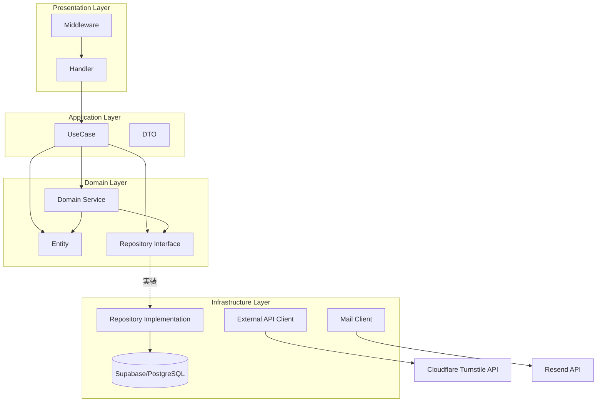
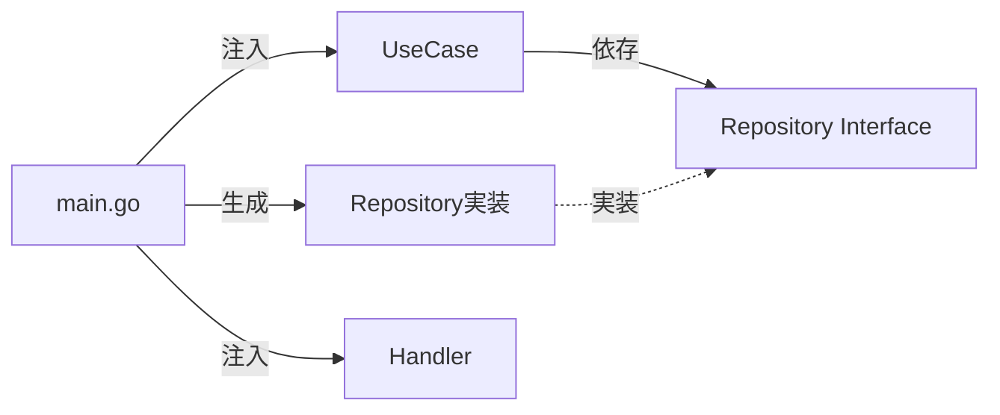
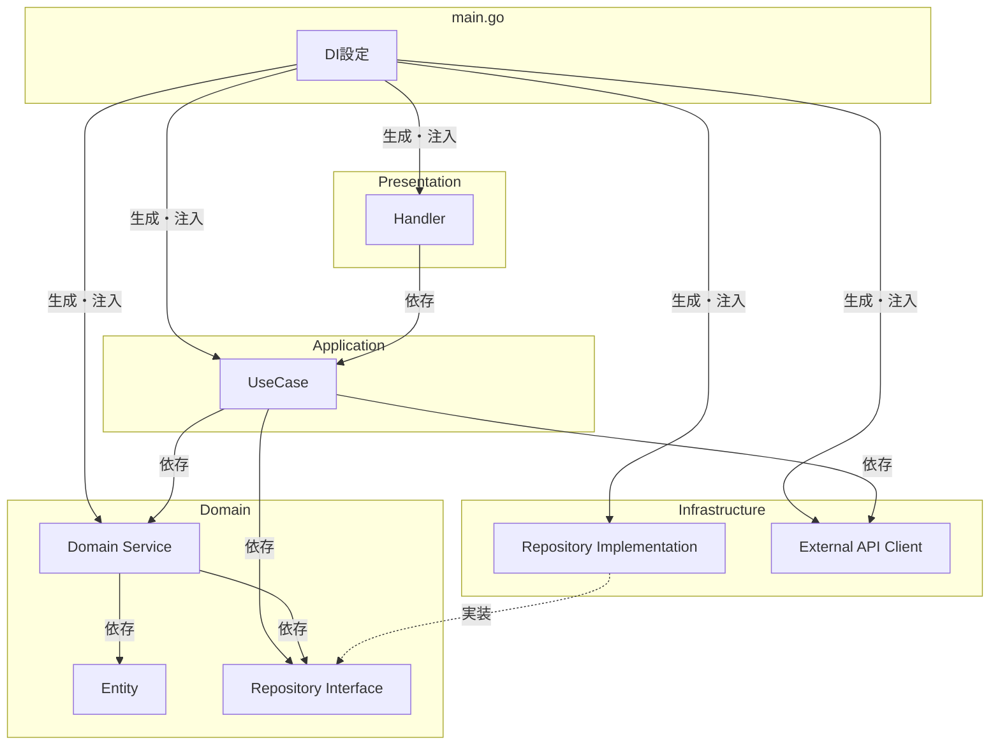

# アーキテクチャ設計

## 1. 概要

### フロントエンド

**Astro 5 + React 19（Islands Architecture）** を採用。

- **静的部分**: Astro コンポーネント（`.astro`）で構築し、JavaScript 0KB で配信
- **動的部分**: React コンポーネント（`.tsx`）を Islands として必要な箇所だけハイドレーション
- **利点**: ページ全体のバンドルサイズを最小化しつつ、フォーム等のインタラクティブな部分は React で実装

### バックエンド

レイヤードアーキテクチャをベースに、以下の設計パターンを取り入れる：

- **Repository パターン** - データアクセスの抽象化
- **DI（依存性注入）** - テスト容易性と疎結合
- **UseCase / Domain Service の分離** - 責務の明確化

## 2. フロントエンド構成

### 技術スタック

| 項目 | 技術 |
|------|------|
| フレームワーク | Astro 5 |
| UI ライブラリ | React 19（Islands Architecture） |
| 言語 | TypeScript |
| スタイリング | Tailwind CSS v4 |
| ランタイム | bun |
| リンター | ESLint（Flat Config） |
| フォーマッター | Prettier |
| テスト | Vitest + Testing Library |

### Islands Architecture

Astro の Islands Architecture は、ページの大部分を静的 HTML として配信し、インタラクティブな部分（Islands）だけを選択的にハイドレーションするアーキテクチャパターン。

```
┌───────────────────────────────────────────────────┐
│  Astro ページ（静的 HTML / JS 0KB）               │
│                                                    │
│  ┌──────────────┐  ┌──────────────────────────┐   │
│  │ 静的ヘッダー  │  │ 静的コンテンツ            │   │
│  │ (.astro)      │  │ (.astro)                  │   │
│  └──────────────┘  └──────────────────────────┘   │
│                                                    │
│  ┌────────────────────────────────────────────┐   │
│  │ 🏝️ React Island（client:load）             │   │
│  │ <ReservationForm client:load />             │   │
│  │ → カレンダー選択、フォーム入力、API通信     │   │
│  └────────────────────────────────────────────┘   │
│                                                    │
│  ┌──────────────────────────────────────────┐     │
│  │ 静的フッター (.astro)                     │     │
│  └──────────────────────────────────────────┘     │
└───────────────────────────────────────────────────┘
```

### ハイドレーション戦略

| ディレクティブ | 用途 | 使用例 |
|---------------|------|--------|
| `client:load` | ページ読み込み時に即座にハイドレーション | 予約フォーム、ログインフォーム、トップのスケジュールカレンダー、管理画面全般（ダッシュボード含む） |
| `client:visible` | 要素が画面内に入った時にハイドレーション | 取引先一覧（`SupplierList`） |
| `client:idle` | ブラウザがアイドル状態になった時にハイドレーション | 現状未使用（採用是非は Issue で検討） |

### フロントエンドディレクトリ構成

```
frontend/
├── src/
│   ├── components/
│   │   ├── astro/           # 静的コンポーネント（.astro）
│   │   └── react/           # React コンポーネント（Islands）
│   │       └── ui/          # 共通 UI 部品（Button / Modal / Card 等）
│   ├── layouts/
│   │   ├── BaseLayout.astro     # 顧客向けレイアウト
│   │   └── AdminLayout.astro    # 管理者向けレイアウト
│   ├── pages/
│   │   ├── index.astro          # トップページ（公開スケジュールカレンダーを含む）
│   │   ├── reservation.astro    # 予約フォーム
│   │   ├── reservation/
│   │   │   └── complete.astro   # 予約申請完了
│   │   ├── suppliers.astro      # 取引先紹介
│   │   └── admin/
│   │       ├── index.astro      # ダッシュボード
│   │       ├── login.astro
│   │       ├── reservations.astro
│   │       ├── reservations/
│   │       │   └── new.astro    # 予約手動登録
│   │       ├── schedules.astro
│   │       └── suppliers.astro
│   ├── styles/
│   │   └── global.css
│   ├── lib/
│   │   ├── api.ts               # 保護 API 用 fetch（Bearer 付与・401 時 refresh）
│   │   ├── auth.ts              # ログイン・refresh・ログアウト
│   │   ├── reservation.ts / adminReservation.ts / availability.ts
│   │   ├── publicSchedule.ts / schedule.ts / publicSuppliers.ts / suppliers.ts
│   │   │                        # 各 API クライアントとエラーメッセージ変換
│   │   ├── calendarUtils.ts / useMonthCalendar.ts / publicScheduleCell.ts
│   │   │                        # カレンダー共通ロジック
│   │   ├── holidays.ts / storeDefaultSchedule.ts / storeHours.ts
│   │   │                        # 祝日判定・店舗定例プレビュー
│   │   ├── calendarTheme.ts / reservationStatusTheme.ts / japaneseMonth.ts / cx.ts
│   │   │                        # 表示ラベル・色・className ユーティリティ
│   │   └── ui/                  # UI 部品の共通スタイル・型
│   ├── data/
│   │   └── holidays.json        # 祝日データ（docs/holidays.md）
│   ├── test/                    # Vitest セットアップ・ヘルパー
│   └── types/
│       ├── reservation.ts       # 予約・スケジュール・認証の型
│       └── supplier.ts          # 取引先の型
├── astro.config.mjs
├── tsconfig.json
├── vitest.config.ts
├── eslint.config.mjs
├── .prettierrc
└── package.json
```

### ページ構成とコンポーネント種別

| ページ | ファイル | 動的部分（React Islands） |
|--------|----------|--------------------------|
| トップページ | `index.astro` | 公開スケジュールカレンダー（`AttentionSection.astro` 経由で `PublicScheduleCalendar client:load`） |
| 予約フォーム | `reservation.astro` | 予約フォーム全体（`ReservationForm client:load`） |
| 予約申請完了 | `reservation/complete.astro` | なし（静的） |
| 取引先紹介 | `suppliers.astro` | 取引先一覧（`SupplierList client:visible`） |
| ログイン | `admin/login.astro` | ログインフォーム（`client:load`） |
| ダッシュボード | `admin/index.astro` | サマリーウィジェット（`DashboardSummary client:load`） |
| 予約一覧 | `admin/reservations.astro` | 予約テーブル・操作（`client:load`） |
| 予約手動登録 | `admin/reservations/new.astro` | 登録フォーム（`client:load`） |
| スケジュール設定 | `admin/schedules.astro` | カレンダー・設定フォーム（`client:load`） |
| 取引先管理 | `admin/suppliers.astro` | CRUD 操作（`client:load`） |

## 3. バックエンド設計思想

### なぜこのバックエンド構成か

| 観点 | 選択 | 理由 |
|------|------|------|
| 全体構成 | レイヤード | プロダクト規模に適切、学習コスト低い |
| データアクセス | Repository パターン | DB変更への耐性、テスト時のモック化 |
| 依存関係 | DI | テスト容易性、疎結合 |
| ビジネスロジック | UseCase + Domain Service | 責務の明確化、肥大化防止 |

### 採用しないもの

| パターン | 理由 |
|----------|------|
| フルDDD | ドメインの複雑さに対して過剰 |
| クリーンアーキテクチャ | ボイラープレートが増えすぎる |
| CQRS | 読み書きの分離が不要な規模 |

## 4. レイヤー構成図



## 5. UseCase と Domain Service の違い

### 責務の違い

| 観点 | UseCase | Domain Service |
|------|---------|----------------|
| **層** | Application Layer | Domain Layer |
| **視点** | 「誰が何をしたいか」 | 「ドメインの問題をどう解決するか」 |
| **責務** | 操作全体のオーケストレーション | ビジネスロジックの実行 |
| **依存** | Repository, Domain Service, 外部API | Entity, Repository Interface のみ |
| **状態** | 持たない（ステートレス） | 持たない（ステートレス） |

### 判断フローチャート

```
Q: そのロジックは「特定の操作（API）」に紐づく？
   └─ Yes → UseCase
   └─ No ↓

Q: そのロジックは「エンティティ1つ」で完結する？
   └─ Yes → Entity のメソッドに
   └─ No → Domain Service
```

### このプロダクトでの具体例

```
┌─────────────────────────────────────────────────────────────┐
│  CreateReservationUseCase（UseCase）                        │
│  「顧客が予約を申請する」という操作全体を調整               │
├─────────────────────────────────────────────────────────────┤
│  1. Turnstile検証        → 外部API                         │
│  2. 入力バリデーション    → DTO / Validator                │
│  3. 空き確認（楽観）      → AvailabilityService に委譲      │
│  4. トランザクション内:                                      │
│     - 同一 visit_date の advisory lock（VisitDateLocker）  │
│     - 空き再確認           → AvailabilityService           │
│     - 予約作成             → ReservationRepository         │
│     - 受付メール記録       → MailEnqueuer（email_outbox）  │
│  5. レスポンス組み立て    → DTO                            │
└─────────────────────────────────────────────────────────────┘

┌─────────────────────────────────────────────────────────────┐
│  AvailabilityService（Domain Service）                      │
│  「空きがあるか計算する」というドメインロジック             │
├─────────────────────────────────────────────────────────────┤
│  - 提供可能数を取得（ScheduleRepository）                   │
│  - 承認済み予約の人数を集計（ReservationRepository）        │
│  - 残り食数を計算                                           │
│  - 予約可否（休業含む／その日の営業設定（有効なスケジュール）／行優先・無行時既定） │
└─────────────────────────────────────────────────────────────┘

┌─────────────────────────────────────────────────────────────┐
│  UpdateStatusUseCase（UseCase）                             │
│  「オーナーが予約ステータスを更新する」操作全体を調整       │
├─────────────────────────────────────────────────────────────┤
│  1. 予約取得             → ReservationRepository           │
│  2. ステータス遷移可否    → domain.CanTransition()         │
│  3. トランザクション内:                                      │
│     - ステータス更新      → ReservationRepository          │
│     - メール記録          → MailEnqueuer（email_outbox）   │
│       - approved → 予約承認メール                          │
│       - rejected → 予約拒否メール                          │
│  4. レスポンス組み立て    → DTO                            │
└─────────────────────────────────────────────────────────────┘
```

メールは UseCase のトランザクション内で `email_outbox` に記録するだけで、送信は Dispatcher が後から行う（§10）。許可されるステータス遷移は `docs/table_design.md` §4 と `docs/api_design.md` の `PATCH /admin/reservations/{id}/status` を正とし、ここには持たない。

## 6. DI（依存性注入）

### なぜDIを使うか

UseCase が Repository の具体的な実装（Supabase など）に直接依存すると、テスト時に実際の DB 接続が必要になり、DB 変更にも弱くなる。インターフェースに依存させることで、テスト時にはモックを注入でき、本番の実装を差し替えても UseCase 側の変更が不要になる。

### DIの流れ



## 7. バックエンドディレクトリ構成

### 現状

```
backend/
├── cmd/
│   ├── api/main.go                 # エントリーポイント、DI、ルーティング
│   ├── migrate/main.go             # マイグレーション適用（schema_migrations で管理）
│   └── seed/main.go                # 開発用シード（admin_users）
│
├── internal/
│   ├── handler/                    # Presentation: HTTP ハンドラーとミドルウェア
│   │   ├── reservation.go / admin_reservation.go / availability.go
│   │   ├── schedule.go / schedule_public.go / schedule_errors.go
│   │   ├── supplier.go / admin_supplier.go
│   │   ├── auth.go / cookie.go / client_ip.go
│   │   ├── outbox.go               # POST /internal/outbox/flush
│   │   ├── middleware.go           # JWT 認証（RequireAuth）・CORS
│   │   └── response.go             # JSON / エラーレスポンスヘルパー
│   │
│   ├── application/                # Application
│   │   ├── transaction.go          # TxManager（トランザクション境界の抽象）
│   │   ├── visit_date_lock.go      # VisitDateLocker（同一来店日の直列化）
│   │   └── usecase/
│   │       ├── auth/               # ログイン・refresh・ログアウト・レートリミット
│   │       ├── reservation/        # 予約作成（顧客 / 管理者）・一覧・ステータス更新・空き確認
│   │       ├── schedule/           # スケジュール取得・一覧・設定・削除
│   │       └── supplier/           # 取引先 CRUD・並び替え・画像アップロード
│   │
│   ├── domain/                     # Domain（フラット）: エンティティ、Repository / 外部サービスのインターフェース、sentinel エラー
│   │   ├── reservation.go / schedule.go / supplier.go / admin_user.go
│   │   ├── refresh_token.go / login_attempt.go / email_outbox.go
│   │   ├── mail.go / captcha.go / storage.go
│   │   ├── holiday/                # 祝日判定（内閣府 CSV を go:embed）
│   │   └── service/                # 空き状況・営業時刻・店舗定例の合成
│   │
│   ├── infrastructure/             # Infrastructure: 外部 API・メール
│   │   ├── external/
│   │   │   ├── resend/             # MailSender 実装（Resend API を net/http で呼ぶ）
│   │   │   ├── storage/            # ImageStorage 実装（S3 互換 / NoOp）
│   │   │   └── turnstile/          # Cloudflare Turnstile 検証
│   │   └── mail/                   # Outbox enqueue・Dispatcher・テンプレート
│   │
│   ├── repository/                 # Infrastructure: Repository 実装（PostgreSQL）
│   ├── datetime/                   # Date / Time 型（JSON・SQL 対応）
│   └── privacy/                    # ログ出力用の個人情報マスク
│
├── pkg/
│   ├── config/config.go            # 環境変数読み込み（一覧は backend/.env.example）
│   └── jwt/jwt.go                  # JWT 生成・検証
│
├── migrations/                     # 000001_*.sql からの連番 SQL（適用済みファイルは編集しない）
├── docker/
│   ├── Dockerfile                  # 本番用（api / migrate / seed の 3 バイナリ）
│   └── Dockerfile.dev              # 開発用（Air ホットリロード）
├── go.mod
└── go.sum
```

`docker-compose.yml` / `docker-compose.prod.yml` / `Makefile` はリポジトリ直下に置く。

### 移行予定

方針: レイヤード + Repository + DI に絞り、DDD 由来の要素は目標から外す（ADR-005）。

予定として残すもの:

- `handler` パッケージからミドルウェアを `presentation/middleware` に分離する（`internal/handler/middleware.go` 冒頭の NOTE。非公開ヘルパーの export か複製が必要）
- logging / recovery ミドルウェアを追加する（現状はハンドラー内の `log.Printf` のみで、HTTP の panic recovery は無い）

目標から外す候補（採否は要判断）:

| 候補 | 現状 |
|------|------|
| `domain/entity` / `domain/repository` / `domain/errors` へのサブパッケージ分割 | フラットな `domain` パッケージ |
| `application/dto` 層 | usecase パッケージの入出力型と handler 内のリクエスト / レスポンス型で変換 |
| `infrastructure/persistence/supabase` への改名 | `internal/repository` |
| `pkg/logger` | 標準 `log` パッケージ |

## 8. 依存関係図



**依存ルール:**
- Domain層は他のレイヤーに依存しない
- Application層はDomain層に依存
- Infrastructure層はDomain層のインターフェースを実装（依存性逆転）
- Presentation層はApplication層に依存
- main.goで全ての依存を解決

## 9. エラーハンドリング

### ドメインエラー

Domain 層は `errors.New` の sentinel エラーを各ファイルに定義する（例: `ErrReservationNotFound`、`ErrCapacityExceeded`、`ErrCaptchaFailed`。`internal/domain/*.go`）。入力バリデーション違反は各 usecase パッケージの `ValidationError`（違反フィールドの一覧）で返す。

### エラーレスポンス変換

各 handler が `errors.Is` / `errors.As` でエラーを判定し、HTTP ステータスとエラーコードに変換する（例: `internal/handler/reservation.go` の予約作成）。想定外のエラーはログに出して 500（`INTERNAL_ERROR`）を返す。エラーコードの一覧は `docs/api_design.md` §3 を正とする。

共通の `HandleError` / `DomainError` 型の導入は Issue で検討中。

## 10. 外部サービス連携

| サービス | 用途 | 連携レイヤー |
|----------|------|-------------|
| Supabase (PostgreSQL) | データベース | Infrastructure Layer（Repository実装） |
| Cloudflare Turnstile | Bot対策 | Infrastructure Layer（`infrastructure/external/turnstile`） |
| Resend | メール配信（予約受付・承認・拒否通知） | Infrastructure Layer（Mail Sender 実装） |

### メール送信（Mail Sender + Outbox）

UseCase は Domain の `MailEnqueuer` / `EmailOutboxRepository` 経由で送信意図を `email_outbox` に記録する（予約操作と同一トランザクション。記録は予約操作の必須条件）。`MailSender` 抽象の実装として Infrastructure の `resend/client.go` が Resend API を呼び、HTTP ステータスを一時失敗 / 恒久失敗（`ErrMailPermanent`）/ 認証エラー（`ErrMailAuth`）に分類する。Dispatcher は Cloud Scheduler → `POST /internal/outbox/flush` で起動し、lease 方式（claim → 送信 → 記録を独立コミット）で指数バックオフ再送する。Dispatcher は TxManager に依存しない（ADR-014 / ADR-015）。

送信するメールの種類:

| メール種別 | トリガー | 宛先 | mail_type |
|-----------|----------|------|-----------|
| 予約申請受付メール | 顧客が Web から予約申請した直後 | 顧客 | `reservation_received` |
| 予約承認メール | オーナーが予約を承認した時 | 顧客 | `reservation_approved` |
| 予約拒否メール | オーナーが予約を拒否した時 | 顧客 | `reservation_rejected` |

## 11. テスト戦略

### モックを使ったUseCaseテスト

Repository や Domain Service のインターフェースに対してモック実装を用意し、UseCase のコンストラクタに注入する。これにより DB や外部 API に接続せずに、ビジネスロジックの正常系・異常系を単体テストできる。DIを使うことで、本番コードを変更せずにモックを注入してテストできる。
