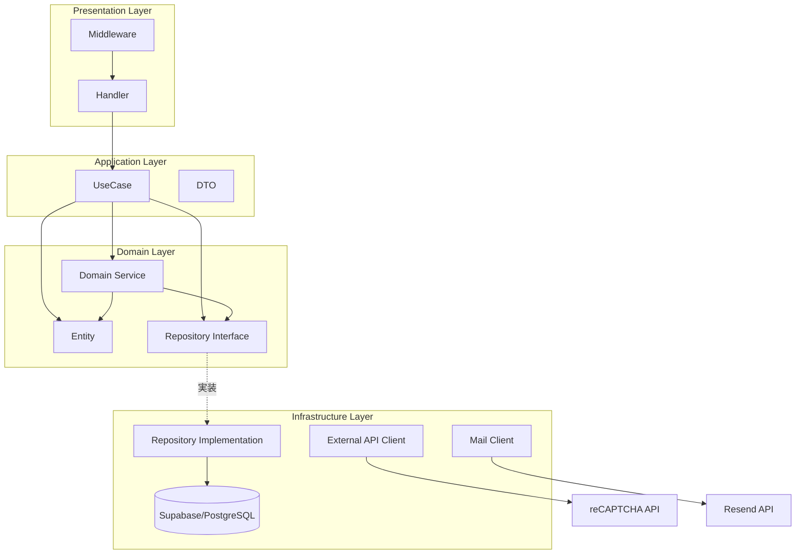
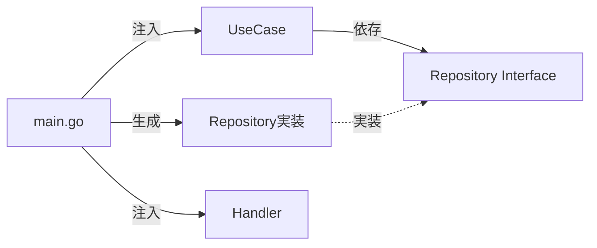
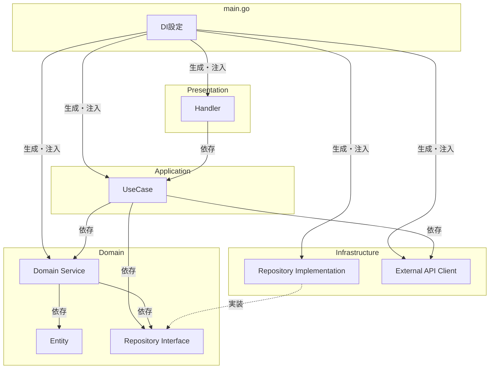

# アーキテクチャ設計

## 1. 概要

### フロントエンド

**Astro 5 + React 19（Islands Architecture）** を採用。

- **静的部分**: Astro コンポーネント（`.astro`）で構築し、JavaScript 0KB で配信
- **動的部分**: React コンポーネント（`.tsx`）を Islands として必要な箇所だけハイドレーション
- **利点**: ページ全体のバンドルサイズを最小化しつつ、フォーム等のインタラクティブな部分は React で実装

### バックエンド

レイヤードアーキテクチャをベースに、以下の設計パターンを取り入れる：

- **Repository パターン** - データアクセスの抽象化
- **DI（依存性注入）** - テスト容易性と疎結合
- **UseCase / Domain Service の分離** - 責務の明確化

## 2. フロントエンド構成

### 技術スタック

| 項目 | 技術 |
|------|------|
| フレームワーク | Astro 5 |
| UI ライブラリ | React 19（Islands Architecture） |
| 言語 | TypeScript |
| スタイリング | Tailwind CSS v4 |
| ランタイム | bun |
| リンター | ESLint（Flat Config） |
| フォーマッター | Prettier |
| テスト | Vitest + Testing Library |

### Islands Architecture

Astro の Islands Architecture は、ページの大部分を静的 HTML として配信し、インタラクティブな部分（Islands）だけを選択的にハイドレーションするアーキテクチャパターン。

```
┌───────────────────────────────────────────────────┐
│  Astro ページ（静的 HTML / JS 0KB）               │
│                                                    │
│  ┌──────────────┐  ┌──────────────────────────┐   │
│  │ 静的ヘッダー  │  │ 静的コンテンツ            │   │
│  │ (.astro)      │  │ (.astro)                  │   │
│  └──────────────┘  └──────────────────────────┘   │
│                                                    │
│  ┌────────────────────────────────────────────┐   │
│  │ 🏝️ React Island（client:load）             │   │
│  │ <ReservationForm client:load />             │   │
│  │ → カレンダー選択、フォーム入力、API通信     │   │
│  └────────────────────────────────────────────┘   │
│                                                    │
│  ┌──────────────────────────────────────────┐     │
│  │ 静的フッター (.astro)                     │     │
│  └──────────────────────────────────────────┘     │
└───────────────────────────────────────────────────┘
```

### ハイドレーション戦略

| ディレクティブ | 用途 | 使用例 |
|---------------|------|--------|
| `client:load` | ページ読み込み時に即座にハイドレーション | 予約フォーム、ログインフォーム |
| `client:visible` | 要素が画面内に入った時にハイドレーション | 取引先カード（スクロール後に表示） |
| `client:idle` | ブラウザがアイドル状態になった時にハイドレーション | ダッシュボードのウィジェット |

### フロントエンドディレクトリ構成

```
frontend/
├── src/
│   ├── components/
│   │   ├── astro/           # 静的コンポーネント（.astro）
│   │   └── react/           # React コンポーネント（Islands）
│   ├── layouts/
│   │   ├── BaseLayout.astro     # 顧客向けレイアウト
│   │   └── AdminLayout.astro    # 管理者向けレイアウト
│   ├── pages/
│   │   ├── index.astro          # トップページ
│   │   ├── schedule.astro       # スケジュール確認
│   │   ├── reservation.astro    # 予約フォーム
│   │   ├── suppliers.astro      # 取引先紹介
│   │   └── admin/
│   │       ├── index.astro      # ダッシュボード
│   │       ├── login.astro
│   │       ├── reservations.astro
│   │       ├── schedules.astro
│   │       └── suppliers.astro
│   ├── styles/
│   │   └── global.css
│   ├── lib/
│   │   └── api.ts               # API クライアント
│   └── types/
│       └── index.ts             # 型定義
├── astro.config.mjs
├── tsconfig.json
├── vitest.config.ts
├── eslint.config.mjs
├── .prettierrc
└── package.json
```

### ページ構成とコンポーネント種別

| ページ | ファイル | 動的部分（React Islands） |
|--------|----------|--------------------------|
| トップページ | `index.astro` | なし（静的） |
| スケジュール確認 | `schedule.astro` | カレンダー表示（`client:load`） |
| 予約フォーム | `reservation.astro` | 予約フォーム全体（`client:load`） |
| 取引先紹介 | `suppliers.astro` | なし（静的） |
| ログイン | `admin/login.astro` | ログインフォーム（`client:load`） |
| ダッシュボード | `admin/index.astro` | サマリーウィジェット（`client:load`） |
| 予約一覧 | `admin/reservations.astro` | 予約テーブル・操作（`client:load`） |
| スケジュール設定 | `admin/schedules.astro` | カレンダー・設定フォーム（`client:load`） |
| 取引先管理 | `admin/suppliers.astro` | CRUD 操作（`client:load`） |

## 3. バックエンド設計思想

### なぜこのバックエンド構成か

| 観点 | 選択 | 理由 |
|------|------|------|
| 全体構成 | レイヤード | プロダクト規模に適切、学習コスト低い |
| データアクセス | Repository パターン | DB変更への耐性、テスト時のモック化 |
| 依存関係 | DI | テスト容易性、疎結合 |
| ビジネスロジック | UseCase + Domain Service | 責務の明確化、肥大化防止 |

### 採用しないもの

| パターン | 理由 |
|----------|------|
| フルDDD | ドメインの複雑さに対して過剰 |
| クリーンアーキテクチャ | ボイラープレートが増えすぎる |
| CQRS | 読み書きの分離が不要な規模 |

## 4. レイヤー構成図



## 5. UseCase と Domain Service の違い

### 責務の違い

| 観点 | UseCase | Domain Service |
|------|---------|----------------|
| **層** | Application Layer | Domain Layer |
| **視点** | 「誰が何をしたいか」 | 「ドメインの問題をどう解決するか」 |
| **責務** | 操作全体のオーケストレーション | ビジネスロジックの実行 |
| **依存** | Repository, Domain Service, 外部API | Entity, Repository Interface のみ |
| **状態** | 持たない（ステートレス） | 持たない（ステートレス） |

### 判断フローチャート

```
Q: そのロジックは「特定の操作（API）」に紐づく？
   └─ Yes → UseCase
   └─ No ↓

Q: そのロジックは「エンティティ1つ」で完結する？
   └─ Yes → Entity のメソッドに
   └─ No → Domain Service
```

### このプロダクトでの具体例

```
┌─────────────────────────────────────────────────────────────┐
│  CreateReservationUseCase（UseCase）                        │
│  「顧客が予約を申請する」という操作全体を調整               │
├─────────────────────────────────────────────────────────────┤
│  1. reCAPTCHA検証        → 外部API                         │
│  2. 入力バリデーション    → DTO / Validator                │
│  3. 空き確認             → AvailabilityService に委譲      │
│  4. 予約作成             → ReservationRepository に委譲    │
│  5. 受付メール送信        → MailService に委譲（非同期）    │
│  6. レスポンス組み立て    → DTO                            │
└─────────────────────────────────────────────────────────────┘

┌─────────────────────────────────────────────────────────────┐
│  AvailabilityService（Domain Service）                      │
│  「空きがあるか計算する」というドメインロジック             │
├─────────────────────────────────────────────────────────────┤
│  - 提供可能数を取得（ScheduleRepository）                   │
│  - 承認済み予約の人数を集計（ReservationRepository）        │
│  - 残り食数を計算                                           │
│  - 定休日判定                                               │
│  - 予約可否の判定                                           │
└─────────────────────────────────────────────────────────────┘

┌─────────────────────────────────────────────────────────────┐
│  UpdateStatusUseCase（UseCase）                             │
│  「オーナーが予約ステータスを更新する」操作全体を調整       │
├─────────────────────────────────────────────────────────────┤
│  1. 予約取得             → ReservationRepository           │
│  2. ステータス遷移可否    → Reservation.CanTransitionTo()  │
│  3. ステータス更新        → ReservationRepository          │
│  4. メール送信            → MailService に委譲（非同期）    │
│     - approved → 予約承認メール                            │
│     - rejected → 予約拒否メール                            │
│  5. レスポンス組み立て    → DTO                            │
└─────────────────────────────────────────────────────────────┘

┌─────────────────────────────────────────────────────────────┐
│  Reservation.CanTransitionTo()（Entity メソッド）           │
│  「このステータスに遷移できるか」という単一エンティティの判定│
├─────────────────────────────────────────────────────────────┤
│  - pending → approved, rejected のみ可                     │
│  - approved → no_show のみ可                               │
│  - rejected, no_show → 遷移不可                            │
└─────────────────────────────────────────────────────────────┘
```

## 6. DI（依存性注入）

### なぜDIを使うか

UseCase が Repository の具体的な実装（Supabase など）に直接依存すると、テスト時に実際の DB 接続が必要になり、DB 変更にも弱くなる。インターフェースに依存させることで、テスト時にはモックを注入でき、本番の実装を差し替えても UseCase 側の変更が不要になる。

### DIの流れ



## 7. バックエンドディレクトリ構成

```
backend/
├── cmd/
│   └── server/
│       └── main.go                 # エントリーポイント、DI設定
│
├── internal/
│   ├── presentation/
│   │   ├── handler/
│   │   │   ├── reservation.go      # 予約関連ハンドラー
│   │   │   ├── schedule.go         # スケジュール関連ハンドラー
│   │   │   ├── supplier.go         # 取引先関連ハンドラー
│   │   │   ├── auth.go             # 認証ハンドラー
│   │   │   └── health.go           # ヘルスチェック
│   │   ├── middleware/
│   │   │   ├── auth.go             # JWT認証
│   │   │   ├── cors.go             # CORS設定
│   │   │   ├── logging.go          # リクエストログ
│   │   │   └── recovery.go         # パニックリカバリ
│   │   ├── router/
│   │   │   └── router.go           # ルーティング定義
│   │   └── response/
│   │       └── response.go         # レスポンスヘルパー
│   │
│   ├── application/
│   │   ├── usecase/
│   │   │   ├── reservation/
│   │   │   │   ├── create.go       # 予約作成（顧客）
│   │   │   │   ├── create_by_admin.go  # 予約作成（オーナー）
│   │   │   │   ├── list.go         # 予約一覧
│   │   │   │   └── update_status.go    # ステータス更新
│   │   │   ├── schedule/
│   │   │   │   ├── get.go          # スケジュール取得
│   │   │   │   ├── set.go          # スケジュール設定
│   │   │   │   └── list.go         # 月間スケジュール
│   │   │   ├── supplier/
│   │   │   │   ├── create.go
│   │   │   │   ├── update.go
│   │   │   │   ├── delete.go
│   │   │   │   └── list.go
│   │   │   └── auth/
│   │   │       ├── login.go
│   │   │       └── logout.go
│   │   └── dto/
│   │       ├── reservation.go
│   │       ├── schedule.go
│   │       ├── supplier.go
│   │       └── auth.go
│   │
│   ├── domain/
│   │   ├── entity/
│   │   │   ├── reservation.go      # 予約エンティティ
│   │   │   ├── schedule.go         # スケジュールエンティティ
│   │   │   ├── supplier.go         # 取引先エンティティ
│   │   │   └── admin_user.go       # 管理者エンティティ
│   │   ├── repository/
│   │   │   ├── reservation.go      # インターフェース
│   │   │   ├── schedule.go
│   │   │   ├── supplier.go
│   │   │   ├── admin_user.go
│   │   │   └── mail.go            # メール送信インターフェース
│   │   ├── service/
│   │   │   ├── availability.go     # 空き状況計算
│   │   │   └── business_hours.go   # 営業時間判定
│   │   └── errors/
│   │       └── errors.go           # ドメインエラー定義
│   │
│   └── infrastructure/
│       ├── persistence/
│       │   └── supabase/
│       │       ├── client.go       # Supabaseクライアント
│       │       ├── reservation.go  # Repository実装
│       │       ├── schedule.go
│       │       ├── supplier.go
│       │       └── admin_user.go
│       └── external/
│           ├── recaptcha/
│           │   └── client.go       # reCAPTCHA検証
│           └── resend/
│               └── client.go       # Resendメール送信クライアント
│
├── pkg/
│   ├── config/
│   │   └── config.go               # 環境変数読み込み
│   ├── jwt/
│   │   └── jwt.go                  # JWT生成・検証
│   └── logger/
│       └── logger.go               # ロガー設定
│
├── migrations/
│   ├── 001_create_reservations.sql
│   ├── 002_create_schedules.sql
│   ├── 003_create_suppliers.sql
│   └── 004_create_admin_users.sql
│
├── docker/
│   ├── Dockerfile
│   ├── docker-compose.local.yml
│   └── docker-compose.prod.yml
│
├── go.mod
├── go.sum
├── Makefile
└── README.md
```

## 8. 依存関係図



**依存ルール:**
- Domain層は他のレイヤーに依存しない
- Application層はDomain層に依存
- Infrastructure層はDomain層のインターフェースを実装（依存性逆転）
- Presentation層はApplication層に依存
- main.goで全ての依存を解決

## 9. エラーハンドリング

### ドメインエラー

ドメイン固有のエラーを `Code`（識別用文字列）と `Message`（日本語メッセージ）を持つ `DomainError` 型として定義する。予約不在（`NOT_FOUND`）、定員超過（`CAPACITY_EXCEEDED`）、定休日予約（`HOLIDAY`）、不正なステータス遷移（`INVALID_TRANSITION`）、reCAPTCHA失敗（`INVALID_RECAPTCHA`）、未認証（`UNAUTHORIZED`）などを事前定義しておく。

### エラーレスポンス変換

Presentation 層の `HandleError` 関数で、`DomainError` の `Code` に応じて適切な HTTP ステータスコードにマッピングする。`NOT_FOUND` → 404、`CAPACITY_EXCEEDED` / `HOLIDAY` → 409、`INVALID_TRANSITION` / `INVALID_RECAPTCHA` → 400、`UNAUTHORIZED` → 401 とし、想定外のエラーは 500 を返す。

## 10. 外部サービス連携

| サービス | 用途 | 連携レイヤー |
|----------|------|-------------|
| Supabase (PostgreSQL) | データベース | Infrastructure Layer（Repository実装） |
| Google reCAPTCHA v3 | Bot対策 | Infrastructure Layer（External API Client） |
| Resend | メール配信（予約受付・承認・拒否通知） | Infrastructure Layer（Mail Client） |

### Resend（メール配信）

バックエンドの Infrastructure Layer に `resend/client.go` を配置し、Domain Layer の `repository/mail.go` インターフェースを実装する。UseCase からはインターフェース経由で呼び出すため、テスト時にはモックに差し替え可能。

送信するメールの種類:

| メール種別 | トリガー | 宛先 |
|-----------|----------|------|
| 予約申請受付メール | 顧客がWebから予約申請した直後 | 顧客 |
| 予約承認メール | オーナーが予約を承認した時 | 顧客 |
| 予約拒否メール | オーナーが予約を拒否した時 | 顧客 |

## 11. テスト戦略

### モックを使ったUseCaseテスト

Repository や Domain Service のインターフェースに対してモック実装を用意し、UseCase のコンストラクタに注入する。これにより DB や外部 API に接続せずに、ビジネスロジックの正常系・異常系を単体テストできる。DIを使うことで、本番コードを変更せずにモックを注入してテストできる。
