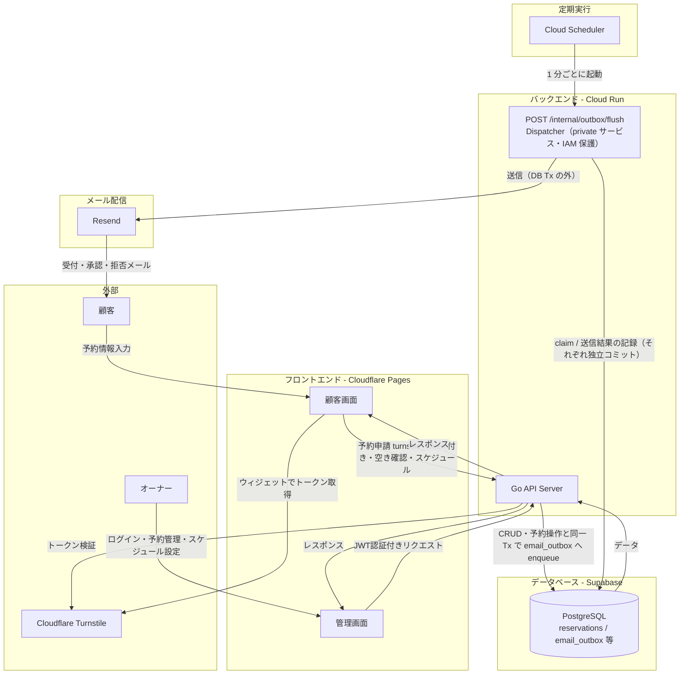
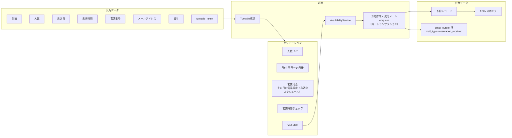
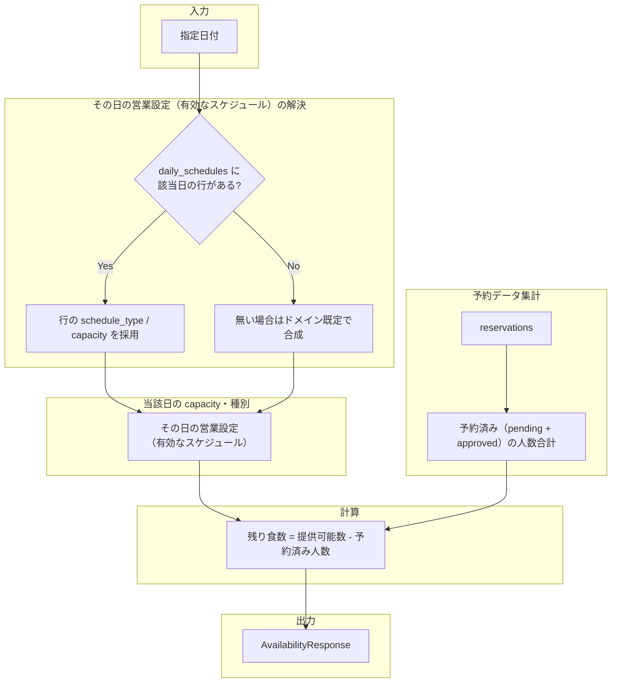
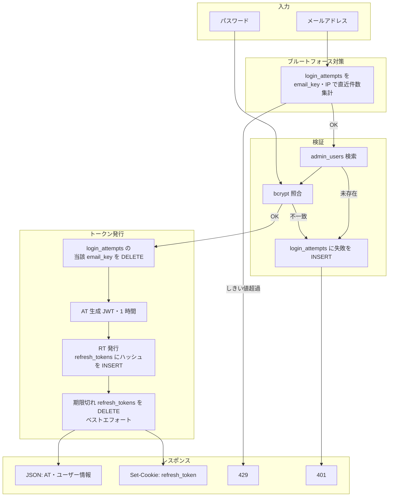
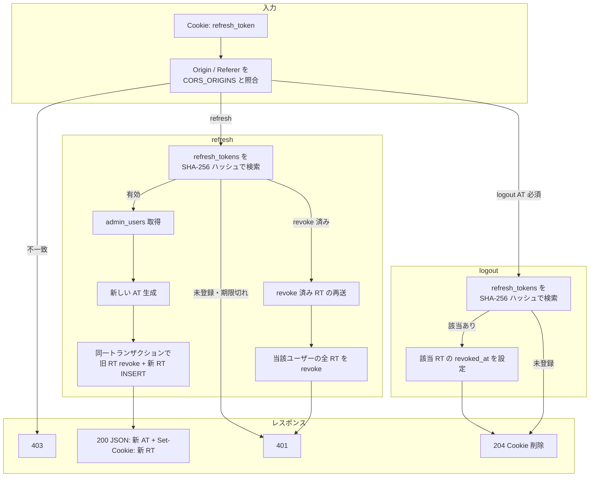
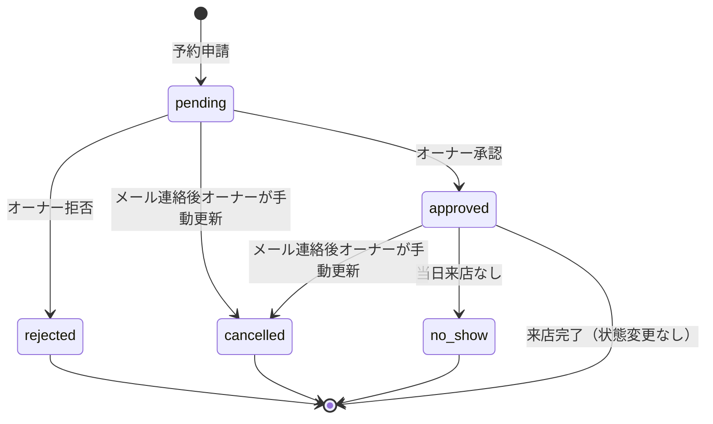
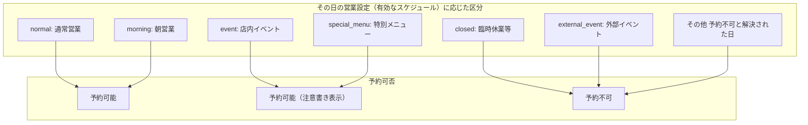
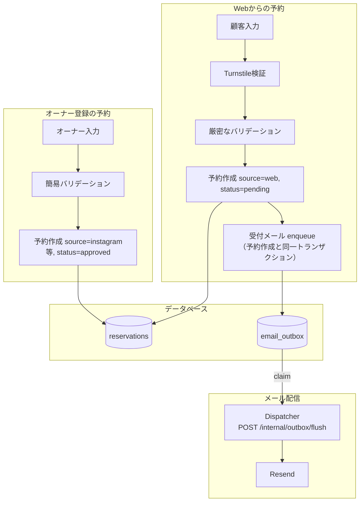
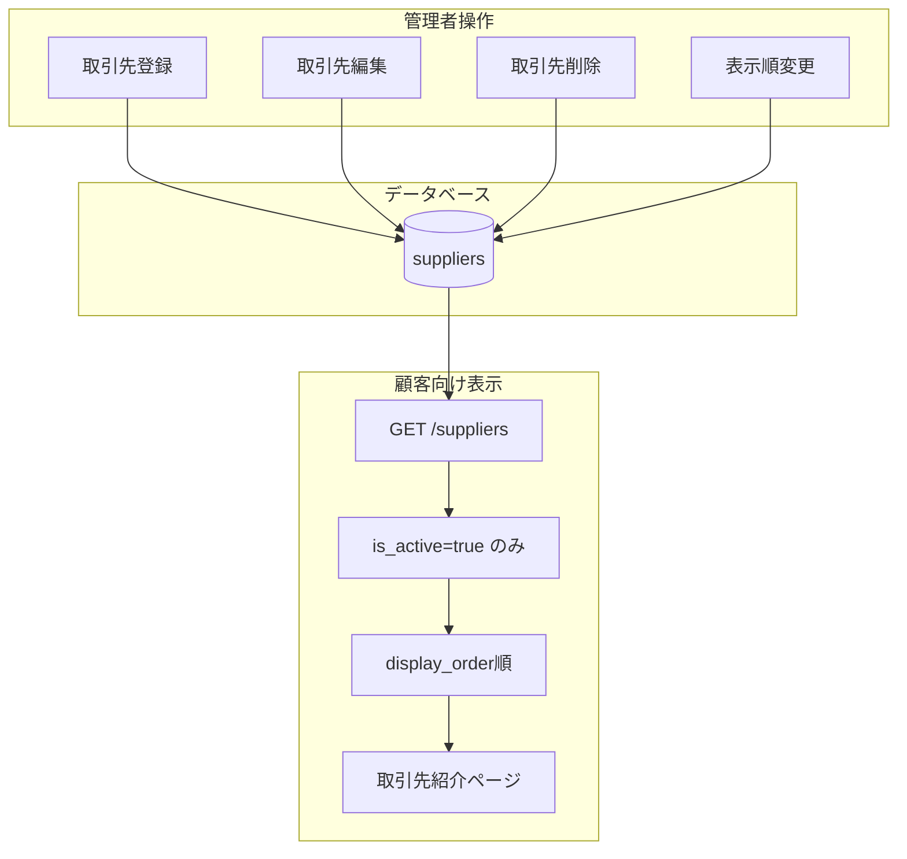

# データフロー図

## 1. システム全体のデータフロー

API はメールを直接送らない。予約 INSERT / ステータス更新と同一トランザクションで `email_outbox` に送信意図を記録し、Cloud Scheduler が起動する `POST /internal/outbox/flush` の Dispatcher が lease 方式（claim → 送信 → 記録をそれぞれ独立コミット）で Resend に送る（ADR-014 / ADR-015）。

## 2. 予約申請のデータフロー

受付メールはレスポンス前に送信しない。`email_outbox` の行は Dispatcher が非同期に送信する（§1）。enqueue の DB エラーは予約作成ごとロールバックする。

## 3. 残り食数の計算フロー

`daily_schedules` に該当日の行がある場合はその行を正とし、**行がない場合**はドメイン既定（店の定例に基づく祝日・曜日別の既定。祝日は同梱の内閣府 CSV で判定。[holidays.md](./holidays.md)）で**その日の営業設定（有効なスケジュール）**を合成する。`AvailabilityService` はその内容から `capacity`・休業相当かどうかを決め、`reservations` の承認済人数と組み合わせて残りを算出する。

## 4. 認証フロー

管理者認証はアクセストークン（AT: JWT HS256・1 時間）とリフレッシュトークン（RT: 不透明文字列・`httpOnly` Cookie・30 日スライディング）の二層（[api_design.md](./api_design.md) §5 認証方式）。DB には RT の SHA-256 ハッシュのみを `refresh_tokens` に保存し、ログイン失敗は `login_attempts` に記録する（[table_design.md](./table_design.md) §2.4・§2.5）。

### 4.1 ログイン（`POST /admin/login`）

### 4.2 AT 更新（`POST /admin/refresh`）・ログアウト（`POST /admin/logout`）

## 5. ステータス遷移

## 6. スケジュールタイプと予約可否

**その日の営業設定（有効なスケジュール）**（DB 行または行なし時の合成結果）に応じて予約可否を決める。`closed`・`external_event`、および**既定解決の結果として休業相当となった日**は予約不可となる。

## 7. API と テーブルの関係

```mermaid
flowchart TB
    subgraph CustomerAPI[顧客向けAPI]
        GetAvailability[GET /reservations/availability<br/>単日 date / 月次 year・month]
        CreateReservation[POST /reservations]
        GetSchedules[GET /schedules]
        GetSuppliers[GET /suppliers]
    end

    subgraph AdminAPI[管理者向けAPI]
        Login[POST /admin/login]
        Refresh[POST /admin/refresh]
        Logout[POST /admin/logout]
        GetReservations[GET /admin/reservations]
        CreateByAdmin[POST /admin/reservations]
        UpdateStatus[PATCH /admin/reservations/:id/status]
        GetAdminSchedules[GET /admin/schedules]
        GetAdminSchedule[GET /admin/schedules/:date]
        SetSchedule[PUT /admin/schedules/:date]
        DeleteSchedule[DELETE /admin/schedules/:date]
        ManageSuppliers[Suppliers CRUD Operations]
    end

    subgraph Tables[テーブル]
        ReservationsTable[(reservations)]
        SchedulesTable[(daily_schedules)]
        SuppliersTable[(suppliers)]
        AdminUsersTable[(admin_users)]
        RefreshTokensTable[(refresh_tokens)]
        LoginAttemptsTable[(login_attempts)]
        OutboxTable[(email_outbox)]
    end

    subgraph InternalAPI[内部API（IAM 保護）]
        FlushOutbox[POST /internal/outbox/flush]
    end

    GetAvailability --> SchedulesTable
    GetAvailability --> ReservationsTable
    CreateReservation --> ReservationsTable
    CreateReservation --> OutboxTable
    UpdateStatus --> OutboxTable
    FlushOutbox --> OutboxTable
    GetSchedules --> SchedulesTable
    GetSuppliers --> SuppliersTable

    Login --> AdminUsersTable
    Login --> LoginAttemptsTable
    Login --> RefreshTokensTable
    Refresh --> RefreshTokensTable
    Refresh --> AdminUsersTable
    Logout --> RefreshTokensTable
    GetReservations --> ReservationsTable
    CreateByAdmin --> ReservationsTable
    UpdateStatus --> ReservationsTable
    GetAdminSchedules --> SchedulesTable
    GetAdminSchedule --> SchedulesTable
    SetSchedule --> SchedulesTable
    DeleteSchedule --> SchedulesTable
    ManageSuppliers --> SuppliersTable
```

## 8. 予約経路によるデータフローの違い

オーナー登録の予約はメールを enqueue しない。承認・拒否メールは `PATCH /admin/reservations/{id}/status` のステータス更新と同一トランザクションで enqueue する（§7）。

## 9. 取引先データフロー

