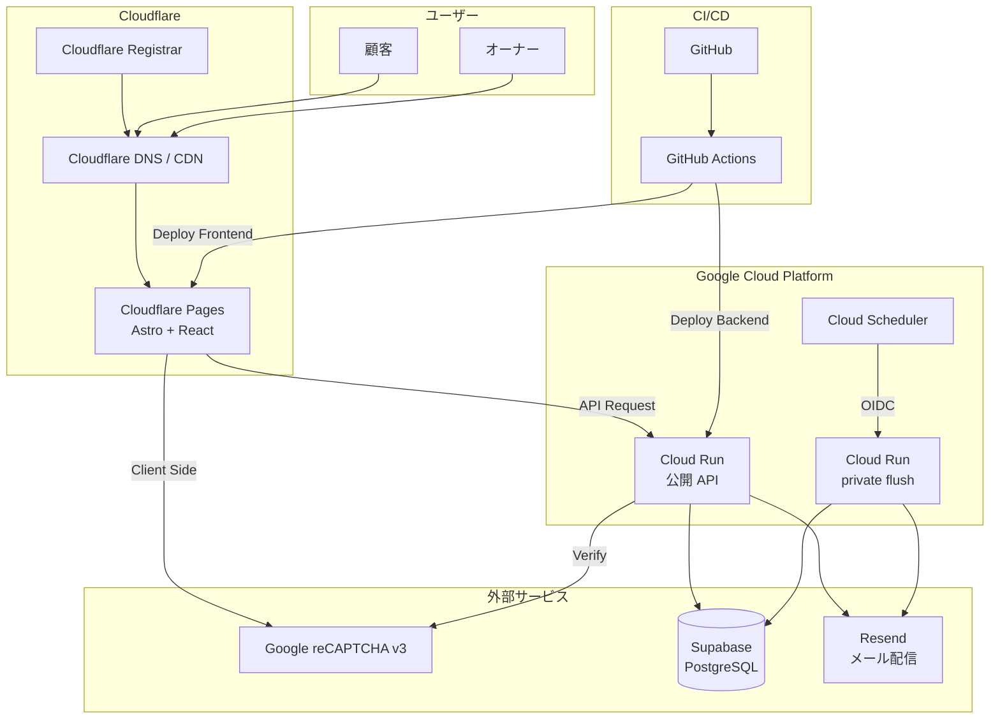
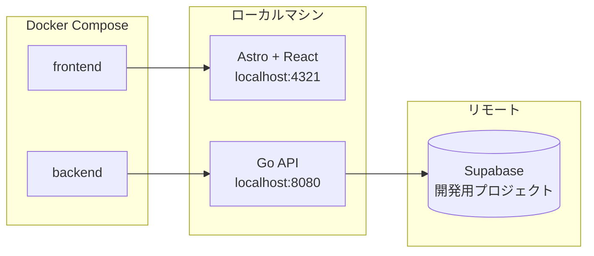
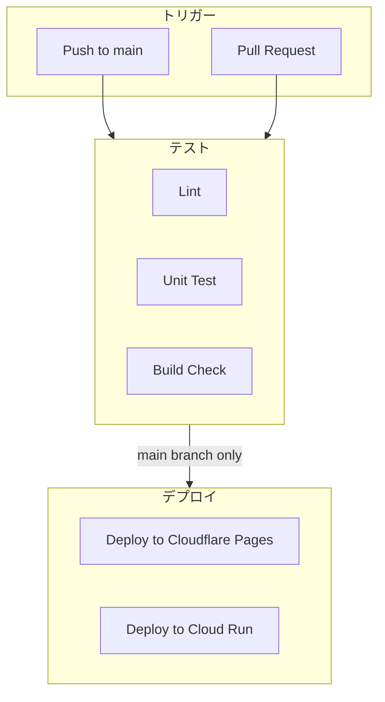

# インフラ構成図

## 1. 全体構成



## 2. 技術スタック

### フロントエンド

| 項目 | 技術 |
|------|------|
| フレームワーク | Astro 5 |
| UI ライブラリ | React 19（Islands Architecture） |
| 言語 | TypeScript |
| スタイリング | Tailwind CSS v4 |
| ランタイム | bun |
| ホスティング | Cloudflare Pages |
| リンター | ESLint（Flat Config） |
| フォーマッター | Prettier |
| テスト | Vitest + Testing Library |
| HTTPクライアント | fetch API |

### バックエンド

| 項目 | 技術 |
|------|------|
| 言語 | Go 1.24+ |
| フレームワーク | net/http (標準ライブラリ) |
| ホスティング | Google Cloud Run |
| 認証 | JWT (golang-jwt/jwt) |
| パスワードハッシュ | bcrypt |
| バリデーション | go-playground/validator |

### データベース

| 項目 | 技術 |
|------|------|
| サービス | Supabase |
| DB | PostgreSQL 15 |
| 接続 | pgx / database/sql |

### メール配信

| 項目 | 技術 |
|------|------|
| サービス | Resend |
| Go SDK | github.com/resend/resend-go/v2 |
| 無料枠 | 3,000通/月（このプロダクトでは十分） |
| 送信元ドメイン | satehits.com（Cloudflare DNSでSPF/DKIM/DMARC設定） |

### ドメイン / DNS

| 項目 | 技術 |
|------|------|
| ドメイン取得・管理 | Cloudflare Registrar |
| DNS | Cloudflare DNS |
| CDN | Cloudflare CDN（自動） |

### インフラ・ツール

| 項目 | 技術 |
|------|------|
| コンテナ | Docker |
| CI/CD | GitHub Actions |
| Bot対策 | Google reCAPTCHA v3 |

## 3. 環境構成

### ローカル開発環境



### 本番環境


## 4. Docker構成

### docker-compose.local.yml

```yaml
version: '3.8'

services:
  frontend:
    build:
      context: ./frontend
      dockerfile: Dockerfile.dev
    ports:
      - "4321:4321"
    volumes:
      - ./frontend:/app
      - /app/node_modules
    environment:
      - PUBLIC_API_URL=http://localhost:8080
      - PUBLIC_RECAPTCHA_SITE_KEY=${RECAPTCHA_SITE_KEY}
    depends_on:
      - backend

  backend:
    build:
      context: ./backend
      dockerfile: Dockerfile.dev
    ports:
      - "8080:8080"
    volumes:
      - ./backend:/app
    environment:
      - DATABASE_URL=${SUPABASE_DATABASE_URL}
      - JWT_SECRET=${JWT_SECRET}
      - RECAPTCHA_SECRET_KEY=${RECAPTCHA_SECRET_KEY}
      - RESEND_API_KEY=${RESEND_API_KEY}
      - MAIL_FROM_ADDRESS=${MAIL_FROM_ADDRESS}
      - ENVIRONMENT=development
```

### docker-compose.prod.yml

```yaml
version: '3.8'

services:
  backend:
    build:
      context: ./backend
      dockerfile: Dockerfile
    environment:
      - DATABASE_URL=${SUPABASE_DATABASE_URL}
      - JWT_SECRET=${JWT_SECRET}
      - RECAPTCHA_SECRET_KEY=${RECAPTCHA_SECRET_KEY}
      - RESEND_API_KEY=${RESEND_API_KEY}
      - MAIL_FROM_ADDRESS=${MAIL_FROM_ADDRESS}
      - ENVIRONMENT=production
```

### Backend Dockerfile

```dockerfile
# Build stage
FROM golang:1.22-alpine AS builder

WORKDIR /app
COPY go.mod go.sum ./
RUN go mod download
COPY . .
RUN CGO_ENABLED=0 GOOS=linux go build -o main ./cmd/server

# Runtime stage
FROM alpine:3.19

RUN apk --no-cache add ca-certificates tzdata
WORKDIR /app
COPY --from=builder /app/main .

EXPOSE 8080
CMD ["./main"]
```

## 5. CI/CD パイプライン



### GitHub Actions ワークフロー

#### `.github/workflows/ci.yml`

```yaml
name: CI

on:
  push:
    branches: [main, develop]
  pull_request:
    branches: [main]

jobs:
  lint-backend:
    runs-on: ubuntu-latest
    steps:
      - uses: actions/checkout@v4
      - uses: actions/setup-go@v5
        with:
          go-version: '1.22'
      - name: golangci-lint
        uses: golangci/golangci-lint-action@v4

  test-backend:
    runs-on: ubuntu-latest
    steps:
      - uses: actions/checkout@v4
      - uses: actions/setup-go@v5
        with:
          go-version: '1.22'
      - run: go test -v ./...

  lint-frontend:
    runs-on: ubuntu-latest
    steps:
      - uses: actions/checkout@v4
      - uses: oven-sh/setup-bun@v2
      - run: cd frontend && bun install --frozen-lockfile
      - run: cd frontend && bun run lint

  build-frontend:
    runs-on: ubuntu-latest
    steps:
      - uses: actions/checkout@v4
      - uses: oven-sh/setup-bun@v2
      - run: cd frontend && bun install --frozen-lockfile
      - run: cd frontend && bun run build
```

#### `.github/workflows/deploy.yml`

```yaml
name: Deploy

on:
  push:
    branches: [main]

jobs:
  deploy-frontend:
    runs-on: ubuntu-latest
    steps:
      - uses: actions/checkout@v4
      - uses: oven-sh/setup-bun@v2
      - name: Install dependencies
        run: cd frontend && bun install --frozen-lockfile
      - name: Build
        run: cd frontend && bun run build
      - name: Deploy to Cloudflare Pages
        uses: cloudflare/wrangler-action@v3
        with:
          apiToken: ${{ secrets.CLOUDFLARE_API_TOKEN }}
          accountId: ${{ secrets.CLOUDFLARE_ACCOUNT_ID }}
          command: pages deploy frontend/dist --project-name=satehits

  deploy-backend:
    runs-on: ubuntu-latest
    steps:
      - uses: actions/checkout@v4
      - uses: google-github-actions/auth@v2
        with:
          credentials_json: ${{ secrets.GCP_SA_KEY }}
      - uses: google-github-actions/setup-gcloud@v2
      - name: Deploy to Cloud Run
        run: |
          gcloud run deploy satehits-api \
            --source ./backend \
            --region asia-northeast1 \
            --platform managed \
            --allow-unauthenticated
```

## 6. 環境変数

### フロントエンド（Cloudflare Pages）

| 変数名 | 説明 |
|--------|------|
| PUBLIC_API_URL | バックエンドAPIのURL |
| PUBLIC_RECAPTCHA_SITE_KEY | reCAPTCHAサイトキー |

> **注**: Astro では `PUBLIC_` プレフィックスを付けた環境変数がクライアントサイドに公開される（Next.js の `NEXT_PUBLIC_` に相当）。

### バックエンド（Cloud Run）

| 変数名 | 説明 |
|--------|------|
| DATABASE_URL | Supabase接続URL |
| JWT_SECRET | JWT署名用シークレット |
| RECAPTCHA_SECRET_KEY | reCAPTCHAシークレットキー |
| RESEND_API_KEY | Resend APIキー（未設定時は NoOp Sender）。`ENVIRONMENT=production` かつ `OUTBOX_FLUSH_ENDPOINT_ENABLED=true` では必須（未設定なら起動失敗） |
| MAIL_FROM_ADDRESS | メール送信元アドレス（例: noreply@satehits.com） |
| OUTBOX_BATCH_SIZE | 1 回の flush で処理する最大件数（既定 20） |
| OUTBOX_FLUSH_TIME_BUDGET_SECONDS | 1 回の flush の時間予算（既定 120）。Cloud Scheduler の attempt-deadline（180 秒）より短くする |
| OUTBOX_FLUSH_ENDPOINT_ENABLED | `true` のときだけ `POST /internal/outbox/flush` を登録（private サービスで true、公開サービスで false。デプロイ設定で固定する） |
| ENVIRONMENT | 環境識別子（development/production） |
| PORT | サーバーポート（Cloud Runは自動設定） |
| STORAGE_ENDPOINT | S3 互換ストレージのエンドポイント（本番: Cloudflare R2、ローカル: MinIO） |
| STORAGE_REGION | リージョン（R2 は `auto` 等） |
| STORAGE_BUCKET | 画像バケット名 |
| STORAGE_ACCESS_KEY | アクセスキー |
| STORAGE_SECRET_KEY | シークレットキー |
| STORAGE_PUBLIC_BASE_URL | 画像の公開 URL ベース（例: `https://images.example.com/bucket` または MinIO の `http://localhost:9000/bucket`） |

### 画像ストレージ（取引先）

| 環境 | 実装 | 備考 |
|------|------|------|
| ローカル | Docker MinIO（`docker-compose.yml`） | S3 API 互換。起動時に `satehits-images` バケットを public read で作成 |
| 本番 | Cloudflare R2 | `aws-sdk-go-v2` の S3 クライアントで同一コードパス |

`STORAGE_*` が未設定の場合、画像アップロード API は無効（NoOp ストレージ）。取引先 CRUD は DB の `image_url` 文字列のみで動作可能。

> **運用**: 画像は公開配信される。非公開取引先の `image_url` を直接知られてもページ上は非表示だが、URL 自体はアクセス可能。機微情報を画像に載せないこと。

## 7. セキュリティ

### 通信

- フロントエンド: HTTPS (Cloudflare自動)
- バックエンド: HTTPS (Cloud Run自動)
- DB接続: SSL/TLS (Supabase)

### 認証・認可

- 管理者認証: JWT (有効期限付き)
- パスワード: bcryptでハッシュ化
- Bot対策: reCAPTCHA v3

### CORS

```go
// 許可するオリジン
allowedOrigins := []string{
    "https://satehits.com",             // 本番
    "https://www.satehits.com",         // 本番（www）
    "http://localhost:4321",            // 開発
}
```

## 8. 監視・ログ

| 項目 | サービス |
|------|----------|
| フロントエンドログ | Cloudflare Analytics |
| バックエンドログ | Cloud Logging |
| エラートラッキング | (将来: Sentry) |
| 稼働監視 | (将来: Cloud Monitoring) |

## 9. コスト概算

| サービス | プラン | 想定コスト |
|----------|--------|------------|
| Cloudflare Pages | Free | $0 |
| Cloudflare Registrar | 実費（ドメイン取得費のみ） | 年間 $10 前後 |
| Cloud Run | 無料枠内 | $0 |
| Supabase | Free tier | $0 |
| Resend | 無料枠（3,000通/月） | $0 |
| reCAPTCHA | 無料 | $0 |
| GitHub Actions | 無料枠 | $0 |

※ トラフィックが増えた場合は要見直し

## 10. Cloudflare Pages 設定

### ビルド設定

| 項目 | 値 |
|------|------|
| フレームワークプリセット | Astro |
| ビルドコマンド | `bun run build` |
| ビルド出力ディレクトリ | `dist` |
| ルートディレクトリ | `frontend` |

### Cloudflare + Astro の注意点

| 項目 | 注意点 | 対応方法 |
|------|--------|----------|
| SSR | デフォルトは静的サイト生成（SSG） | 必要な場合は `@astrojs/cloudflare` アダプターを追加 |
| 画像最適化 | Astro の `<Image>` コンポーネントはビルド時最適化 | 静的ビルドでは問題なし。SSR時は外部サービスを検討 |
| Node.js API | Cloudflare Workers ランタイムでは Node.js API が制限される | SSR を使う場合は `@astrojs/cloudflare` で互換レイヤーを利用 |

### Astro 設定ファイル（`astro.config.mjs`）

```javascript
import { defineConfig } from 'astro/config';
import react from '@astrojs/react';
import tailwindcss from '@astrojs/tailwind';

export default defineConfig({
  integrations: [react(), tailwindcss()],
});
```

### カスタムドメイン設定手順

1. **Cloudflare Registrar でドメイン取得**
   - Cloudflare ダッシュボード → ドメイン登録 → `satehits.com` を取得

2. **Cloudflare Pages にカスタムドメインを追加**
   - Pages プロジェクト → カスタムドメイン → `satehits.com` と `www.satehits.com` を追加
   - DNS レコードは自動で設定される（Cloudflare Registrar 利用時）

3. **SSL/TLS 設定**
   - Cloudflare ダッシュボード → SSL/TLS → 「フル（厳密）」を選択
   - 自動的にHTTPS化される

## 11. Resend 設定

### 概要

Resend は顧客向けメールの配信先（`MailSender` 実装）。送信意図は PostgreSQL の `email_outbox` に永続化し、Cloud Scheduler が private Cloud Run の flush エンドポイントを 1 分ごとに呼ぶ（ADR-014 / ADR-015）。手順の冪等スクリプトは `scripts/setup-scheduler.sh`（attempt-deadline 180 秒）。

### 2 サービスのデプロイ設定

同一イメージを 2 つの Cloud Run サービスとしてデプロイし、flush の有効・無効は**デプロイ設定（`--set-env-vars`）で固定**する。手動で env を変えない。

| サービス | 認証 | OUTBOX_FLUSH_ENDPOINT_ENABLED | RESEND_API_KEY |
|---------|------|-------------------------------|----------------|
| `satehits-api`（公開） | `--allow-unauthenticated` | `false` | 不要（enqueue のみ） |
| `satehits-api-internal`（private flush） | `--no-allow-unauthenticated` | `true` | 必須（production では未設定なら起動失敗） |

時間の制約は `送信タイムアウト 30 秒 ≤ OUTBOX_FLUSH_TIME_BUDGET_SECONDS 120 秒 < Scheduler attempt-deadline 180 秒 < Cloud Run request timeout（既定 300 秒）` を保つ。

### Outbox 運用（failed 行の復帰）

`failed` は自動復帰しない。`last_error` で原因を確認して潰してから、手動で `pending` に戻す。

```sql
-- 対象確認
SELECT id, reservation_id, mail_type, attempt_count, last_error, updated_at
FROM email_outbox WHERE status = 'failed' ORDER BY updated_at;

-- 復帰（1 行ずつ）
UPDATE email_outbox
SET status = 'pending', attempt_count = 0, next_attempt_at = NOW(), last_error = NULL
WHERE id = '<outbox id>' AND status = 'failed';
```

注意:

- Resend の Idempotency-Key は 24 時間保持される。失敗レスポンスがキャッシュされるかは公式に明記されていないため、**最終試行（`updated_at`）から 24 時間以上経ってから**戻す
- 宛先不正など恒久エラーは戻しても同じ結果になる。顧客に連絡して宛先を直す運用（別途）
- 同一予約の後続メールは先行が `pending` に戻ると順序どおり待つ（受付 → 承認の順）
- `halted=auth_error` が続く場合は `RESEND_API_KEY` を確認する。該当行の試行は消費されていないので、キー修正後は次の flush で自動再開する

監視・アラートは未決定（ADR-014）。当面は上の SELECT で目視する。

コスト目安: 1 分間隔では約 43,200 回/月。Cloud Scheduler は実行回数ではなくジョブ数課金。Cloud Run のリクエスト数もこのジョブ単体では無料枠を十分下回るが、無料枠は billing account 単位で共有されるため「必ず無料」とは限らない。Cloud Run の「CPU always allocated」は有効にしない。

### 送信元ドメインの DNS 設定

Resend でカスタムドメイン（`satehits.com`）からメールを送信するには、Cloudflare DNS に以下のレコードを追加する必要がある:

| レコード種別 | ホスト | 値 | 目的 |
|-------------|--------|-----|------|
| TXT | `satehits.com` | `v=spf1 include:_spf.resend.com ~all` | SPF（送信元認証） |
| CNAME | `resend._domainkey` | Resendダッシュボードで確認 | DKIM（メール署名） |
| TXT | `_dmarc` | `v=DMARC1; p=none;` | DMARC（認証ポリシー） |

### メール通知の種類

| 種類 | タイミング | 宛先 | 内容 |
|------|-----------|------|------|
| 予約申請受付メール | 顧客がWebから予約申請した直後 | 顧客 | 申請を受け付けた旨、オーナー確認後に連絡する旨 |
| 予約承認メール | オーナーが予約を承認した時 | 顧客 | 予約確定の通知、来店日時、キャンセルポリシー |
| 予約拒否メール | オーナーが予約を拒否した時 | 顧客 | 予約できなかった旨、Instagramへの誘導 |

### Go SDK の使用例

```go
import "github.com/resend/resend-go/v2"

client := resend.NewClient(os.Getenv("RESEND_API_KEY"))

params := &resend.SendEmailRequest{
    From:    os.Getenv("MAIL_FROM_ADDRESS"),
    To:      []string{customerEmail},
    Subject: "【さて、羊に戻るとしよう】ご予約を受け付けました",
    Html:    htmlContent,
}

sent, err := client.Emails.Send(params)
```
