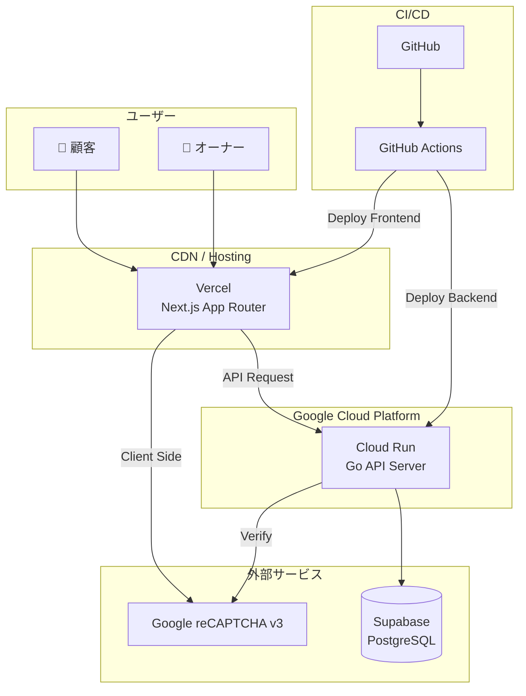
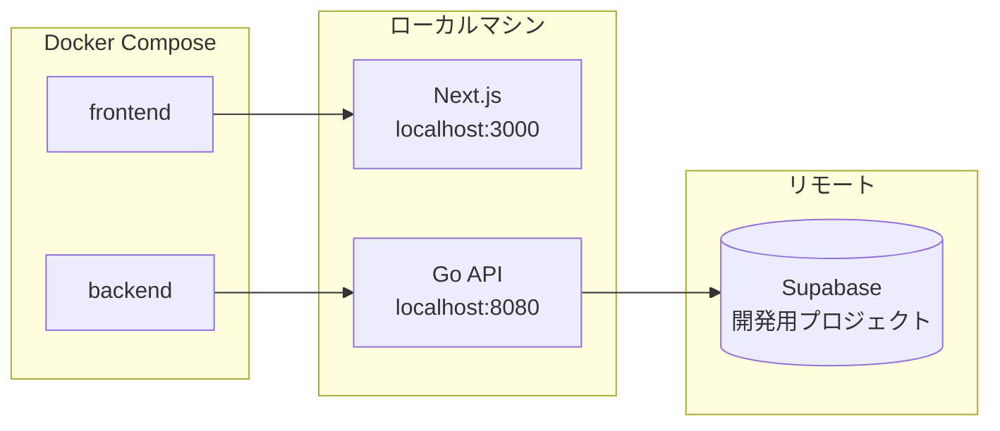
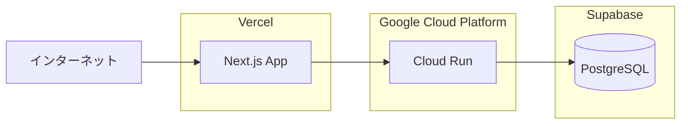
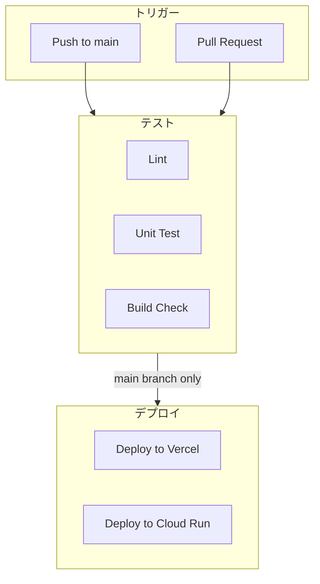

# インフラ構成図

## 1. 全体構成



## 2. 技術スタック

### フロントエンド

| 項目 | 技術 |
|------|------|
| フレームワーク | Next.js 14 (App Router) |
| 言語 | TypeScript |
| スタイリング | Tailwind CSS |
| ホスティング | Vercel |
| 状態管理 | React Context / Zustand (必要に応じて) |
| フォーム | React Hook Form |
| バリデーション | Zod |
| HTTPクライアント | fetch API |

### バックエンド

| 項目 | 技術 |
|------|------|
| 言語 | Go 1.22+ |
| フレームワーク | net/http (標準ライブラリ) |
| ホスティング | Google Cloud Run |
| 認証 | JWT (golang-jwt/jwt) |
| パスワードハッシュ | bcrypt |
| バリデーション | go-playground/validator |

### データベース

| 項目 | 技術 |
|------|------|
| サービス | Supabase |
| DB | PostgreSQL 15 |
| 接続 | pgx / database/sql |

### インフラ・ツール

| 項目 | 技術 |
|------|------|
| コンテナ | Docker |
| CI/CD | GitHub Actions |
| Bot対策 | Google reCAPTCHA v3 |

## 3. 環境構成

### ローカル開発環境



### 本番環境



## 4. Docker構成

### docker-compose.local.yml

```yaml
version: '3.8'

services:
  frontend:
    build:
      context: ./frontend
      dockerfile: Dockerfile.dev
    ports:
      - "3000:3000"
    volumes:
      - ./frontend:/app
      - /app/node_modules
    environment:
      - NEXT_PUBLIC_API_URL=http://localhost:8080
      - NEXT_PUBLIC_RECAPTCHA_SITE_KEY=${RECAPTCHA_SITE_KEY}
    depends_on:
      - backend

  backend:
    build:
      context: ./backend
      dockerfile: Dockerfile.dev
    ports:
      - "8080:8080"
    volumes:
      - ./backend:/app
    environment:
      - DATABASE_URL=${SUPABASE_DATABASE_URL}
      - JWT_SECRET=${JWT_SECRET}
      - RECAPTCHA_SECRET_KEY=${RECAPTCHA_SECRET_KEY}
      - ENVIRONMENT=development
```

### docker-compose.prod.yml

```yaml
version: '3.8'

services:
  backend:
    build:
      context: ./backend
      dockerfile: Dockerfile
    environment:
      - DATABASE_URL=${SUPABASE_DATABASE_URL}
      - JWT_SECRET=${JWT_SECRET}
      - RECAPTCHA_SECRET_KEY=${RECAPTCHA_SECRET_KEY}
      - ENVIRONMENT=production
```

### Backend Dockerfile

```dockerfile
# Build stage
FROM golang:1.22-alpine AS builder

WORKDIR /app
COPY go.mod go.sum ./
RUN go mod download
COPY . .
RUN CGO_ENABLED=0 GOOS=linux go build -o main ./cmd/server

# Runtime stage
FROM alpine:3.19

RUN apk --no-cache add ca-certificates tzdata
WORKDIR /app
COPY --from=builder /app/main .

EXPOSE 8080
CMD ["./main"]
```

## 5. CI/CD パイプライン



### GitHub Actions ワークフロー

#### `.github/workflows/ci.yml`

```yaml
name: CI

on:
  push:
    branches: [main, develop]
  pull_request:
    branches: [main]

jobs:
  lint-backend:
    runs-on: ubuntu-latest
    steps:
      - uses: actions/checkout@v4
      - uses: actions/setup-go@v5
        with:
          go-version: '1.22'
      - name: golangci-lint
        uses: golangci/golangci-lint-action@v4

  test-backend:
    runs-on: ubuntu-latest
    steps:
      - uses: actions/checkout@v4
      - uses: actions/setup-go@v5
        with:
          go-version: '1.22'
      - run: go test -v ./...

  lint-frontend:
    runs-on: ubuntu-latest
    steps:
      - uses: actions/checkout@v4
      - uses: actions/setup-node@v4
        with:
          node-version: '20'
      - run: cd frontend && npm ci
      - run: cd frontend && npm run lint

  build-frontend:
    runs-on: ubuntu-latest
    steps:
      - uses: actions/checkout@v4
      - uses: actions/setup-node@v4
        with:
          node-version: '20'
      - run: cd frontend && npm ci
      - run: cd frontend && npm run build
```

#### `.github/workflows/deploy.yml`

```yaml
name: Deploy

on:
  push:
    branches: [main]

jobs:
  deploy-backend:
    runs-on: ubuntu-latest
    steps:
      - uses: actions/checkout@v4
      - uses: google-github-actions/auth@v2
        with:
          credentials_json: ${{ secrets.GCP_SA_KEY }}
      - uses: google-github-actions/setup-gcloud@v2
      - name: Deploy to Cloud Run
        run: |
          gcloud run deploy satehits-api \
            --source ./backend \
            --region asia-northeast1 \
            --platform managed \
            --allow-unauthenticated

  # Vercelは自動デプロイを使用
```

## 6. 環境変数

### フロントエンド（Vercel）

| 変数名 | 説明 |
|--------|------|
| NEXT_PUBLIC_API_URL | バックエンドAPIのURL |
| NEXT_PUBLIC_RECAPTCHA_SITE_KEY | reCAPTCHAサイトキー |

### バックエンド（Cloud Run）

| 変数名 | 説明 |
|--------|------|
| DATABASE_URL | Supabase接続URL |
| JWT_SECRET | JWT署名用シークレット |
| RECAPTCHA_SECRET_KEY | reCAPTCHAシークレットキー |
| ENVIRONMENT | 環境識別子（development/production） |
| PORT | サーバーポート（Cloud Runは自動設定） |

## 7. セキュリティ

### 通信

- フロントエンド: HTTPS (Vercel自動)
- バックエンド: HTTPS (Cloud Run自動)
- DB接続: SSL/TLS (Supabase)

### 認証・認可

- 管理者認証: JWT (有効期限付き)
- パスワード: bcryptでハッシュ化
- Bot対策: reCAPTCHA v3

### CORS

```go
// 許可するオリジン
allowedOrigins := []string{
    "https://satehits.vercel.app",     // 本番
    "http://localhost:3000",            // 開発
}
```

## 8. 監視・ログ

| 項目 | サービス |
|------|----------|
| フロントエンドログ | Vercel Logs |
| バックエンドログ | Cloud Logging |
| エラートラッキング | (将来: Sentry) |
| 稼働監視 | (将来: Cloud Monitoring) |

## 9. コスト概算

| サービス | プラン | 想定コスト |
|----------|--------|------------|
| Vercel | Hobby (無料) | $0 |
| Cloud Run | 無料枠内 | $0 |
| Supabase | Free tier | $0 |
| reCAPTCHA | 無料 | $0 |
| GitHub Actions | 無料枠 | $0 |

※ トラフィックが増えた場合は要見直し
