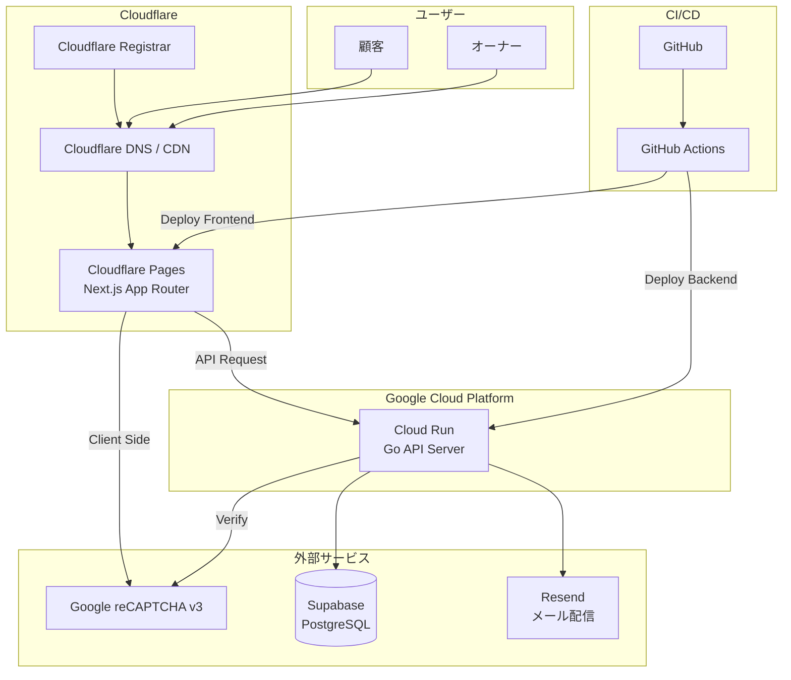
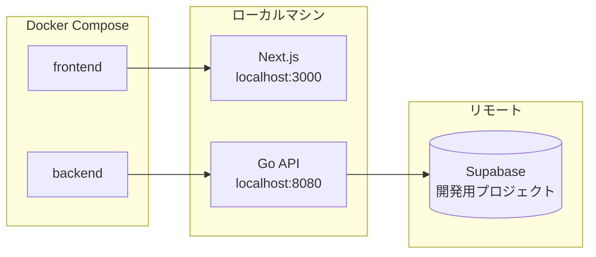
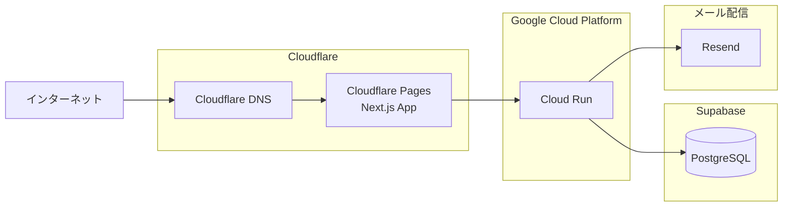
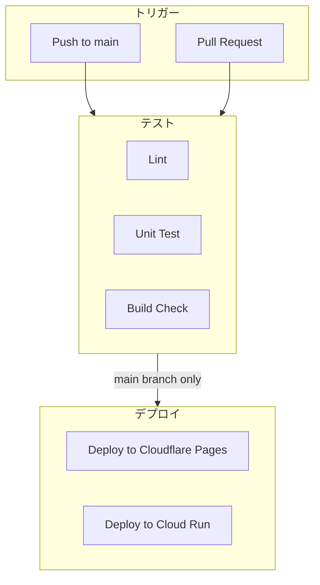

# インフラ構成図

## 1. 全体構成



## 2. 技術スタック

### フロントエンド

| 項目 | 技術 |
|------|------|
| フレームワーク | Next.js 15 (App Router) |
| 言語 | TypeScript |
| スタイリング | Tailwind CSS |
| ホスティング | Cloudflare Pages |
| 状態管理 | React Context / Zustand (必要に応じて) |
| フォーム | React Hook Form |
| バリデーション | Zod |
| HTTPクライアント | fetch API |

### バックエンド

| 項目 | 技術 |
|------|------|
| 言語 | Go 1.24+ |
| フレームワーク | net/http (標準ライブラリ) |
| ホスティング | Google Cloud Run |
| 認証 | JWT (golang-jwt/jwt) |
| パスワードハッシュ | bcrypt |
| バリデーション | go-playground/validator |

### データベース

| 項目 | 技術 |
|------|------|
| サービス | Supabase |
| DB | PostgreSQL 15 |
| 接続 | pgx / database/sql |

### メール配信

| 項目 | 技術 |
|------|------|
| サービス | Resend |
| Go SDK | github.com/resend/resend-go/v2 |
| 無料枠 | 3,000通/月（このプロダクトでは十分） |
| 送信元ドメイン | satehits.com（Cloudflare DNSでSPF/DKIM/DMARC設定） |

### ドメイン / DNS

| 項目 | 技術 |
|------|------|
| ドメイン取得・管理 | Cloudflare Registrar |
| DNS | Cloudflare DNS |
| CDN | Cloudflare CDN（自動） |

### インフラ・ツール

| 項目 | 技術 |
|------|------|
| コンテナ | Docker |
| CI/CD | GitHub Actions |
| Bot対策 | Google reCAPTCHA v3 |

## 3. 環境構成

### ローカル開発環境



### 本番環境



## 4. Docker構成

### docker-compose.local.yml

```yaml
version: '3.8'

services:
  frontend:
    build:
      context: ./frontend
      dockerfile: Dockerfile.dev
    ports:
      - "3000:3000"
    volumes:
      - ./frontend:/app
      - /app/node_modules
    environment:
      - NEXT_PUBLIC_API_URL=http://localhost:8080
      - NEXT_PUBLIC_RECAPTCHA_SITE_KEY=${RECAPTCHA_SITE_KEY}
    depends_on:
      - backend

  backend:
    build:
      context: ./backend
      dockerfile: Dockerfile.dev
    ports:
      - "8080:8080"
    volumes:
      - ./backend:/app
    environment:
      - DATABASE_URL=${SUPABASE_DATABASE_URL}
      - JWT_SECRET=${JWT_SECRET}
      - RECAPTCHA_SECRET_KEY=${RECAPTCHA_SECRET_KEY}
      - RESEND_API_KEY=${RESEND_API_KEY}
      - MAIL_FROM_ADDRESS=${MAIL_FROM_ADDRESS}
      - ENVIRONMENT=development
```

### docker-compose.prod.yml

```yaml
version: '3.8'

services:
  backend:
    build:
      context: ./backend
      dockerfile: Dockerfile
    environment:
      - DATABASE_URL=${SUPABASE_DATABASE_URL}
      - JWT_SECRET=${JWT_SECRET}
      - RECAPTCHA_SECRET_KEY=${RECAPTCHA_SECRET_KEY}
      - RESEND_API_KEY=${RESEND_API_KEY}
      - MAIL_FROM_ADDRESS=${MAIL_FROM_ADDRESS}
      - ENVIRONMENT=production
```

### Backend Dockerfile

```dockerfile
# Build stage
FROM golang:1.22-alpine AS builder

WORKDIR /app
COPY go.mod go.sum ./
RUN go mod download
COPY . .
RUN CGO_ENABLED=0 GOOS=linux go build -o main ./cmd/server

# Runtime stage
FROM alpine:3.19

RUN apk --no-cache add ca-certificates tzdata
WORKDIR /app
COPY --from=builder /app/main .

EXPOSE 8080
CMD ["./main"]
```

## 5. CI/CD パイプライン



### GitHub Actions ワークフロー

#### `.github/workflows/ci.yml`

```yaml
name: CI

on:
  push:
    branches: [main, develop]
  pull_request:
    branches: [main]

jobs:
  lint-backend:
    runs-on: ubuntu-latest
    steps:
      - uses: actions/checkout@v4
      - uses: actions/setup-go@v5
        with:
          go-version: '1.22'
      - name: golangci-lint
        uses: golangci/golangci-lint-action@v4

  test-backend:
    runs-on: ubuntu-latest
    steps:
      - uses: actions/checkout@v4
      - uses: actions/setup-go@v5
        with:
          go-version: '1.22'
      - run: go test -v ./...

  lint-frontend:
    runs-on: ubuntu-latest
    steps:
      - uses: actions/checkout@v4
      - uses: actions/setup-node@v4
        with:
          node-version: '20'
      - run: cd frontend && npm ci
      - run: cd frontend && npm run lint

  build-frontend:
    runs-on: ubuntu-latest
    steps:
      - uses: actions/checkout@v4
      - uses: actions/setup-node@v4
        with:
          node-version: '20'
      - run: cd frontend && npm ci
      - run: cd frontend && npm run build
```

#### `.github/workflows/deploy.yml`

```yaml
name: Deploy

on:
  push:
    branches: [main]

jobs:
  deploy-frontend:
    runs-on: ubuntu-latest
    steps:
      - uses: actions/checkout@v4
      - uses: actions/setup-node@v4
        with:
          node-version: '20'
      - name: Install dependencies
        run: cd frontend && npm ci
      - name: Build
        run: cd frontend && npm run build
      - name: Deploy to Cloudflare Pages
        uses: cloudflare/wrangler-action@v3
        with:
          apiToken: ${{ secrets.CLOUDFLARE_API_TOKEN }}
          accountId: ${{ secrets.CLOUDFLARE_ACCOUNT_ID }}
          command: pages deploy frontend/.next --project-name=satehits

  deploy-backend:
    runs-on: ubuntu-latest
    steps:
      - uses: actions/checkout@v4
      - uses: google-github-actions/auth@v2
        with:
          credentials_json: ${{ secrets.GCP_SA_KEY }}
      - uses: google-github-actions/setup-gcloud@v2
      - name: Deploy to Cloud Run
        run: |
          gcloud run deploy satehits-api \
            --source ./backend \
            --region asia-northeast1 \
            --platform managed \
            --allow-unauthenticated
```

## 6. 環境変数

### フロントエンド（Cloudflare Pages）

| 変数名 | 説明 |
|--------|------|
| NEXT_PUBLIC_API_URL | バックエンドAPIのURL |
| NEXT_PUBLIC_RECAPTCHA_SITE_KEY | reCAPTCHAサイトキー |

### バックエンド（Cloud Run）

| 変数名 | 説明 |
|--------|------|
| DATABASE_URL | Supabase接続URL |
| JWT_SECRET | JWT署名用シークレット |
| RECAPTCHA_SECRET_KEY | reCAPTCHAシークレットキー |
| RESEND_API_KEY | Resend APIキー |
| MAIL_FROM_ADDRESS | メール送信元アドレス（例: noreply@satehits.com） |
| ENVIRONMENT | 環境識別子（development/production） |
| PORT | サーバーポート（Cloud Runは自動設定） |

## 7. セキュリティ

### 通信

- フロントエンド: HTTPS (Cloudflare自動)
- バックエンド: HTTPS (Cloud Run自動)
- DB接続: SSL/TLS (Supabase)

### 認証・認可

- 管理者認証: JWT (有効期限付き)
- パスワード: bcryptでハッシュ化
- Bot対策: reCAPTCHA v3

### CORS

```go
// 許可するオリジン
allowedOrigins := []string{
    "https://satehits.com",             // 本番
    "https://www.satehits.com",         // 本番（www）
    "http://localhost:3000",            // 開発
}
```

## 8. 監視・ログ

| 項目 | サービス |
|------|----------|
| フロントエンドログ | Cloudflare Analytics |
| バックエンドログ | Cloud Logging |
| エラートラッキング | (将来: Sentry) |
| 稼働監視 | (将来: Cloud Monitoring) |

## 9. コスト概算

| サービス | プラン | 想定コスト |
|----------|--------|------------|
| Cloudflare Pages | Free | $0 |
| Cloudflare Registrar | 実費（ドメイン取得費のみ） | 年間 $10 前後 |
| Cloud Run | 無料枠内 | $0 |
| Supabase | Free tier | $0 |
| Resend | 無料枠（3,000通/月） | $0 |
| reCAPTCHA | 無料 | $0 |
| GitHub Actions | 無料枠 | $0 |

※ トラフィックが増えた場合は要見直し

## 10. Cloudflare Pages 設定

### ビルド設定

| 項目 | 値 |
|------|------|
| フレームワークプリセット | Next.js |
| ビルドコマンド | `npm run build` |
| ビルド出力ディレクトリ | `.next` |
| ルートディレクトリ | `frontend` |
| Node.js バージョン | 20 |

### Cloudflare + Next.js の注意点

| 項目 | 注意点 | 対応方法 |
|------|--------|----------|
| 画像最適化 | `next/image` のデフォルト最適化はCloudflare Pagesでは動作しない | `@cloudflare/next-on-pages` を使用、または `unoptimized: true` を設定 |
| ISR | Incremental Static Regeneration はCloudflare Pagesで制限あり | SSR または SSG で代替。必要に応じて `revalidate` の挙動を確認 |
| Edge Runtime | Cloudflare Pages は Edge Runtime で動作 | Node.js 固有のAPIは使用不可。`runtime: 'edge'` を意識した実装 |
| ミドルウェア | Next.js Middleware はサポートされる | `@cloudflare/next-on-pages` 経由で動作 |

### `@cloudflare/next-on-pages` の設定

```bash
# インストール
npm install --save-dev @cloudflare/next-on-pages

# next.config.js に追加
# setupDevPlatform() を使用してローカル開発時もCloudflare環境をエミュレート
```

### カスタムドメイン設定手順

1. **Cloudflare Registrar でドメイン取得**
   - Cloudflare ダッシュボード → ドメイン登録 → `satehits.com` を取得

2. **Cloudflare Pages にカスタムドメインを追加**
   - Pages プロジェクト → カスタムドメイン → `satehits.com` と `www.satehits.com` を追加
   - DNS レコードは自動で設定される（Cloudflare Registrar 利用時）

3. **SSL/TLS 設定**
   - Cloudflare ダッシュボード → SSL/TLS → 「フル（厳密）」を選択
   - 自動的にHTTPS化される

## 11. Resend 設定

### 概要

Resend は開発者ファーストのメール配信サービス。シンプルなAPIで信頼性の高いメール送信が可能。

### 送信元ドメインの DNS 設定

Resend でカスタムドメイン（`satehits.com`）からメールを送信するには、Cloudflare DNS に以下のレコードを追加する必要がある:

| レコード種別 | ホスト | 値 | 目的 |
|-------------|--------|-----|------|
| TXT | `satehits.com` | `v=spf1 include:_spf.resend.com ~all` | SPF（送信元認証） |
| CNAME | `resend._domainkey` | Resendダッシュボードで確認 | DKIM（メール署名） |
| TXT | `_dmarc` | `v=DMARC1; p=none;` | DMARC（認証ポリシー） |

### メール通知の種類

| 種類 | タイミング | 宛先 | 内容 |
|------|-----------|------|------|
| 予約申請受付メール | 顧客がWebから予約申請した直後 | 顧客 | 申請を受け付けた旨、オーナー確認後に連絡する旨 |
| 予約承認メール | オーナーが予約を承認した時 | 顧客 | 予約確定の通知、来店日時、キャンセルポリシー |
| 予約拒否メール | オーナーが予約を拒否した時 | 顧客 | 予約できなかった旨、Instagramへの誘導 |

### Go SDK の使用例

```go
import "github.com/resend/resend-go/v2"

client := resend.NewClient(os.Getenv("RESEND_API_KEY"))

params := &resend.SendEmailRequest{
    From:    os.Getenv("MAIL_FROM_ADDRESS"),
    To:      []string{customerEmail},
    Subject: "【さて、羊に戻るとしよう】ご予約を受け付けました",
    Html:    htmlContent,
}

sent, err := client.Emails.Send(params)
```
