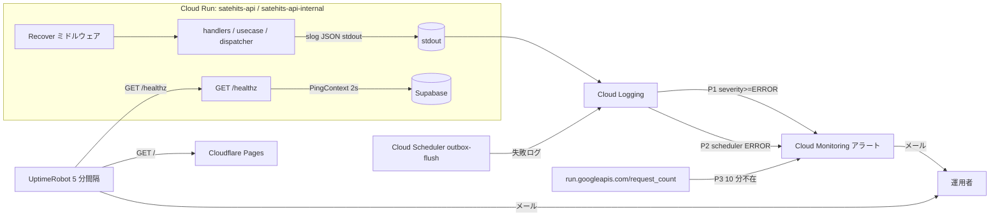

# 監視設計（ADR-012 の実装設計・運用手順）

> 関連: [ADR-012](./architecture_decision_records.md)（決定。「ADR-012: 監視・エラートラッキング」）/ ADR-014（Outbox の監視要件。同ファイル）/ [infrastructure.md §8](./infrastructure.md) / [deploy_cloud_run.md](./deploy_cloud_run.md)
> 本書は「何をどう作るか」を確定させる実装設計と、稼働後の運用手順。実装は [IMPLEMENTATION_PLAN.md](./IMPLEMENTATION_PLAN.md) の手順に従うこと。

構成は **A. GCP 純正（Cloud Logging のログベースアラート + Cloud Monitoring）** と **D. 外形監視（UptimeRobot）** の併用。通知先は**メールのみ**（ADR-012）。Sentry・Slack 自前通知は採用しない。

---

## 1. 検知したい事象と検知手段

| # | 事象 | 検知手段 | 通知 |
|---|------|----------|------|
| E1 | 公開 API が応答しない（Cloud Run 停止・起動失敗・DNS / 証明書・Supabase 停止） | D: UptimeRobot が `GET /healthz` を 5 分間隔で監視 | UptimeRobot → メール |
| E2 | 5xx の発生（予約申請の失敗を含む）・Cloud Run の起動失敗・インスタンス枯渇 | A: ログベースアラート P1（`severity>=ERROR`） | Cloud Monitoring → メール |
| E3 | panic | Recover ミドルウェアが 500 を返し ERROR ログ（スタック付き）→ P1 | 同上 |
| E4 | Outbox の `failed` 確定・Resend 認証エラー・mark 失敗 | Dispatcher の ERROR ログ → P1（private サービスも P1 の対象） | 同上 |
| E5 | Cloud Scheduler ジョブ（`outbox-flush`）の失敗 | A: ログベースアラート P2 | 同上 |
| E6 | flush がそのまま動いていない（Scheduler の停止・削除・private サービス到達不能） | A: メトリクス不在アラート P3（private サービスのリクエスト数が 10 分間ゼロ） | 同上 |
| E7 | フロント（Cloudflare Pages）が落ちている | D: UptimeRobot が `https://satehits.com/` を監視 | UptimeRobot → メール |

対象外（今回は作らない）: レイテンシ・4xx 率・フロントの JS エラー・Supabase 側のメトリクス。再検討トリガーは §9。

---

## 2. 設計判断

| ID | 判断 | 理由 |
|----|------|------|
| D-01 | アラートは **Cloud Logging のログベースアラート**を主とし、メトリクスアラートは「不在検知」（P3）だけに使う | 5xx・panic・Outbox 失敗・Scheduler 失敗はすべて「ERROR ログが出る」に正規化できるので、仕組みが 1 つで済む。5xx 率などのメトリクスは月間リクエスト数千（ADR-000）では統計的に意味がない |
| D-02 | 5xx とアプリ ERROR ログを**別ポリシーにせず P1 に統合**する | Cloud Run のリクエストログは 5xx で `severity=ERROR` になるため、`severity>=ERROR` 1 本で両方拾える。分けると 1 障害で 2 通届く |
| D-03 | P1 のフィルタから `/healthz` を除外する | Supabase 停止時に healthz が 503 を返し続けると P1 が鳴り続ける。healthz の失敗は D（UptimeRobot）が担当。実ユーザーのリクエストが失敗すればそれは別途 P1 に乗る |
| D-04 | 構造化ログは **標準 `log/slog` の JSON ハンドラ**を Cloud Logging のキーに合わせて使う。外部ライブラリ（`cloud.google.com/go/logging`、slogcp 等）は入れない | 依存を増やさず、stdout に JSON を書くだけで Cloud Run が `severity` / `message` / `sourceLocation` を解釈する。ログ API を直接叩く利点（ラベル・トレース）はこの規模では不要 |
| D-05 | `slog.SetDefault` を使い、既存の `log.Printf` は **INFO 扱い**で残す。ERROR / WARN にすべき箇所だけ `slog` に書き換える（§4.2 の表が正） | 全 53 箇所を一括で書き換える必要がない。`SetDefault` は `log` パッケージの出力を自動で slog に流す（Go 1.21+）。ただし INFO 固定なので、アラート対象にしたい行は明示的に `slog.Error` にしないと P1 に乗らない |
| D-06 | 開発環境（`ENVIRONMENT=development`）は `slog.NewTextHandler`、それ以外は JSON | ローカル（`make dev` / Air）で JSON は読みにくい。本番・staging は Cloud Logging が解釈できる JSON |
| D-07 | panic は **`Recover` ミドルウェア**で捕捉し、`INTERNAL_ERROR` の 500 JSON を返して `stack_trace` 付き ERROR ログを出す。ミドルウェアは最外周（`Recover(CORS(mux))`） | 現状は `net/http` が panic を握りつぶして接続を切るだけで、ログは `http: panic serving` の平文（INFO）になり P1 に乗らない。`stack_trace` キーは Error Reporting がスタックとして認識する |
| D-08 | 死活監視は **`GET /healthz`（DB ping 付き）** を新設し、`GET /` は変更しない | `GET /` は DB に触らないため Supabase の停止（Free tier の pause 含む）を検知できない。`/` の意味を変えると `HandleRoot` の 404 兼用と CD のスモークに影響する |
| D-09 | healthz の DB ping は **2 秒タイムアウト**。失敗時は **503** を返し、アプリのログは **WARN**（ERROR にしない） | ERROR にすると D-03 で除外した意味がなくなる（リクエストログは Cloud Run 側で ERROR になるが、それは `/healthz` 除外で落ちる） |
| D-10 | 外形監視は **UptimeRobot Free**（5 分間隔・メール通知）。Cloud Monitoring の Uptime Check は**作らない** | GCP の外から見る目的は UptimeRobot で果たせる。Uptime Check も作ると 1 障害で 2 系統からメールが来る。Better Stack（3 分間隔・ステータスページ）は要件が出たら乗り換える（§9） |
| D-11 | アラートは **production だけ**に作る。staging は `SERVICE_SUFFIX=-stg` で同じスクリプトを実行すれば作れるが、既定では作らない | staging は開発中に意図的に壊すことがありノイズになる。動作確認（§7.2）のときだけ一時的に作って消す |
| D-12 | ポリシーは `scripts/setup-monitoring.sh`（冪等。`setup-scheduler.sh` と同じ流儀）で作る。Console で手作業しない | 既存の GCP セットアップがすべてスクリプト化されており、再現性を揃える。Terraform はこの規模では過剰 |
| D-13 | ログベースアラートの通知間隔は **30 分に 1 通**（`notificationRateLimit.period=1800s`）、自動クローズ **30 分**（`autoClose=1800s`） | 1 人運用でメール通知のため、連続する同種エラーで受信箱が埋まらないようにする。30 分は autoClose の下限 |
| D-14 | 起動失敗（`log.Fatal`）のために専用のアラートは作らない | Cloud Run が `Container failed to start` を `severity=ERROR` で出すので P1 に乗る。加えて CD のデプロイ step が失敗して GitHub から通知が来る |
| D-15 | CD のスモークテストを `GET /` から **`GET /healthz`** に変える | デプロイ直後に DB 接続まで確認できる。`DATABASE_URL` の Secret 差し替えミスをデプロイ時点で検知する |
| D-16 | リクエストログのミドルウェアは作らない。トレース ID の相関（`logging.googleapis.com/trace`）も今回はやらない | Cloud Run がリクエストごとの status / latency / URL を自動でログに出す。トレース相関は全ログ呼び出しに context を通す改修が必要で、今回のスコープ外（§9） |
| D-17 | Error Reporting 向けの `@type` は付けない | 付けると全 ERROR ログが Error Reporting に集まるが、メッセージにログごとの ID が入っているとグルーピングが崩れる。panic だけ `stack_trace` で自然に拾われれば十分 |

**要確認（ユーザー判断待ち・実装をブロックしない）**

- 通知先メールアドレス（`setup-monitoring.sh` の `NOTIFICATION_EMAIL`）。実装・staging 検証は開発者自身のアドレスで先行し、production 実行時に決める
- UptimeRobot アカウントの作成者（オーナーか開発者か）。開発者アカウントで先行し、必要なら後で招待する
- フロントの外形監視 URL。カスタムドメイン `https://satehits.com/` を前提にする。未接続なら Cloudflare Pages の `*.pages.dev` URL で先行

---

## 3. 全体像



---

## 4. アプリ側の変更（backend/）

### 4.1 構造化ログ: `internal/logging`

新規パッケージ `backend/internal/logging/`（`logging.go` / `logging_test.go`）。`internal/privacy` と同じく「アプリ横断の小さなユーティリティ」の位置づけで、Domain には依存しない。

```go
package logging

// Setup は ENVIRONMENT に応じた slog.Logger を生成し slog.SetDefault する。
// development: TextHandler（人が読む）。それ以外: Cloud Logging 互換の JSONHandler。
// 戻り値は main で起動ログを出すために使う。log.Printf も以後この logger（INFO）に流れる。
func Setup(environment string) *slog.Logger

// NewCloudLoggingHandler は stdout に Cloud Logging 互換 JSON を書く slog.Handler を返す（テスト用に io.Writer を差し替え可能）。
func NewCloudLoggingHandler(w io.Writer, opts *slog.HandlerOptions) slog.Handler
```

`NewCloudLoggingHandler` は `slog.NewJSONHandler` に次の `ReplaceAttr` を掛けたもの（`AddSource: true`）。

| slog の属性 | 出力キー | 値の変換 |
|-------------|----------|----------|
| `slog.LevelKey` | `severity` | `DEBUG` / `INFO` / `ERROR` はそのまま。**`WARN` → `WARNING`**（Cloud Logging の列挙名） |
| `slog.MessageKey` | `message` | そのまま |
| `slog.SourceKey` | `logging.googleapis.com/sourceLocation` | `slog.Source` のまま（`function` / `file` / `line`） |
| `slog.TimeKey` | `time` | 変えない（Cloud Run は `time` を解釈する） |
| それ以外 | そのまま | `jsonPayload` の任意フィールドになる |

`main.go` の呼び出し順は `cfg := config.Load()` → `logger := logging.Setup(cfg.Environment)` → 以降のログ。`config.Load` 内の `log.Fatal` は Setup 前なので平文のまま（D-14 のとおり問題ない）。

`logging_test.go` で検証すること: (1) `WARN` が `severity:"WARNING"` になる、(2) `message` キーに本文が入る、(3) `logging.googleapis.com/sourceLocation` キーが存在する、(4) 任意属性（例 `"reservation_id"`）がトップレベルに出る。`bytes.Buffer` に書いて `json.Unmarshal` で確認する。

### 4.2 既存ログ呼び出しのレベル分類（この表が正。表にない行は `log.Printf` のまま INFO）

`slog` に書き換える行と、そのレベル・メッセージ・属性。メッセージは英語の短い文、属性キーは snake_case、エラーは `"err"` キー。個人情報は既存どおり `privacy.Mask*` を通す。

| ファイル:行（現状） | 現状の出力 | 変更後 |
|----------------------|------------|--------|
| `handler/reservation.go:112` | `Failed to create reservation: %v` | `slog.Error("create reservation failed", "err", err)` |
| `handler/admin_reservation.go:283` | `%s: %v`（logPrefix） | `slog.Error(logPrefix, "err", err)` |
| `handler/schedule_errors.go:26` | `%s: %v`（failLog） | `slog.Error(failLog, "err", err)` |
| `handler/availability.go:154` | 同上 | 同上 |
| `handler/supplier.go:127` | `%s: %v`（logPrefix） | `slog.Error(logPrefix, "err", err)` |
| `handler/auth.go:114` | `Login failed: %v`（500 の分岐のみ） | `slog.Error("login failed", "err", err)` |
| `handler/auth.go:154` | `Refresh failed: %v` | `slog.Error("refresh failed", "err", err)` |
| `handler/auth.go:183` | `Logout failed: %v` | `slog.Error("logout failed", "err", err)` |
| `handler/response.go:56` | `Failed to marshal JSON: %v` | `slog.Error("marshal response failed", "err", err)` |
| `handler/response.go:60` | `Failed to write error fallback response: %v` | `slog.Error("write fallback response failed", "err", err)` |
| `handler/response.go:69` | `Failed to write response: %v` | `slog.Warn("write response failed", "err", err)`（クライアント切断が主因のため WARN） |
| `handler/outbox.go`（`HandleFlush` の 500 分岐。**現状ログなし**） | なし | `slog.Error("outbox flush failed", "err", err)` を追加 |
| `mail/dispatcher.go:186` | `ERROR: mail outbox halted: reason=auth_error ...` | `slog.Error("mail outbox halted", "reason", HaltAuthError, "outbox_id", msg.ID, "mail_type", msg.MailType, "reservation_id", msg.ReservationID, "err", sendErr)` |
| `mail/dispatcher.go:217` | `ERROR: mail outbox failed: ...` | `slog.Error("mail outbox failed", "outbox_id", ..., "mail_type", ..., "reservation_id", ..., "attempt", msg.AttemptCount, "err", sendErr)` |
| `mail/dispatcher.go:223` | `ERROR: mail outbox %s: ...`（mark 失敗） | `slog.Error("mail outbox mark failed", "op", op, "outbox_id", ..., "mail_type", ..., "reservation_id", ..., "attempt", ..., "err", err)` |
| `mail/dispatcher.go:206` | `mail outbox retry: ...` | `slog.Warn("mail outbox retry", "outbox_id", ..., "mail_type", ..., "reservation_id", ..., "attempt", ..., "next_attempt_at", nextAt.Format(time.RFC3339), "err", sendErr)` |
| `mail/dispatcher.go:129` | `mail outbox halted: reason=time_budget ...` | `slog.Warn("mail outbox halted", "reason", HaltTimeBudget, "processed", stats.Processed)` |
| `usecase/supplier/upload_image.go:79` | `failed to delete old supplier image: ...` | `slog.Warn("delete old supplier image failed", "key", oldKey, "err", delErr)` |
| `usecase/reservation/create_reservation.go:181` | `WARN: mail already enqueued ...` | `slog.Warn("mail already enqueued", "reservation_id", reservationID, "mail_type", mailType)` |
| `usecase/auth/login.go:189` | `refresh token cleanup failed: %v` | `slog.Warn("refresh token cleanup failed", "err", err)` |
| `handler/admin_supplier.go:281` | `failed to remove multipart temp files: %v` | `slog.Warn("remove multipart temp files failed", "err", removeErr)` |
| `cmd/api/main.go:50` | `WARNING: bundled holiday data ends at %d ...` | `slog.Warn("bundled holiday data needs update", "last_year", holidays.LastYear(), "hint", "make update-holidays (docs/holidays.md)")` |
| `cmd/api/main.go:56,62,238` | `log.Fatalf(...)` | `slog.Error(..., "err", err)` の直後に `os.Exit(1)`（Setup 後なので JSON で ERROR にする） |
| `cmd/api/main.go:250` | `Server shutdown error: %v` | `slog.Warn("server shutdown error", "err", err)` |

上記以外（監査用の `Saved Reservation ...`、起動時の `Connected to Database!` 等、`cmd/migrate` / `cmd/seed`、`pkg/config`）は `log` のまま（INFO）。テストが `log` の出力文字列に依存していないことは実装時に `grep -rn "log\." backend --include=*_test.go` で確認する。

### 4.3 Recover ミドルウェア: `internal/handler/recover.go`

```go
// Recover は panic を捕捉して 500 INTERNAL_ERROR を返し、スタック付きの ERROR ログを出す。
// http.ErrAbortHandler は net/http の規約どおり再 panic する（接続を切る意図のため）。
func Recover(next http.Handler) http.Handler
```

擬似コード:

```
defer func() {
    p := recover(); if p == nil { return }
    if p == http.ErrAbortHandler { panic(p) }
    slog.ErrorContext(r.Context(), "panic recovered",
        "panic", fmt.Sprint(p), "method", r.Method, "path", r.URL.Path,
        "stack_trace", string(debug.Stack()))
    if !rec.wroteHeader { respondWithError(w, 500, InternalErrorCode, "サーバー内部でエラーが発生しました", nil) }
}()
next.ServeHTTP(rec, r)
```

- `rec` は `http.ResponseWriter` を包んで `WriteHeader` / `Write` 済みかを記録する最小のラッパー（`wroteHeader bool`）。ヘッダ送信後の panic では追加のレスポンスは書かない（書けない）
- `main.go` の配線: `Handler: handler.Recover(handler.CORS(cfg.CORSOrigins)(http.DefaultServeMux))`
- 既存ミドルウェアと同じく `package handler` に置く（`respondWithError` を使うため。#47 の分離時に一緒に動かす）
- `recover_test.go`: (1) panic するハンドラで 500・`{"error":{"code":"INTERNAL_ERROR",...}}`、(2) `http.ErrAbortHandler` は再 panic する、(3) panic しないハンドラは素通し、(4) ヘッダ送信後の panic では 2 度目の WriteHeader をしない（`httptest.ResponseRecorder.Code` が最初の値のまま）

### 4.4 `GET /healthz`: `internal/handler/health.go`

| 項目 | 内容 |
|------|------|
| パス | `GET /healthz`（`/api/v1` の外。`/internal/outbox/flush` と同じく運用向け。openapi.yaml には載せず `docs/api_design.md` §2 に「運用向け」として追記） |
| 認証 | なし（公開サービス。既存の `GET /api/v1/schedules` も DB を読む公開 API なので新たな露出ではない） |
| 処理 | `context.WithTimeout(r.Context(), 2*time.Second)` で `pinger.PingContext(ctx)` |
| 200 | `{"status":"ok","database":"ok"}` |
| 503 | `{"status":"error","database":"error"}`。同時に `slog.Warn("health check failed", "component", "database", "err", err)`（D-09） |
| 405 | `GET` 以外は `respondMethodNotAllowed(w, http.MethodGet)` |
| キャッシュ | `Cache-Control: no-store` |

```go
// Pinger は DB 接続確認の最小インターフェース（*sql.DB が満たす）
type Pinger interface { PingContext(ctx context.Context) error }

type HealthHandler struct { db Pinger; timeout time.Duration }
func NewHealthHandler(db Pinger) *HealthHandler
func (h *HealthHandler) HandleHealth(w http.ResponseWriter, r *http.Request)
```

- `main.go`: `http.HandleFunc("/healthz", handler.NewHealthHandler(db).HandleHealth)`。public / private 両サービスで有効（同一イメージ・条件分岐なし）
- `health_test.go`: フェイク `Pinger`（`err` を返す / 返さない / `ctx.Done()` まで待つ）で 200・503・タイムアウト時 503・405 を検証
- `handler/method_not_allowed_test.go` の一覧に `/healthz` を足す

### 4.5 CD のスモークテスト（D-15）

`.github/workflows/deploy-backend.yml` の `Smoke test (public service)` step の `curl` 先を `${PUBLIC_URL}/healthz` に変える。private 側は従来どおり呼ばない。

---

## 5. A: Cloud Monitoring の設定

### 5.1 通知チャネル

| 項目 | 値 |
|------|----|
| 種別 | `email` |
| displayName | `satehits alerts (email)` |
| `email_address` | `NOTIFICATION_EMAIL`（要確認） |

スクリプトは displayName で既存を検索し、無ければ作る（production / staging で共用）。

### 5.2 アラートポリシー（production の値。staging は `SERVICE_SUFFIX=-stg` / `JOB_NAME=outbox-flush-stg`）

**P1: `satehits-api errors`（ログベース）**

```
resource.type="cloud_run_revision"
resource.labels.service_name=("satehits-api" OR "satehits-api-internal")
severity>=ERROR
NOT httpRequest.requestUrl:"/healthz"
```

拾えるもの: アプリの `slog.Error`（500・panic・Outbox failed / auth_error / mark 失敗）、Cloud Run のリクエストログ（5xx）、Cloud Run のシステムログ（`Container failed to start`、`no available instance`）。

**P2: `satehits outbox-flush scheduler failed`（ログベース）**

```
resource.type="cloud_scheduler_job"
resource.labels.job_id="outbox-flush"
severity>=ERROR
```

拾えるもの: Scheduler の試行失敗（private サービスが非 2xx・タイムアウト・OIDC 失敗）。

**P3: `satehits outbox-flush absent`（メトリクス不在）**

| 項目 | 値 |
|------|----|
| metric | `run.googleapis.com/request_count` |
| filter | `resource.type="cloud_run_revision" AND resource.labels.service_name="satehits-api-internal"` |
| aggregation | `alignmentPeriod=60s`, `perSeriesAligner=ALIGN_SUM`, `crossSeriesReducer=REDUCE_SUM` |
| duration（不在） | `600s` |

拾えるもの: Scheduler が止まっている（pause・削除・SA 権限喪失）、private サービスに到達できない。1 分ごとに叩かれる前提なので 10 分ゼロなら異常。**staging には作らない**（Scheduler を止める運用があるため）。

**共通**

| 項目 | 値 |
|------|----|
| `combiner` | `OR` |
| `notificationChannels` | §5.1 のチャネル |
| `alertStrategy.notificationRateLimit.period` | `1800s`（P1 / P2 のみ。メトリクス条件には付けない） |
| `alertStrategy.autoClose` | `1800s` |
| `documentation.content` | `docs/monitoring.md §7 を参照` と対処の 1 行（メールに載る） |
| `documentation.mimeType` | `text/markdown` |

### 5.3 `scripts/setup-monitoring.sh`

`setup-scheduler.sh` と同じ形式（`set -euo pipefail`、環境変数で上書き、番号付きコメント、冪等）。Cloud Shell で実行する。

| 環境変数 | 既定 | 用途 |
|----------|------|------|
| `PROJECT_ID` | 必須 | GCP プロジェクト |
| `NOTIFICATION_EMAIL` | 必須 | 通知先メール |
| `SERVICE_SUFFIX` | 空 | staging なら `-stg` |
| `JOB_NAME` | `outbox-flush` | Scheduler ジョブ名（staging なら `outbox-flush-stg`） |
| `CREATE_ABSENT_POLICY` | `true` | P3 を作るか（staging では `false` で実行する） |

手順:

1. `gcloud services enable monitoring.googleapis.com logging.googleapis.com`
2. 通知チャネル: `gcloud beta monitoring channels list --filter='displayName="satehits alerts (email)"' --format='value(name)'` で検索 → 無ければ `gcloud beta monitoring channels create --display-name=... --type=email --channel-labels=email_address=${NOTIFICATION_EMAIL}`
3. P1 / P2 / P3 それぞれ: JSON を `mktemp` に heredoc で書く（bash 変数を展開する）→ `gcloud alpha monitoring policies list --filter='displayName="<名前>"' --format='value(name)'` で検索 → 無ければ `policies create --policy-from-file`、有れば `policies update <name> --policy-from-file`
4. 最後に作成したポリシー名と、UptimeRobot 側の手順（§6）へ進む旨を `echo`

`gcloud alpha monitoring policies` が使えない環境では `gcloud beta` / GA を試す（実装時に `gcloud monitoring policies --help` で確認し、script のコメントに残す）。

---

## 6. D: UptimeRobot の設定（手動）

UptimeRobot Free（50 モニター・5 分間隔・メール通知）。IaC 化はしない（Free プランの API は読み取り中心で、2 モニターの手作業を上回る価値がない）。

| モニター名 | 種別 | URL | 間隔 | 成功条件 |
|------------|------|-----|------|----------|
| `satehits-api (production)` | HTTP(s) | `https://api.satehits.com/healthz`（カスタムドメイン未接続の間は `satehits-api` の `*.run.app` URL） | 5 分 | HTTP 200 |
| `satehits-web (production)` | HTTP(s) | `https://satehits.com/` | 5 分 | HTTP 200 |

- Alert Contacts: `NOTIFICATION_EMAIL` と同じアドレス
- staging のモニターは作らない（D-11 と同じ理由）
- モニターの間隔 5 分 × 2 = 月約 17,000 リクエスト。Cloud Run の無料枠（200 万リクエスト / 月）に対して無視できる。ただし `/healthz` は 5 分ごとに Cloud Run のインスタンスを起こす（`min-instances=0` のまま。無料枠内の見込み。`docs/deploy_cloud_run.md` §5 コスト参照）

---

## 7. 運用

### 7.1 メールが来たら

| 件名に含まれる名前 | 意味 | 最初にやること |
|--------------------|------|----------------|
| `satehits-api errors` | 5xx / panic / Outbox 失敗 / 起動失敗 | メール本文のログ抜粋で `message` を見る。`panic recovered` なら `stack_trace`、`mail outbox failed` なら `docs/infrastructure.md` §11 の復帰手順、`Container failed to start` なら `docs/deploy_cloud_run.md` §5 ログ節。詳細は Cloud Console → Logging で `severity>=ERROR` を直近 1 時間で開く |
| `satehits outbox-flush scheduler failed` | Scheduler の試行が失敗 | private サービス（`satehits-api-internal`）のログを見る。`RESEND_API_KEY` の期限切れなら `halted=auth_error` が併発している |
| `satehits outbox-flush absent` | flush が 10 分動いていない | `gcloud scheduler jobs describe outbox-flush` で `state` を見る（`PAUSED` なら `resume`）。Scheduler が正常なら private サービスの IAM（`roles/run.invoker`）を確認 |
| UptimeRobot `satehits-api ... is DOWN` | 公開 API が応答しない / DB 接続不可 | `curl -i https://api.satehits.com/healthz`。`database: error` なら Supabase のダッシュボードで pause / 障害を確認。接続自体が失敗なら Cloud Run のリビジョンとドメインマッピング |
| UptimeRobot `satehits-web ... is DOWN` | フロントが応答しない | Cloudflare Pages のデプロイ状況と Cloudflare のステータスページ |

### 7.2 動作確認（アラートを意図的に発火させる）

**staging で確認する**（`SERVICE_SUFFIX=-stg JOB_NAME=outbox-flush-stg CREATE_ABSENT_POLICY=false` でポリシーを一時的に作り、確認後に `gcloud alpha monitoring policies delete` で消す）。

- **P1**: staging の公開サービスで panic か 500 を実際に起こすのは難しいので、Logging API に Cloud Run リソースの ERROR エントリを直接書く（`entries.write`。`resource.labels` は実在するリビジョン名でなくてよい）

  ```bash
  TOKEN="$(gcloud auth print-access-token)"
  curl -sS -X POST "https://logging.googleapis.com/v2/entries:write" \
    -H "Authorization: Bearer ${TOKEN}" -H "Content-Type: application/json" \
    -d "{\"entries\":[{\"logName\":\"projects/${PROJECT_ID}/logs/run.googleapis.com%2Fstdout\",\"resource\":{\"type\":\"cloud_run_revision\",\"labels\":{\"project_id\":\"${PROJECT_ID}\",\"service_name\":\"satehits-api-stg\",\"revision_name\":\"manual-test\",\"location\":\"asia-northeast1\",\"configuration_name\":\"satehits-api-stg\"}},\"severity\":\"ERROR\",\"jsonPayload\":{\"message\":\"monitoring test: ignore\"}}]}"
  ```

  数分以内にメールが届くこと。届いたら Cloud Console → Monitoring → Alerting でインシデントを閉じる
- **P2**: staging の Scheduler ジョブの `--uri` を一時的に存在しないパス（`/internal/outbox/nope`）に `update` して `gcloud scheduler jobs run` → 404 で失敗ログ → メール。確認後に `setup-scheduler.sh` を再実行して戻す
- **P3（production のみ）**: 本番稼働後に `gcloud scheduler jobs pause outbox-flush` → 10 分待ってメール → `resume`。営業時間外に行う（pause 中はメールが送られない）
- **healthz**: `curl -i <url>/healthz` が 200 と `{"status":"ok","database":"ok"}` を返す。UptimeRobot のダッシュボードで Up になる
- **UptimeRobot**: モニター作成後、URL を一時的に `/healthz-nope` に変えて Down メールが届くことを確認し、戻す

### 7.3 コスト（月額の見込み）

| 項目 | 無料枠 / 単価 | 見込み |
|------|---------------|--------|
| Cloud Logging 取り込み | 50 GiB / 月まで無料 | 月間リクエスト数千 + ログ数行 / リクエストで数 MB。$0 |
| ログベースアラート P1 / P2 | 条件課金の対象かは料金ページで**要確認**（2026 年にアラート条件の課金が導入。1 条件 $0.10 / 月程度） | 最大でも $0.30 / 月 |
| メトリクスアラート P3 | 1 条件 $0.10 / 月程度 + 返却時系列課金（微小） | $0.1〜0.2 / 月 |
| 通知チャネル（メール） | 無料 | $0 |
| UptimeRobot Free | 無料 | $0 |
| healthz による Cloud Run 起動 | 無料枠内 | $0（billing account 単位の共有に注意。`docs/infrastructure.md` §11） |

初回セットアップ後に Cloud Console → Billing → レポートで Monitoring の行が出ていないか 1 か月後に確認する。

---

## 8. 横断規約（今後コードを足すときに毎回やること）

- **500 を返す分岐では必ず `slog.Error` を出す**（`respondWithError(..., http.StatusInternalServerError, ...)` の直前）。ログが無いと P1 のメールに原因が載らない。4xx はログ不要（Cloud Run のリクエストログで足りる）
- **レベルの基準**: `Error` = 人が対処しないと直らない（500・データ不整合・外部サービスの認証失敗）。`Warn` = 自動で回復するか実害が限定的（再送待ち・掃除の失敗・クライアント切断）。`Info` = 監査・起動情報。**`Error` を出した行は P1 でメールが飛ぶ**と意識する
- **属性キーは snake_case**、エラーは `"err"`、ID は `"<entity>_id"`。メッセージは英語の短い文（`<動詞句> failed` 形）で、可変値はメッセージに入れず属性にする（メール本文とログ検索でまとめやすい）
- **個人情報は `privacy.Mask*` を通してから**属性に入れる（氏名・電話・メール）。予約 ID・取引先 ID はそのままでよい
- **新しい Cloud Run サービス / Scheduler ジョブを増やしたら** `setup-monitoring.sh` の P1 のサービス名リストと P2 のジョブ名に足す
- **新しい外部依存（DB 以外）を healthz に入れない**。healthz は「自分と DB が生きているか」だけ。外部 API の死活を混ぜると外部障害で自サービスが Down 扱いになる

---

## 9. 再検討トリガー・将来

| 条件 | 見直すこと |
|------|------------|
| P1 のメールだけでは原因追跡に時間がかかる（同じエラーの頻度・初出が分からない）ことが 2 回続いた | Sentry（Go SDK）の導入。`BeforeSend` で PII をマスクし、ADR-013 と整合させる |
| 5 分間隔の外形監視では検知が遅いと感じた | Better Stack Free（3 分間隔）へ乗り換え、またはステータスページが必要になった時点で乗り換え |
| フロントで再現困難な JS エラーが報告された | Sentry のブラウザ SDK（`PublicScheduleCalendar` / `ReservationForm` の Island だけ） |
| ログからリクエスト単位の追跡がしたくなった | `X-Cloud-Trace-Context` を読んで `logging.googleapis.com/trace` を付けるミドルウェアと、context 経由の logger 受け渡し（D-16 の解除） |
| アラート課金が月 $1 を超えた | P3 をログベース（Scheduler の `AttemptFinished` 不在は取れないため）に寄せられないか、または P3 自体を削る |
| 予約数・リクエスト数が ADR-000 の想定を超えた | 5xx 率・レイテンシのメトリクスアラートを追加 |
