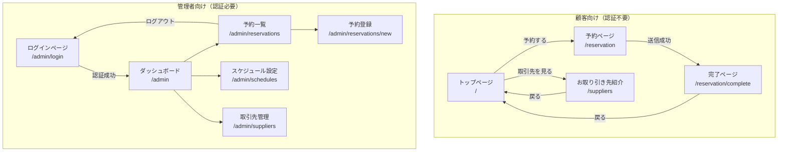

# 画面遷移図

## 1. 全体構成



## 2. 顧客向け画面

### 2.1 画面一覧

| 画面名 | パス | 説明 |
|--------|------|------|
| トップページ | `/` | 店舗情報・予約への導線 |
| 予約ページ | `/reservation` | 予約フォーム |
| 完了ページ | `/reservation/complete` | 予約申請完了 |
| お取り引き先紹介 | `/suppliers` | 取引先一覧ページ |

### 2.2 トップページ

```
┌─────────────────────────────────────────┐
│  さて、羊に戻るとしよう                   │
│  ─和紅茶とお野菜と富山湾の幸─             │
├─────────────────────────────────────────┤
│                                         │
│  ■ コンセプト                           │
│  小麦、乳製品、卵、添加物などは          │
│  使わないお昼ご飯を提供...               │
│                                         │
│  ■ 営業時間                             │
│  月火水土祝 11:30-15:00 (LO 13:30)      │
│  日 8:30-15:00 (LO 13:30) 朝営業あり    │
│  定休日: 木・金                          │
│  ※Web予約の可否はスケジュールAPIに従う   │
│                                         │
│  ■ アクセス                             │
│  富山県高岡市駅南5丁目4-7               │
│  WINE LAB内                             │
│                                         │
│  ┌─────────────────────────────┐        │
│  │      予約する               │        │
│  └─────────────────────────────┘        │
│                                         │
│  ※8名以上・当日予約・2週間以上先は      │
│   Instagramへ @satehits                 │
│                                         │
└─────────────────────────────────────────┘
```

### 2.3 予約ページ

```
┌─────────────────────────────────────────┐
│  ← 戻る            予約                  │
├─────────────────────────────────────────┤
│                                         │
│  ■ 来店日を選択                          │
│  ┌───────────────────────────────┐      │
│  │  2025年2月                     │      │
│  │  日 月 火 水 木 金 土          │      │
│  │                    1          │      │
│  │  2  3  4  5 ×  ×  8          │      │
│  │  9 10 11 12 ×  × 15          │      │
│  └───────────────────────────────┘      │
│  ※グレー: 定休日  残り○食と表示         │
│                                         │
│  ■ 来店時間                             │
│  ┌─────────────────────────────┐        │
│  │  12:00                  ▼   │        │
│  └─────────────────────────────┘        │
│                                         │
│  ■ 人数                                 │
│  ┌─────────────────────────────┐        │
│  │  2名                    ▼   │        │
│  └─────────────────────────────┘        │
│  ※8名以上はInstagramへ                  │
│                                         │
│  ■ お名前 *                             │
│  ┌─────────────────────────────┐        │
│  │  山田太郎                    │        │
│  └─────────────────────────────┘        │
│                                         │
│  ■ 電話番号 *                           │
│  ┌─────────────────────────────┐        │
│  │  090-1234-5678               │        │
│  └─────────────────────────────┘        │
│                                         │
│  ■ メールアドレス *                     │
│  ┌─────────────────────────────┐        │
│  │  yamada@example.com          │        │
│  └─────────────────────────────┘        │
│                                         │
│  ■ 備考（魚の火入れ希望・テーブル席希望等）│
│  ┌─────────────────────────────┐        │
│  │                              │        │
│  │                              │        │
│  └─────────────────────────────┘        │
│  ※アレルギー・苦手食材の対応は         │
│   行っておりません                       │
│                                         │
│  ┌─────────────────────────────┐        │
│  │  ☑ reCAPTCHA                │        │
│  └─────────────────────────────┘        │
│                                         │
│  ┌─────────────────────────────┐        │
│  │      予約を申請する          │        │
│  └─────────────────────────────┘        │
│                                         │
└─────────────────────────────────────────┘
```

### 2.4 完了ページ

```
┌─────────────────────────────────────────┐
│            予約申請完了                  │
├─────────────────────────────────────────┤
│                                         │
│           ✓                             │
│                                         │
│  予約申請を受け付けました               │
│                                         │
│  ────────────────────                   │
│  来店日: 2025年2月10日                  │
│  時間: 12:00                            │
│  人数: 2名                              │
│  お名前: 山田太郎 様                    │
│  ────────────────────                   │
│                                         │
│  オーナーが確認後、                      │
│  承認・拒否をご連絡いたします。          │
│                                         │
│  ⚠️ キャンセルポリシー                   │
│  ・キャンセルは前日までにご連絡ください  │
│  ・当日キャンセルは100%のキャンセル料    │
│    が発生します                          │
│                                         │
│  ※変更・キャンセルは                    │
│   Instagramへご連絡ください              │
│   @satehits                             │
│                                         │
│  ┌─────────────────────────────┐        │
│  │      トップに戻る            │        │
│  └─────────────────────────────┘        │
│                                         │
└─────────────────────────────────────────┘
```

### 2.5 お取り引き先紹介ページ

```
┌─────────────────────────────────────────┐
│  ← 戻る       お取り引き先               │
├─────────────────────────────────────────┤
│                                         │
│  当店は、富山県内の素晴らしい生産者の    │
│  皆様に支えられています。               │
│                                         │
│  ─────────────────────────────          │
│                                         │
│  ┌─────────────────────────────────┐    │
│  │  [画像]                          │    │
│  │                                  │    │
│  │  〇〇農園                        │    │
│  │  富山県で無農薬野菜を栽培        │    │
│  │  されています。旬の野菜を        │    │
│  │  直接仕入れています。            │    │
│  │                                  │    │
│  │  📷 Instagramを見る              │    │
│  └─────────────────────────────────┘    │
│                                         │
│  ┌─────────────────────────────────┐    │
│  │  [画像]                          │    │
│  │                                  │    │
│  │  △△和紅茶園                     │    │
│  │  国産和紅茶を生産されています。  │    │
│  │  当店の和紅茶はこちらから        │    │
│  │  仕入れています。                │    │
│  │                                  │    │
│  │  📷 Instagramを見る              │    │
│  └─────────────────────────────────┘    │
│                                         │
│  ─────────────────────────────          │
│                                         │
│  お取り引きに関するお問い合わせは       │
│  Instagramへお願いいたします。          │
│  📷 @satehits                           │
│                                         │
└─────────────────────────────────────────┘
```

## 3. 管理者向け画面

### 3.1 画面一覧

| 画面名 | パス | 説明 |
|--------|------|------|
| ログイン | `/admin/login` | 認証画面 |
| ダッシュボード | `/admin` | 管理トップ |
| 予約一覧 | `/admin/reservations` | 日別予約管理 |
| 予約登録 | `/admin/reservations/new` | オーナーによる予約登録 |
| スケジュール設定 | `/admin/schedules` | 月間スケジュール管理 |
| 取引先管理 | `/admin/suppliers` | 取引先の追加・編集・削除 |

### 3.2 ログインページ

```
┌─────────────────────────────────────────┐
│           管理者ログイン                 │
├─────────────────────────────────────────┤
│                                         │
│  ■ メールアドレス                       │
│  ┌─────────────────────────────┐        │
│  │  owner@example.com           │        │
│  └─────────────────────────────┘        │
│                                         │
│  ■ パスワード                           │
│  ┌─────────────────────────────┐        │
│  │  ••••••••                    │        │
│  └─────────────────────────────┘        │
│                                         │
│  ┌─────────────────────────────┐        │
│  │      ログイン                │        │
│  └─────────────────────────────┘        │
│                                         │
└─────────────────────────────────────────┘
```

### 3.3 ダッシュボード

```
┌─────────────────────────────────────────┐
│  🏠 ダッシュボード          [ログアウト] │
├─────────────────────────────────────────┤
│                                         │
│  ■ 今日の予約                           │
│  ┌─────────────────────────────────┐    │
│  │  2025年2月7日（金）定休日       │    │
│  └─────────────────────────────────┘    │
│                                         │
│  ■ 明日の予約                           │
│  ┌─────────────────────────────────┐    │
│  │  承認待ち: 2件                  │    │
│  │  承認済み: 3件 (6名)            │    │
│  │  残り: 4食                      │    │
│  └─────────────────────────────────┘    │
│                                         │
│  ┌────────────┐  ┌────────────┐         │
│  │ 予約一覧   │  │ 提供数設定 │         │
│  └────────────┘  └────────────┘         │
│                                         │
└─────────────────────────────────────────┘
```

### 3.4 予約一覧ページ

```
┌─────────────────────────────────────────┐
│  ← 戻る        予約一覧      [ログアウト]│
├─────────────────────────────────────────┤
│                                         │
│  ■ 日付を選択                           │
│  ┌─────────────────────────────┐        │
│  │  2025-02-10            📅   │        │
│  └─────────────────────────────┘        │
│                                         │
│  残り: 4食 / 10食                       │
│                                         │
│  ┌─────────────────────────────────┐    │
│  │ 🟡 12:00 山田太郎 (2名)         │    │
│  │    📞 090-1234-5678             │    │
│  │    ✉️ yamada@example.com        │    │
│  │    申請中                        │    │
│  │    [承認] [拒否]                 │    │
│  ├─────────────────────────────────┤    │
│  │ 🟢 12:30 佐藤花子 (4名)         │    │
│  │    📞 080-9876-5432             │    │
│  │    ✉️ sato@example.com          │    │
│  │    備考: エビアレルギーあり      │    │
│  │    承認済み                      │    │
│  │    [No Show]                     │    │
│  └─────────────────────────────────┘    │
│                                         │
│  🟡申請中  🟢承認  🔴拒否  ⚫No Show    │
│                                         │
└─────────────────────────────────────────┘
```

### 3.5 スケジュール設定ページ

```
┌─────────────────────────────────────────┐
│  ← 戻る    スケジュール設定  [ログアウト]│
├─────────────────────────────────────────┤
│                                         │
│  ■ 2026年2月                     [< >]  │
│                                         │
│  ┌───────────────────────────────────┐  │
│  │ 日  月  火  水  木  金  土        │  │
│  │  1   2   3   4   5   6   7       │  │
│  │ 朝      通  通  休  休  朝       │  │
│  │  8   9  10  11  12  13  14      │  │
│  │ 朝      通  ｲﾍﾞ  休  休  朝       │  │
│  │ 15  16  17  18  19  20  21      │  │
│  │ 朝      通  通  休  休  朝       │  │
│  │ 22  23  24  25  26  27  28      │  │
│  │ 朝  特      通  休  休  朝       │  │
│  └───────────────────────────────────┘  │
│                                         │
│  凡例: 通=通常 朝=朝営業 ｲﾍﾞ=店内イベント 外=外部イベント（店休）│
│       特=特別メニュー 休=定休日 臨=臨時休                    │
│                                         │
│  ─────────────────────────────          │
│  ■ 2026-02-11 (水) の設定               │
│                                         │
│  タイプ: ┌─────────────────┐            │
│          │ 外部イベント（店休）▼ │            │
│          └─────────────────┘            │
│                                         │
│  イベント名:                             │
│  ┌─────────────────────────────┐        │
│  │ 和紅茶をしばく会              │        │
│  └─────────────────────────────┘        │
│                                         │
│  説明（顧客に表示）:                     │
│  ┌─────────────────────────────┐        │
│  │ 和紅茶をしばく会 入門編      │        │
│  │ @WINE LAB.                   │        │
│  │ 通常のランチ営業はおやすみ   │        │
│  └─────────────────────────────┘        │
│                                         │
│  提供可能数: ┌───────┐                   │
│              │  0  ▼ │                   │
│              └───────┘                   │
│                                         │
│  ┌─────────────────────────────┐        │
│  │      保存する                │        │
│  └─────────────────────────────┘        │
│                                         │
└─────────────────────────────────────────┘
```

### 3.6 予約登録ページ（オーナー用）

```
┌─────────────────────────────────────────┐
│  ← 戻る      予約登録        [ログアウト]│
├─────────────────────────────────────────┤
│                                         │
│  ■ 予約経路 *                           │
│  ┌─────────────────────────────┐        │
│  │ Instagram              ▼   │        │
│  └─────────────────────────────┘        │
│                                         │
│  ■ 来店日 *                             │
│  ┌─────────────────────────────┐        │
│  │  2026-02-10            📅   │        │
│  └─────────────────────────────┘        │
│                                         │
│  ■ 来店時間 *                           │
│  ┌─────────────────────────────┐        │
│  │  12:00                  ▼   │        │
│  └─────────────────────────────┘        │
│                                         │
│  ■ 人数 *                               │
│  ┌─────────────────────────────┐        │
│  │  2名                    ▼   │        │
│  └─────────────────────────────┘        │
│                                         │
│  ■ お名前 *                             │
│  ┌─────────────────────────────┐        │
│  │                              │        │
│  └─────────────────────────────┘        │
│                                         │
│  ■ 電話番号 *                           │
│  ┌─────────────────────────────┐        │
│  │                              │        │
│  └─────────────────────────────┘        │
│                                         │
│  ■ メールアドレス *                     │
│  ┌─────────────────────────────┐        │
│  │                              │        │
│  └─────────────────────────────┘        │
│                                         │
│  ■ 備考                                 │
│  ┌─────────────────────────────┐        │
│  │                              │        │
│  └─────────────────────────────┘        │
│                                         │
│  ■ ステータス                           │
│  ┌─────────────────────────────┐        │
│  │ 承認済み                ▼   │        │
│  └─────────────────────────────┘        │
│                                         │
│  ┌─────────────────────────────┐        │
│  │      登録する                │        │
│  └─────────────────────────────┘        │
│                                         │
└─────────────────────────────────────────┘
```

### 3.7 取引先管理ページ

```
┌─────────────────────────────────────────┐
│  ← 戻る      取引先管理      [ログアウト]│
├─────────────────────────────────────────┤
│                                         │
│  ┌─────────────────────────────┐        │
│  │     + 取引先を追加          │        │
│  └─────────────────────────────┘        │
│                                         │
│  ┌─────────────────────────────────┐    │
│  │ ☰ 〇〇農園                      │    │
│  │   富山県で無農薬野菜を...        │    │
│  │   🟢 表示中                      │    │
│  │   [編集] [削除]                  │    │
│  ├─────────────────────────────────┤    │
│  │ ☰ △△和紅茶園                   │    │
│  │   国産和紅茶を生産...            │    │
│  │   🟢 表示中                      │    │
│  │   [編集] [削除]                  │    │
│  ├─────────────────────────────────┤    │
│  │ ☰ □□水産                       │    │
│  │   富山湾の新鮮な魚を...          │    │
│  │   ⚫ 非表示                      │    │
│  │   [編集] [削除]                  │    │
│  └─────────────────────────────────┘    │
│                                         │
│  ※ ドラッグで並び替え可能               │
│                                         │
└─────────────────────────────────────────┘
```

### 3.8 取引先編集モーダル

```
┌─────────────────────────────────────────┐
│  取引先を編集                      [×]  │
├─────────────────────────────────────────┤
│                                         │
│  ■ 取引先名 *                           │
│  ┌─────────────────────────────┐        │
│  │ 〇〇農園                     │        │
│  └─────────────────────────────┘        │
│                                         │
│  ■ 説明文 *                             │
│  ┌─────────────────────────────┐        │
│  │ 富山県で無農薬野菜を栽培    │        │
│  │ されています。旬の野菜を    │        │
│  │ 直接仕入れています。        │        │
│  └─────────────────────────────┘        │
│                                         │
│  ■ Instagram URL                        │
│  ┌─────────────────────────────┐        │
│  │ https://instagram.com/...   │        │
│  └─────────────────────────────┘        │
│                                         │
│  ■ 画像                                 │
│  ┌─────────────────────────────┐        │
│  │  📷 画像をアップロード       │        │
│  └─────────────────────────────┘        │
│                                         │
│  ■ 表示設定                             │
│  ☑ サイトに表示する                     │
│                                         │
│  ┌────────────┐  ┌────────────┐         │
│  │ キャンセル │  │   保存     │         │
│  └────────────┘  └────────────┘         │
│                                         │
└─────────────────────────────────────────┘
```

## 4. 画面遷移マトリクス

| 遷移元 | 遷移先 | トリガー |
|--------|--------|----------|
| トップ | 予約 | 「予約する」ボタン |
| 予約 | トップ | 「戻る」ボタン |
| 予約 | 完了 | 予約申請成功 |
| 完了 | トップ | 「トップに戻る」ボタン |
| ログイン | ダッシュボード | ログイン成功 |
| ダッシュボード | 予約一覧 | メニュー選択 |
| ダッシュボード | 提供数設定 | メニュー選択 |
| 予約一覧 | ダッシュボード | 「戻る」ボタン |
| 提供数設定 | ダッシュボード | 「戻る」ボタン |
| 任意の管理画面 | ログイン | ログアウト |

## 5. ファイル構成（Astro + React）

### ディレクトリ構成

```
frontend/src/
├── pages/                          # ファイルベースルーティング
│   ├── index.astro                 # / （トップページ）
│   ├── reservation.astro           # /reservation （予約フォーム）
│   ├── suppliers.astro             # /suppliers （取引先紹介）
│   └── admin/
│       ├── index.astro             # /admin （ダッシュボード）
│       ├── login.astro             # /admin/login
│       ├── reservations.astro      # /admin/reservations
│       └── schedules.astro         # /admin/schedules
│       └── suppliers.astro         # /admin/suppliers
├── components/
│   ├── astro/                      # 静的コンポーネント（.astro）
│   │   ├── Header.astro
│   │   ├── Footer.astro
│   │   ├── HeroSection.astro
│   │   └── SupplierCard.astro
│   └── react/                      # React Islands（.tsx）
│       ├── ReservationForm.tsx      # 予約フォーム（カレンダー + 入力）
│       ├── LoginForm.tsx            # ログインフォーム
│       ├── ReservationTable.tsx     # 予約一覧テーブル
│       ├── ScheduleCalendar.tsx     # スケジュールカレンダー
│       ├── ScheduleSettingForm.tsx  # スケジュール設定フォーム
│       ├── SupplierManager.tsx      # 取引先 CRUD
│       └── DashboardSummary.tsx     # ダッシュボードサマリー
└── layouts/
    ├── BaseLayout.astro             # 顧客向け共通レイアウト
    └── AdminLayout.astro            # 管理者向け共通レイアウト
```

### ページとコンポーネントの対応

| パス | ページファイル（.astro） | React Island（.tsx） | ハイドレーション |
|------|-------------------------|---------------------|-----------------|
| `/` | `index.astro` | なし | - |
| `/reservation` | `reservation.astro` | `ReservationForm.tsx` | `client:load` |
| `/suppliers` | `suppliers.astro` | なし | - |
| `/admin/login` | `admin/login.astro` | `LoginForm.tsx` | `client:load` |
| `/admin` | `admin/index.astro` | `DashboardSummary.tsx` | `client:load` |
| `/admin/reservations` | `admin/reservations.astro` | `ReservationTable.tsx` | `client:load` |
| `/admin/schedules` | `admin/schedules.astro` | `ScheduleCalendar.tsx` / `ScheduleSettingForm.tsx` | `client:load` |
| `/admin/suppliers` | `admin/suppliers.astro` | `SupplierManager.tsx` | `client:load` |

### ファイル配置の考え方

- **`.astro` ファイル（ページ・静的コンポーネント）**: JavaScript を一切含まない静的 HTML として配信。ヘッダー、フッター、テキストコンテンツなど。
- **`.tsx` ファイル（React Islands）**: ユーザー操作が必要な部分だけ React でハイドレーション。フォーム入力、API 通信、状態管理が必要な箇所。

#### Astro ページでの React Island 使用例

```astro
---
// reservation.astro
import BaseLayout from '../layouts/BaseLayout.astro';
import ReservationForm from '../components/react/ReservationForm.tsx';
---

<BaseLayout title="予約">
  <h1>予約</h1>
  <!-- React Island: ページ読み込み時にハイドレーション -->
  <ReservationForm client:load />
</BaseLayout>
```

## 6. レスポンシブ対応

| 画面 | PC | タブレット | スマホ |
|------|-----|------------|--------|
| トップ | ○ | ○ | ○ |
| 予約 | ○ | ○ | ○ |
| 完了 | ○ | ○ | ○ |
| ログイン | ○ | ○ | △（オーナー用なので優先度低） |
| ダッシュボード | ○ | ○ | △ |
| 予約一覧 | ○ | ○ | △ |
| 提供数設定 | ○ | ○ | △ |
