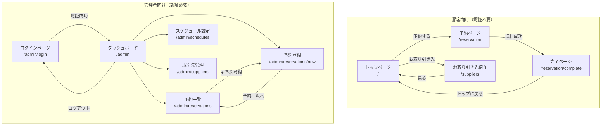

# 画面遷移図

各画面の要素と操作は実装（`frontend/src/pages/**` と `components/react/*.tsx`）から起こしている。ファイル構成は `CLAUDE.md` §3 を正とする。

## 1. 全体構成

管理画面はどの画面からも共通ナビ（§3.1）で予約一覧・予約登録・スケジュール設定・取引先管理へ移動でき、ロゴでダッシュボードに戻れる。図では共通ナビの矢印を省略している。

## 2. 顧客向け画面

### 2.1 画面一覧

| 画面名 | パス | 説明 |
|--------|------|------|
| トップページ | `/` | 店舗紹介・営業カレンダー・予約への導線 |
| 予約ページ | `/reservation` | 予約フォーム |
| 完了ページ | `/reservation/complete` | 予約申請完了 |
| お取り引き先紹介 | `/suppliers` | 取引先一覧ページ |

**共通ヘッダー・フッター**（`Header.astro` / `Footer.astro`）

- ヘッダー: ロゴ（トップへ）、ページ内リンク（Top / Concept / Menu / Attention / Store Info）、「予約する」（`/reservation`）、「お取り引き先」（`/suppliers`）。スマホはハンバーガーメニュー
- フッター: 店名・住所・営業時間、「予約する」「お取り引き先」リンク、Instagram

### 2.2 トップページ

- **目的**: 店舗のコンセプト・料理・来店時の注意を伝え、予約へ誘導する
- **主要な要素**
  - ヒーロー
  - コンセプト（「和紅茶とお野菜と富山湾の幸」）
  - お料理について: 食材へのこだわり（小麦・乳製品・卵・添加物は不使用、富山県産の魚・米、無農薬野菜）、料理について、アレルギー・苦手食材は対応しない旨
  - ご来店の方へ（開閉式）
    - 営業について（既定で開く）: 当月の営業カレンダー（`PublicScheduleCalendar`）。店舗定例の営業時間・定休日のヘッダー、休業日のセルに「休」、朝営業の日付に丸印、イベント名がある日にイベントバー、凡例「〇…朝営業」、Event Info（日付・イベント名・説明）
    - ご予約について: 1 日 10 食限定、予約可能期間（翌日〜14 日先）、人数 1〜7 名、日曜朝営業は予約不可、キャンセルポリシー、「8名以上の団体、当日予約、2週間以上先のご予約は Instagram DM へ」
    - お席について / 駐車場について
  - 店舗情報: 住所、営業時間（月火水土祝 11:30-15:00、日 8:30-15:00、LO 13:30、定休日 木・金）、Instagram DM、席数、Google マップ、「予約する」ボタン、注記「※ 8名以上・当日予約・2週間以上先は Instagram へ」
- **操作と遷移**: 「予約する」（ヘッダー・店舗情報・フッター）→ 予約ページ。「お取り引き先」（ヘッダー・フッター）→ お取り引き先紹介
- **状態**: 営業カレンダーは読み込み中に「読み込み中…」、取得失敗時に「スケジュールを表示できません。時間をおいて再度ご確認ください。」

### 2.3 予約ページ

- **目的**: 顧客が来店日時・人数・連絡先を入力して予約を申請する
- **主要な要素**（`ReservationForm.tsx`）
  - 来店日を選択: 月カレンダー（前月・次月の移動）。予約可能範囲内の営業日に「残N」（残り 3 食以下は赤字）、範囲内の休業日に「休」。範囲外・休業日・残り 0 の日は選択不可。注記「※ 翌日〜14日先まで予約可能です」。選択中の日付と残り食数を表示
  - 来店時間: 11:30〜13:30 の 30 分刻み（日付を選ぶまで無効）
  - 人数: 1〜7 名。注記「※ 8名以上の場合は Instagram DM よりお問い合わせください」
  - お名前 / 電話番号 / メールアドレス（必須）
  - 備考（プレースホルダ「魚の火入れ希望・テーブル席希望等」）。注記「※ アレルギー・苦手食材の対応は行っておりません」
  - Cloudflare Turnstile ウィジェット
  - 「予約を申請する」ボタン
- **操作と遷移**: 送信成功で完了ページへ（表示用の予約内容を `sessionStorage` に保存）。ヘッダーからトップへ戻れる
- **状態**
  - 空き状況の読み込み中は「空き状況を読み込み中...」、取得失敗時はエラーと「空き状況を取得できないため、来店日を選択できません」を出し送信不可
  - 入力エラーは各欄の下に表示。API の `VALIDATION_ERROR` は欄ごとに、その他は送信ボタン上にまとめて表示し、Turnstile をリセットする
  - Turnstile 未完了の間は送信不可。本番でサイトキー未設定なら「予約フォームの認証（Turnstile）が未設定のため、本番環境ではお申し込みできません」、開発環境では認証をスキップする旨を表示
  - 送信中はボタンが「送信中...」

### 2.4 完了ページ

- **目的**: 申請を受け付けたことと、今後の流れ・キャンセルポリシーを伝える
- **主要な要素**
  - チェックマーク、「予約申請を受け付けました」「ありがとうございます」
  - 予約内容（来店日・時間・人数・お名前）
  - 「オーナーが確認後、承認・拒否をご連絡いたします。」とキャンセルポリシー（前日までに連絡、当日キャンセルは 100% のキャンセル料）
  - 「変更・キャンセルは Instagram へご連絡ください」と @satehits へのリンク
  - 「トップに戻る」ボタン
- **操作と遷移**: 「トップに戻る」→ トップページ
- **状態**: 予約内容は `sessionStorage` から読み、表示後に削除する。読めないとき（直接アクセス・再読み込み）は「予約情報を取得できませんでした」

### 2.5 お取り引き先紹介ページ

- **目的**: 取引先の生産者を紹介する
- **主要な要素**
  - 「戻る」リンク（トップへ）、見出し「お取り引き先」、紹介文
  - 取引先カード（`SupplierList.tsx`、`client:visible`）: 画像（未設定ならプレースホルダ）、取引先名、説明文、「Instagramを見る」（URL がある場合のみ）。公開中の取引先を表示順に並べる
  - お取り引きの問い合わせ先（Instagram @satehits）
- **操作と遷移**: 「戻る」→ トップページ
- **状態**: 読み込み中はスケルトン 2 枚、取得失敗時はエラー文言、0 件なら「現在、公開中の取引先はありません」

## 3. 管理者向け画面

### 3.1 画面一覧

| 画面名 | パス | 説明 |
|--------|------|------|
| ログイン | `/admin/login` | 認証画面 |
| ダッシュボード | `/admin` | 管理トップ |
| 予約一覧 | `/admin/reservations` | 予約の確認・承認・拒否・キャンセル |
| 予約登録 | `/admin/reservations/new` | オーナーによる予約登録 |
| スケジュール設定 | `/admin/schedules` | 月間スケジュール管理 |
| 取引先管理 | `/admin/suppliers` | 取引先の追加・編集・削除・並び替え |

**共通ナビ**（`AdminLayout.astro`。ログイン以外の管理画面）

- ロゴ「さて、羊に戻るとしよう - 管理画面」: ダッシュボードへのリンク（画面ごとの戻るボタンは置かない）
- ナビ項目: 予約一覧（+ 未対応バッジ）/ 予約登録 / スケジュール / 取引先 / ログアウト。スマホはハンバーガーメニュー（全画面オーバーレイ、Esc で閉じる）
- 認証: 表示時に `ensureAccessToken()` で AT を確認し（必要なら RT Cookie で refresh）、失敗したらログインページへ
- ログアウト: API でログアウトし、結果にかかわらずログインページへ

**共通ナビの未対応バッジ**

管理画面共通ナビ（PC ナビ・モバイルメニュー）の「予約一覧」リンク横に、未対応 pending 件数を赤い丸バッジ（赤地に白数字、10 件以上は「9+」）で表示する。

- 件数の定義: `status = pending` かつ `visit_date` が今日以降（ローカル日付）。過去日の pending は数えない
- 取得: 認証確認後に `GET /admin/reservations?status=pending` を非同期で呼び、ページ描画はブロックしない
- 再取得: 予約一覧でのステータス更新後（`pending-count-changed` イベント）と bfcache 復帰時（`pageshow` の `persisted`）に取り直す。ナビとダッシュボードの同時取得は 1 リクエストにまとめる
- 0 件または取得失敗時はバッジを出さない
- 読み上げ: バッジの数字は `aria-hidden`、読み上げ名は「未対応の予約 N 件」（件数は 9+ に丸めない）
- リンク: バッジ自体を `/admin/reservations?range=all&status=pending`（全期間の申請中一覧）へのリンクにする。「予約一覧」の文字リンクはクエリなしのまま（入れ子の `a` を作らないため、バッジは文字リンクの隣に置く独立したリンク）
- ロジックは `lib/pendingReservations.ts`（`countActionablePending` / `formatBadgeCount` / `fetchActionablePendingCount` / `notifyPendingCountChanged` / `subscribePendingCountRefresh`）

### 3.2 ログインページ

- **目的**: 管理者を認証する
- **主要な要素**（`LoginForm.tsx`。共通ナビなし）: 見出し「管理者ログイン」、メールアドレス、パスワード、「ログイン」ボタン
- **操作と遷移**: ログイン成功 → ダッシュボード
- **状態**
  - 未入力: 「メールアドレスとパスワードを入力してください」
  - 認証失敗（401）: 「メールアドレスまたはパスワードが正しくありません」
  - 入力エラー・試行回数超過: API のメッセージをそのまま表示
  - その他: 「ログインに失敗しました。時間をおいて再度お試しください。」
  - 送信中はボタンが「ログイン中...」

### 3.3 ダッシュボード

- **目的**: 今日・明日の予約状況と未対応の予約をひと目で確認する
- **主要な要素**（`DashboardSummary.tsx`）
  - 見出し「ダッシュボード」
  - 未対応の注意帯（下記）
  - 「今日の予約」「明日の予約」のサマリーカード: 日付、残り提供数（残り / 提供数）、承認待ち件数、承認済み件数（人数）、先頭 3 件の予約（時刻・名前・人数・ステータス）と「他 N件」。休業日は「定休日」
  - クイックリンク 5 つ: 予約一覧（未対応バッジ付き）/ 予約登録 / スケジュール / 取引先 / サイト確認（トップページを別タブで開く）
- **操作と遷移**: クイックリンク・注意帯の「予約一覧へ」・共通ナビから各画面へ
- **状態**: サマリーカードは読み込み中に「読み込み中...」、空き状況・予約の取得失敗はカード内にエラー表示（予約の取得失敗時は件数を「—」）

**未対応の注意帯**

- 未対応 pending（今日以降）が 1 件以上あるとき、見出し直下に赤系の注意帯「未対応の予約が N 件あります。承認または拒否を行ってください」と「予約一覧へ」リンク（`/admin/reservations?range=all&status=pending`）を表示する。クイックリンク「予約一覧」にも共通ナビと同じ赤バッジを付ける。0 件なら何も出さない

### 3.4 予約一覧ページ

- **目的**: 日付ごと・全期間の予約を確認し、ステータスを変更する
- **主要な要素**（`ReservationTable.tsx` / `MonthCalendar.tsx`）
  - 見出し「予約一覧」と「+ 予約登録」ボタン
  - カレンダー（左）: 月移動、各日にスケジュール種別バッジ、営業日は「N件」と「予約済み食数/提供数食」、未対応の赤点（下記）、種別の凡例。今日を強調し、選択日に枠
  - 表示範囲の見出し・ステータス select（「すべてのステータス」/ 申請中 / 承認済み / 拒否 / キャンセル / No Show）・全期間トグル（下記）
  - 空き状況（選択日）: 「残り: N食 / 提供数食」「予約済み: N食」。休業日は「定休日」
  - 予約カード: ステータス色の点、来店時刻、名前（人数）、ステータスバッジ（申請中 / 承認済み / 拒否 / キャンセル / No Show の 5 状態）、電話番号、メールアドレス、備考
  - 操作ボタン（カード下部「操作:」）: 申請中は「承認」「拒否」「キャンセル」、承認済みは「No Show」「キャンセル」。拒否・キャンセル・No Show は終端でボタンなし
  - 確認ダイアログ（`ConfirmModal`）: 「予約を承認」「予約を拒否」「予約をキャンセル」「No Show に変更」。拒否では「拒否理由（任意）」の入力欄と「入力した場合のみ、顧客への拒否メールに理由が記載されます。」
  - ステータスの凡例（5 状態の色）
- **操作と遷移**
  - カレンダーの日付を押すと選択日の予約を表示
  - ステータスボタン → 確認ダイアログ → 実行後に一覧・空き状況を取り直し、未対応バッジの再取得を通知する
  - 「+ 予約登録」・共通ナビ → 予約登録
- **状態**
  - 読み込み中は「読み込み中...」（カレンダー・一覧それぞれ）、空き状況は「空き状況を読み込み中...」
  - 取得失敗はエラー帯と「予約を取得できませんでした」。ステータス更新の失敗もエラー帯で表示
  - 選択日モードの空表示: 「予約がありません」、休業日は「この日は定休日です」

**カレンダーの未対応マーカー**

- 未対応（`pending`）が 1 件以上ある日のセル右上に赤い点を出す（数字は出さない）。読み上げ用に `sr-only` で「未対応あり」
- 対象は今日以降の日だけ。過去日の pending には点を付けない（ナビのバッジと同じ `countActionablePending` で数える）
- 点は絶対配置で、「N件 x/y食」の表示を押し出さない。スケジュール設定・予約フォームのカレンダーには出さない

**全期間トグル**

- 右側パネルの表示範囲の見出しと同じ行の右端に「全期間」のトグルスイッチ（`role="switch"`）を置く（見出しは左、トグルは右。狭い幅では折り返す）。OFF（既定）は選択日モード、ON は全期間モード
- 行の左の見出しは、選択日モードでは選択日（例「2026年9月10日（木）」）、全期間モードでは「全期間の予約」。ステータス絞り込みの `select` は見出しの隣に置く
- ステータスの絞り込みはどちらのモードでも効き、トグルを切り替えても選択は保持する
- 全期間モードの一覧は来店日昇順で、日付見出し（例「2026年9月26日（土）」）ごとにグループ化する。今日以降を先に並べ、過去分は末尾の「過去の予約（N件）」の折りたたみ（既定は閉じる）にまとめる
- 日付見出し、またはカレンダーの日付を押すと、トグルが OFF になりその日が選択される（全期間のまま日付選択はしない）
- 該当 0 件のときは「未対応の予約はありません」（`status` が `pending` 以外なら「該当する予約はありません」）と「選択日の表示に戻る」ボタンを出す。出すのは取得に成功したときだけで、読み込み中はローディング、失敗時はエラー表示のまま。自動で選択日モードには戻さない
- 最後の 1 件を承認・拒否してカードが消えたら、空表示の文言にフォーカスを移す

**URL クエリ**

- `/admin/reservations?range=all&status=pending` で「トグル ON + 申請中」の状態で開く。`range` は `all` のみ、`status` は既存の選択肢のみ有効で、不正値は既定にフォールバックする
- トグル・ステータスを変えたら `history.replaceState` で URL に反映する（履歴は増やさない）。既定状態ならクエリを消す

### 3.5 スケジュール設定ページ

- **目的**: 日ごとの営業種別・提供数・イベント情報を設定し、必要なら店舗定例に戻す
- **主要な要素**（`ScheduleCalendar.tsx` / `MonthCalendar.tsx`）
  - 見出し「スケジュール設定」
  - カレンダー: 月移動、各日にスケジュール種別の短縮バッジ（通 / 朝 / イ / 外 / 特 / 休）、選択日に枠
  - 凡例: 通常 / 朝営業 / イベント / 外部イベント（店休）/ 特別メニュー / 定休日・臨時休（`closed` のバッジは定休日・臨時休で共通なので併記。#43）
  - 設定パネル（日付を選ぶと表示。未選択時は「カレンダーから日付を選択してください」）
    - 見出し「YYYY/MM/DD の設定」
    - タイプ select: 通常 / 朝営業 / イベント / 外部イベント（店休）/ 特別メニュー / 臨時休。店舗定例の木金を開いたときの `closed` の選択肢は「定休日」と表示する
    - イベント名（イベント・外部イベントのとき。必須）
    - 説明（顧客に表示）（イベント・外部イベント・特別メニューのとき）
    - 提供可能数 select（0〜15）。外部イベントでは欄を隠し、0 で保存する
    - 「保存する」ボタン
    - 「定例に戻す」ボタン（個別設定がある日だけ）
  - 店舗定例に戻す確認ダイアログ: 「YYYY/MM/DD の個別設定を削除し、店舗定例に戻します。」と、戻る先の店舗定例のプレビュー（`storeDefaultSchedule.ts` の祝日 → 曜日ルール）
- **操作と遷移**: 日付選択 → 設定を編集 → 保存（Upsert）。「定例に戻す」→ 確認 → 削除して月を取り直す
- **状態**
  - 月の取得中はカレンダーに「読み込み中...」、取得失敗時はエラー帯と「スケジュールを表示できません」
  - 保存時にイベント名が空なら「イベント名は必須です」。API の入力エラーは詳細メッセージを連結して表示。保存中は「保存中...」
  - 定例に戻す失敗はダイアログ内に表示（すでに定例なら「すでに店舗定例です」）

### 3.6 予約登録ページ（オーナー用）

- **目的**: Instagram・電話などで受けた予約をオーナーが登録する
- **主要な要素**（`ReservationCreateForm.tsx`）
  - 見出し「予約登録」
  - 予約経路（必須）: Instagram / 電話 / ウォークイン / その他
  - 来店日（必須）: ポップアップの日付ピッカー（`DatePickerField.tsx`。月カレンダーに種別バッジと「残N」、休業日は「休」。休業日・満席日も選択できる）
  - 来店時間（必須）: 8:30〜13:30 の 30 分刻み
  - 人数（必須）: 1〜7 名
  - お名前 / 電話番号 / メールアドレス（必須）、備考
  - ステータス: 承認済み（既定）/ 申請中
  - 「登録する」ボタン
- **操作と遷移**
  - 登録前に、ステータスが承認済み・申請中なら空き状況を取得し、提供数を超える場合は `window.confirm` で確認する（「提供可能数（N食）を超えて登録されます（予約済み N食 + 今回 N食 = N食）。このまま登録しますか？」）。空き状況を取得できなかった場合も「空き状況を確認できませんでした。提供可能数を超える可能性があります。このまま登録しますか？」で確認する
  - 登録成功で「予約を登録しました」と「予約一覧へ」（→ 予約一覧）「続けて登録」（フォームを初期化）を表示し、未対応バッジの再取得を通知する
- **状態**: 未入力は各欄の下にエラー。API の入力エラーは欄ごと、その他はボタン上に表示。送信中は「登録中...」。日付ピッカーは読み込み中・スケジュール取得失敗・予約サマリー取得失敗をポップアップ内に表示

### 3.7 取引先管理ページ

- **目的**: 公開ページに出す取引先を管理する
- **主要な要素**（`SupplierManager.tsx`）
  - 見出し「取引先管理」
  - 「+ 取引先を追加」ボタン
  - 取引先カード（表示順）: ドラッグハンドル、画像サムネイル（ある場合）、取引先名、表示状態バッジ（表示中 / 非表示）、説明文（2 行まで）、Instagram リンク（ある場合）、「編集」「削除」ボタン
  - 注記「※ ドラッグで並び替え可能」
- **操作と遷移**
  - 「+ 取引先を追加」「編集」→ 取引先編集モーダル（§3.8）
  - 「削除」→ 確認ダイアログ「この取引先を削除しますか？この操作は取り消せません。」→ 削除
  - カードをドラッグして並び替え（ドラッグ終了時に並び順を保存）
- **状態**: 読み込み中は「読み込み中...」、0 件は「取引先が登録されていません」。取得・削除・並び替えの失敗はエラー帯で表示し、並び替えに失敗したら一覧を取り直す

### 3.8 取引先編集モーダル

- **目的**: 取引先を追加・編集する
- **主要な要素**
  - タイトル「取引先を追加」/「取引先を編集」
  - 取引先名（必須）、説明文（必須）、Instagram URL
  - 画像: プレビュー、ファイル選択（JPEG / PNG / WebP、5MB 以内）
  - 「サイトに表示する」トグル
  - 「キャンセル」「保存する」ボタン
- **操作と遷移**: 保存で取引先を作成・更新し、画像を選んでいればアップロードする。キャンセルで閉じる
- **状態**: 未入力・URL 不正は各欄の下にエラー（「取引先名を入力してください」「説明文を入力してください」「有効なInstagramのURLを入力してください」）、API エラーはモーダル内に表示。保存中は「保存中...」。新規作成後に画像アップロードだけ失敗した場合は、作成済みの取引先の編集モードに切り替わるので、再保存しても二重作成しない

## 4. 画面遷移マトリクス

| 遷移元 | 遷移先 | トリガー |
|--------|--------|----------|
| トップ | 予約 | 「予約する」ボタン（ヘッダー・店舗情報・フッター） |
| トップ | お取り引き先紹介 | 「お取り引き先」リンク（ヘッダー・フッター） |
| 予約 | 完了 | 予約申請成功 |
| 完了 | トップ | 「トップに戻る」ボタン |
| お取り引き先紹介 | トップ | 「戻る」リンク |
| ログイン | ダッシュボード | ログイン成功 |
| ダッシュボード | 予約一覧 | クイックリンク「予約一覧」/ 注意帯「予約一覧へ」 |
| ダッシュボード | 予約登録 | クイックリンク「予約登録」 |
| ダッシュボード | スケジュール | クイックリンク「スケジュール」 |
| ダッシュボード | 取引先 | クイックリンク「取引先」 |
| 予約一覧 | 予約登録 | 「+ 予約登録」ボタン / ナビ |
| 予約登録 | 予約一覧 | 登録成功後の「予約一覧へ」 / ナビ |
| 任意の管理画面 | 予約一覧 / 予約登録 / スケジュール / 取引先 | ナビ |
| 任意の管理画面 | 予約一覧（全期間・申請中） | ナビの未対応バッジ |
| 任意の管理画面 | ダッシュボード | ロゴ |
| 任意の管理画面 | ログイン | ログアウト / 認証切れ |

## 5. レスポンシブ対応

| 画面 | PC | タブレット | スマホ |
|------|-----|------------|--------|
| トップ | ○ | ○ | ○ |
| 予約 | ○ | ○ | ○ |
| 完了 | ○ | ○ | ○ |
| お取り引き先紹介 | ○ | ○ | ○ |
| ログイン | ○ | ○ | △（オーナー用なので優先度低） |
| ダッシュボード | ○ | ○ | △ |
| 予約一覧 | ○ | ○ | △ |
| 予約登録 | ○ | ○ | △ |
| スケジュール設定 | ○ | ○ | △ |
| 取引先管理 | ○ | ○ | △ |
