# シーケンス図

## 1. 残り食数確認（顧客）

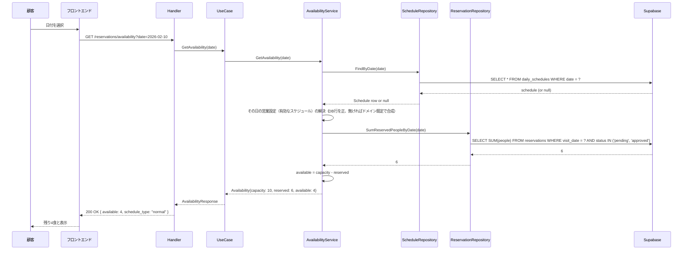

## 2. 予約申請成功（顧客）

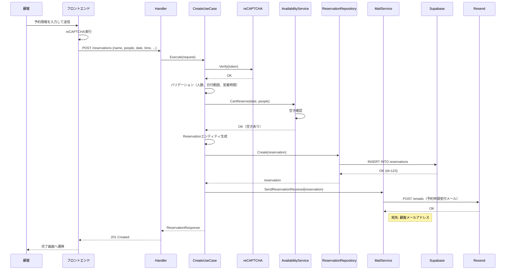

## 3. 予約申請失敗（空きなし）

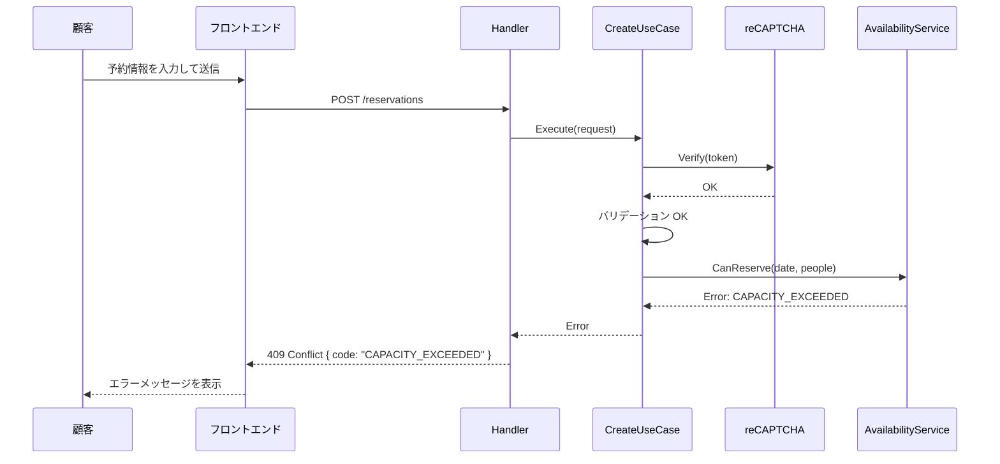

## 4. ログイン（オーナー）

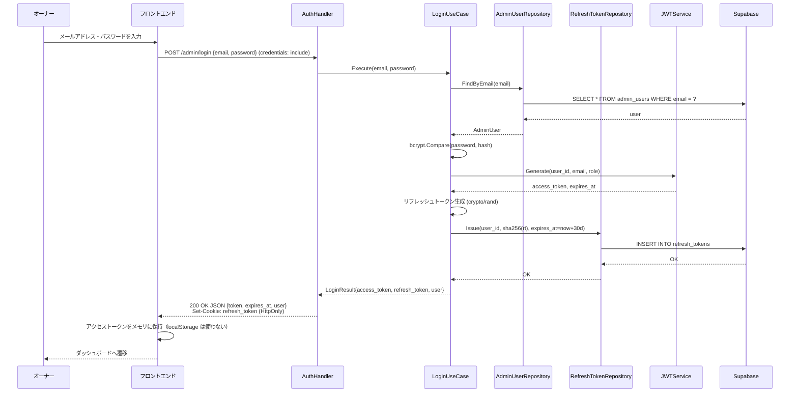

## 4.1. アクセストークン更新（リフレッシュ）

ページ再読み込みや AT 期限切れ（401）時に、Cookie の RT で新しい AT を取得する。

正常系は **検証 → 読み取り（ユーザー取得・AT 生成）→ 旧 RT の Revoke と新 RT の Issue を 1 トランザクション** の順で行う。副作用のない処理を先に済ませ、状態を変える Revoke / Issue を最後にまとめることで、途中失敗でセッションを壊さない。

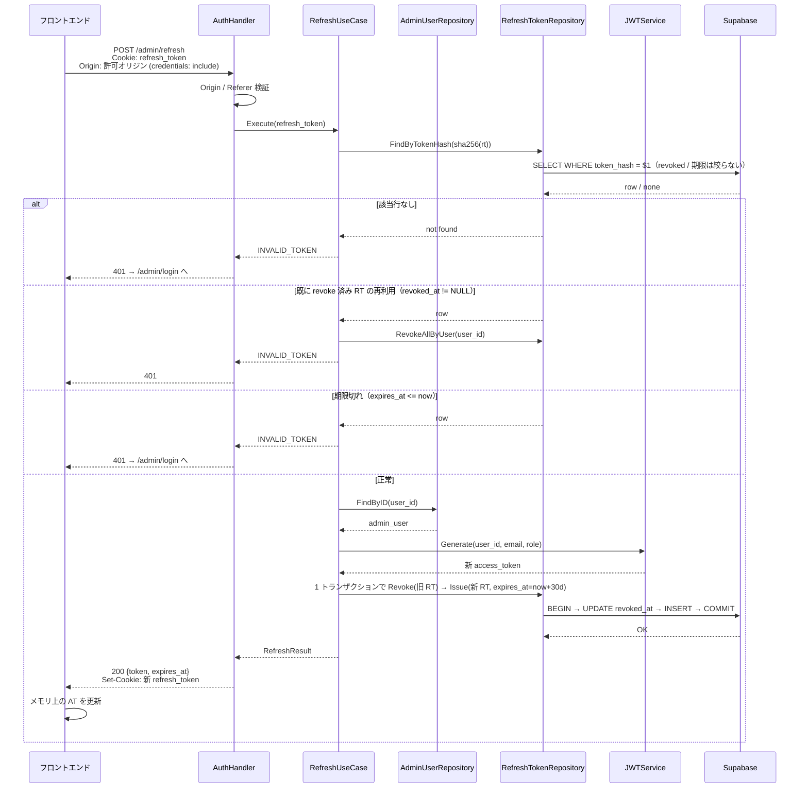

## 4.2. ログアウト（オーナー）

Cookie の RT をサーバ側で revoke し、Cookie を削除する。有効な AT（`Authorization: Bearer`）も必須（`api_design.md` 参照）。

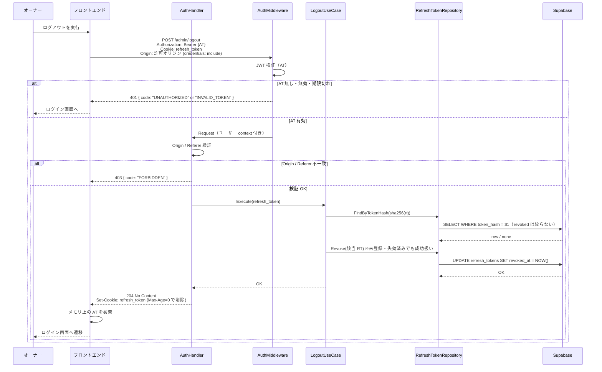

## 5. 予約一覧取得（オーナー）

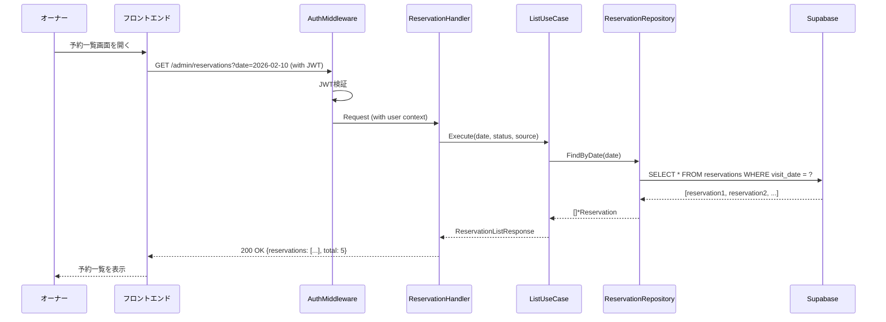

## 6. 予約承認（オーナー）

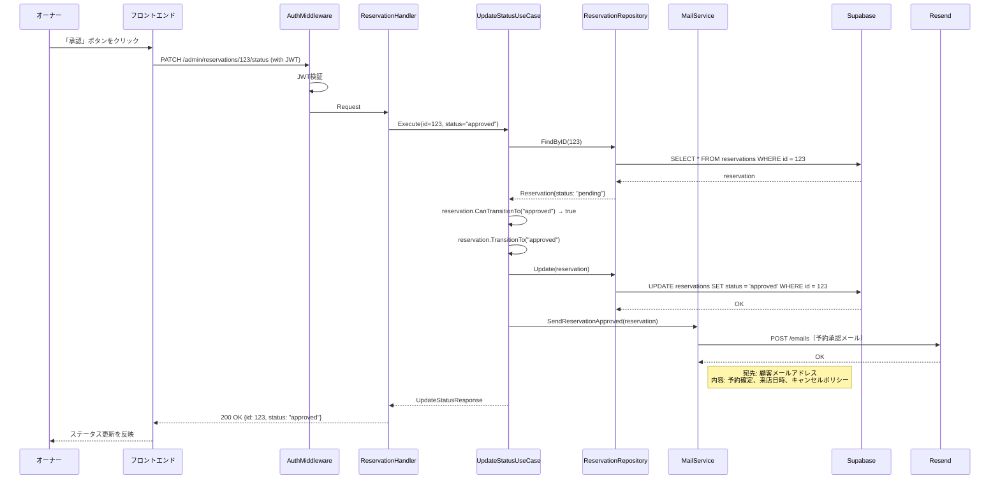

## 7. 予約拒否（オーナー）

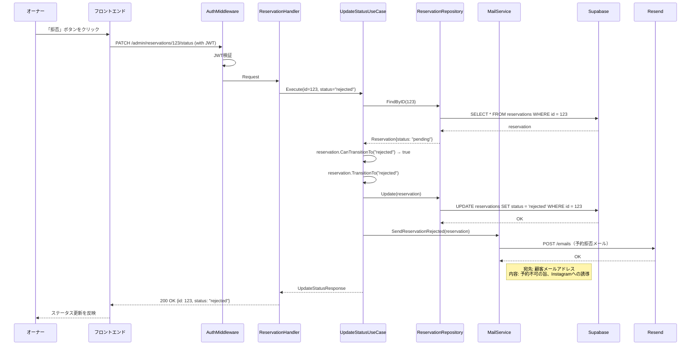

## 8. メール送信シーケンス

予約に関する各種メール通知は、バックエンドの UseCase から MailService（Resend）を経由して顧客に送信される。

### 8.1 予約申請受付メール（顧客へ）

顧客がWebから予約を申請した直後に送信される。

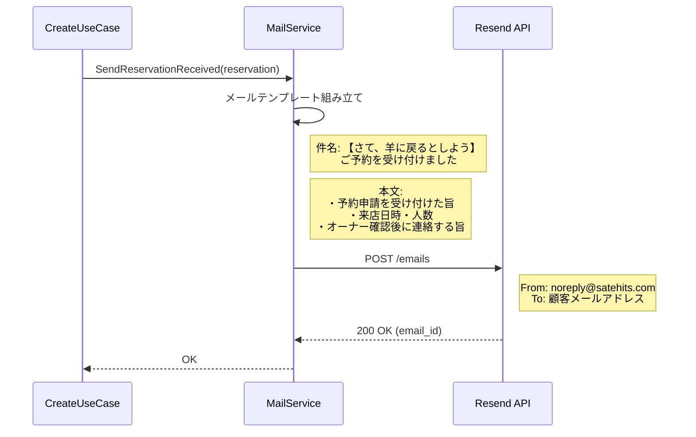

### 8.2 予約承認メール（顧客へ）

オーナーが予約を承認した時に送信される。

### 8.3 予約拒否メール（顧客へ）

オーナーが予約を拒否した時に送信される。

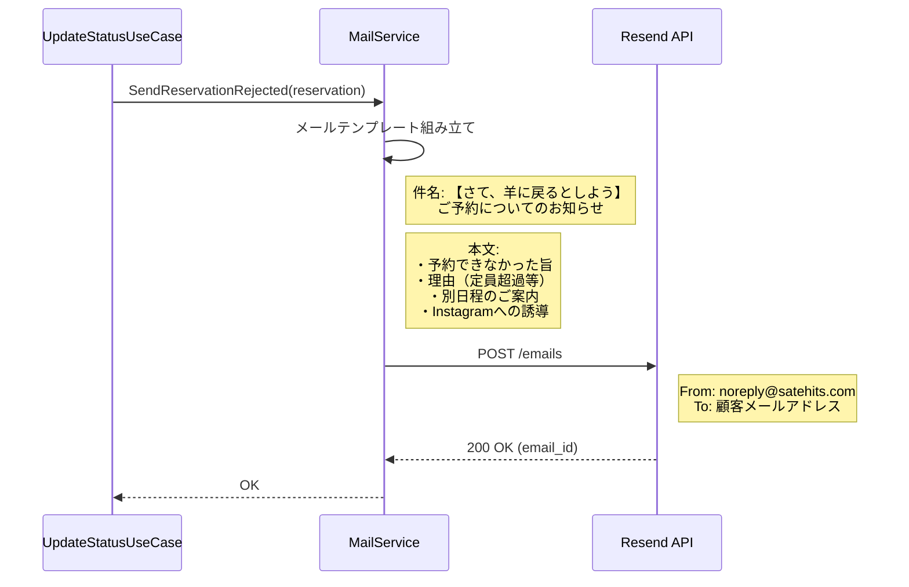

## 9. スケジュール設定（オーナー）

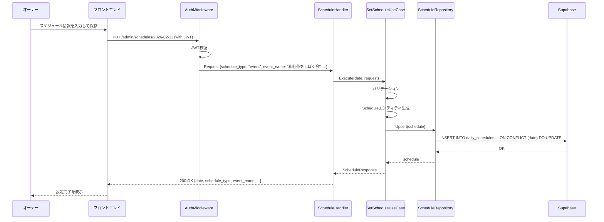

## 10. 予約登録（オーナー）

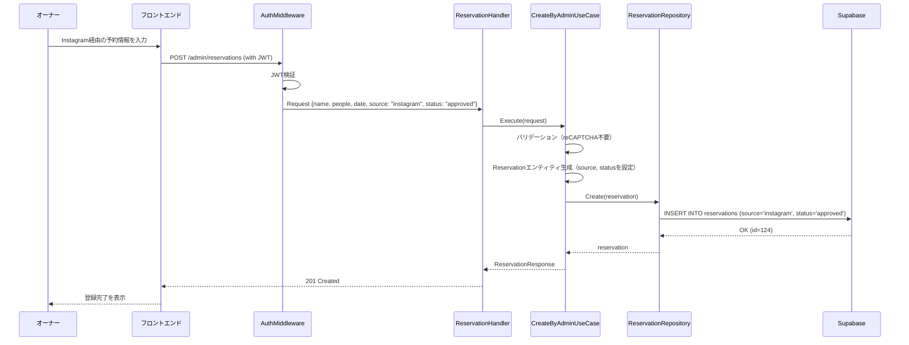

## 11. 認証エラー

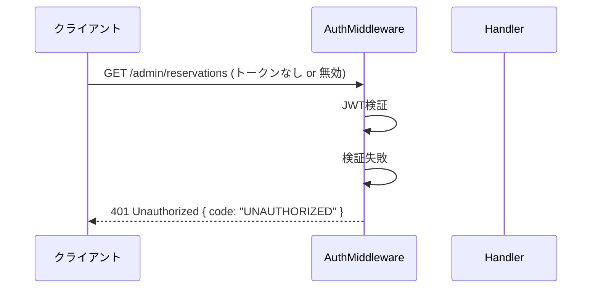

## 12. 取引先登録（オーナー）

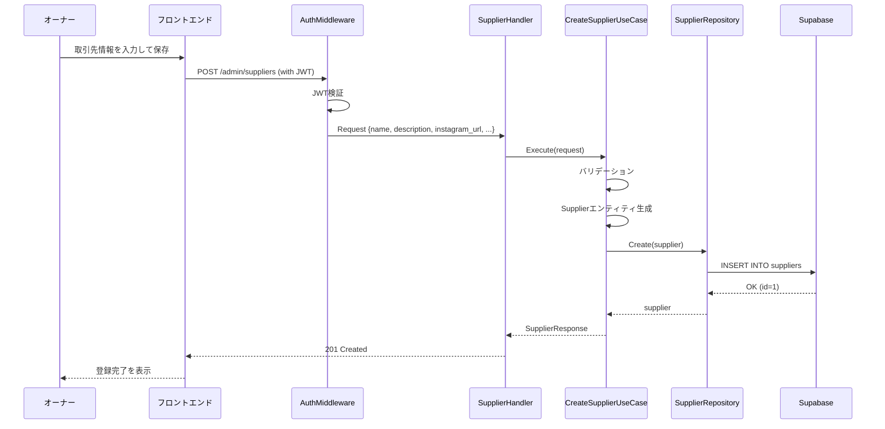
