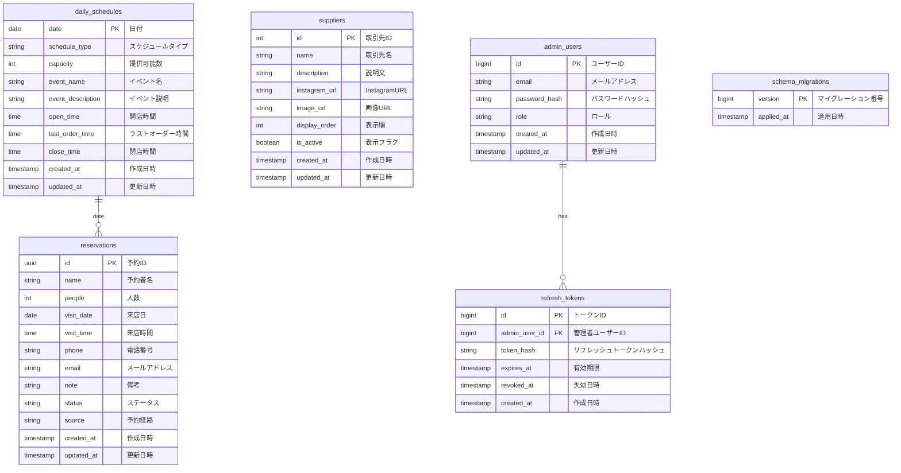
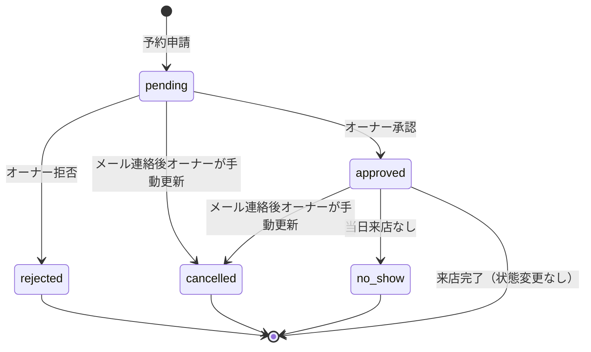

# テーブル設計

## 1. ER図（Mermaid）



## 2. テーブル定義

### 2.1 reservations（予約）

予約情報を管理するテーブル。

| カラム名 | データ型 | NULL | デフォルト | 説明 |
|----------|----------|------|------------|------|
| id | UUID | NO | `gen_random_uuid()` | 予約ID（主キー） |
| name | TEXT | NO | - | 予約者名 |
| people | INTEGER | NO | - | 人数（1〜7） |
| visit_date | DATE | NO | - | 来店日 |
| visit_time | TIME | NO | - | 来店時間 |
| phone | TEXT | NO | - | 電話番号 |
| email | TEXT | NO | - | メールアドレス |
| note | TEXT | YES | NULL | 備考（魚の火入れ希望・テーブル席希望等） |
| status | TEXT | NO | 'pending' | ステータス |
| source | TEXT | NO | 'web' | 予約経路 |
| created_at | TIMESTAMPTZ | NO | NOW() | 作成日時 |
| updated_at | TIMESTAMPTZ | NO | NOW() | 更新日時 |

**制約:**
- `people`: CHECK (people >= 1 AND people <= 7)
- `status`: CHECK (status IN ('pending', 'approved', 'rejected', 'cancelled', 'no_show'))
- `source`: CHECK (source IN ('web', 'instagram', 'phone', 'walk_in', 'other'))

**インデックス:**
- `idx_reservations_visit_date`: visit_date（日付検索用）
- `idx_reservations_status`: status（ステータス絞り込み用）
- `idx_reservations_created_at`: created_at（半年経過データ削除バッチ用）
- `idx_reservations_unique_active`: `(visit_date, visit_time, phone)` の部分ユニーク（`status IN ('pending', 'approved')` のみ。キャンセル・拒否後は同じ電話番号で再予約可）

**ステータスの値:**
| 値 | 説明 |
|----|------|
| pending | 申請中（Web 予約直後） |
| approved | 承認済み |
| rejected | 拒否 |
| cancelled | メール連絡を受け、オーナーが手動でキャンセルに更新 |
| no_show | 当日来店なし |

**将来追加（メール送信実装時）:**

非同期メール送信の送信済み判定・再送用。初回実装（インプロセス非同期キュー + Resend）では **追加しない**。Cloud Tasks ワーカー等で再送・監査が必要になったタイミングで別マイグレーションで追加する。

**拒否理由（reject_reason）:**

オーナーが拒否時に任意入力できる理由は **DB カラムとしては保存しない**。PATCH `/admin/reservations/{id}/status` の任意 `reason` をメール本文生成にのみ使用する。

```sql
ALTER TABLE reservations ADD COLUMN IF NOT EXISTS email_sent_at TIMESTAMPTZ;
```

- `NULL` = 未送信
- 値あり = 送信済み（ワーカーが送信成功時に `NOW()` をセット）
- 顧客向け API レスポンスには含めない（内部用）

**sourceの値:**
| 値 | 説明 |
|----|------|
| web | Webサイトからの予約 |
| instagram | Instagram DMからの予約（オーナー登録） |
| phone | 電話からの予約（オーナー登録） |
| walk_in | 飛び込み・直接来店（オーナー登録） |
| other | その他（知人など、オーナー登録） |

### 2.2 daily_schedules（日別スケジュール）

日ごとのスケジュール・営業情報を管理するテーブル。

| カラム名 | データ型 | NULL | デフォルト | 説明 |
|----------|----------|------|------------|------|
| date | DATE | NO | - | 日付（主キー） |
| schedule_type | TEXT | NO | - | スケジュールタイプ |
| capacity | INTEGER | NO | 10 | 提供可能数 |
| event_name | TEXT | YES | NULL | イベント名 |
| event_description | TEXT | YES | NULL | イベント説明（顧客に表示） |
| open_time | TIME | YES | NULL | 開店時間（`normal` / `morning` / `special_menu` / `event` で未指定時はアプリが店舗デフォルトを補完。`closed` は常に NULL） |
| last_order_time | TIME | YES | NULL | ラストオーダー時間（上記と同様） |
| close_time | TIME | YES | NULL | 閉店時間（上記と同様） |
| created_at | TIMESTAMPTZ | NO | NOW() | 作成日時 |
| updated_at | TIMESTAMPTZ | NO | NOW() | 更新日時 |

**制約:**
- `capacity`: CHECK (capacity >= 0)
- `schedule_type`: CHECK (schedule_type IN ('normal', 'morning', 'event', 'external_event', 'special_menu', 'closed'))

**schedule_typeの値:**
| 値 | 説明 | 予約 | デフォルト営業時間 |
|----|------|------|-------------------|
| normal | 通常営業（月火水土祝） | 可 | 11:30-15:00 (LO 13:30) |
| morning | 朝営業（日曜） | 可 | 8:30-15:00 (LO 13:30) |
| event | 店内イベント等（和紅茶をしばく会等）。`event_name` 必須 | 可（注意書き表示） | 省略時は曜日別デフォルト |
| external_event | 外部イベント（店舗休業）。`event_name` 必須 | 不可（イベント情報表示） | - |
| special_menu | 特別メニュー（リゾットランチ等） | 可（注意書き表示） | 通常と同じ |
| closed | 臨時休業 | 不可 | - |

**備考（営業可否・提供数の「正」）:**
- **該当日付に行が存在する場合** — その行の `schedule_type`・`capacity`・時刻などが**唯一の正**（顧客向け空き・カレンダー・予約可否はこれに従う）。
- **行が存在しない場合** — アプリケーションがドメイン既定（店の定例カレンダーに基づく曜日別の既定 `schedule_type` / `capacity` など）で**その日の営業設定（有効なスケジュール）**を合成する。臨時変更や例外は、オーナーが `PUT /admin/schedules/{date}` 等で行を作成し、`daily_schedules` に永続化する。

### 2.3 admin_users（管理者ユーザー）

管理画面にログインできるユーザーを管理するテーブル。

| カラム名 | データ型 | NULL | デフォルト | 説明 |
|----------|----------|------|------------|------|
| id | BIGSERIAL | NO | auto | ユーザーID（主キー） |
| email | TEXT | NO | - | メールアドレス（ユニーク） |
| password_hash | TEXT | NO | - | パスワードハッシュ（bcrypt） |
| role | TEXT | NO | - | ロール |
| created_at | TIMESTAMPTZ | NO | NOW() | 作成日時 |
| updated_at | TIMESTAMPTZ | NO | NOW() | 更新日時 |

**制約:**
- `email`: UNIQUE
- `role`: CHECK (role IN ('owner', 'developer'))

**備考:**
- パスワードは bcrypt（cost 12）でハッシュ化して保存する（`api_design.md` 参照）
- 開発用の初期データ投入は `backend/cmd/seed`（`make seed`）を使う

### 2.4 refresh_tokens（リフレッシュトークン）

管理者セッションのリフレッシュトークン（RT）を管理するテーブル。平文の RT は保存せず、**SHA-256 ハッシュのみ**を `token_hash` に格納する（`api_design.md` の認証方式参照）。

| カラム名 | データ型 | NULL | デフォルト | 説明 |
|----------|----------|------|------------|------|
| id | BIGSERIAL | NO | auto | トークンID（主キー） |
| admin_user_id | BIGINT | NO | - | 管理者ユーザーID（`admin_users.id` への外部キー） |
| token_hash | TEXT | NO | - | RT の SHA-256 ハッシュ（ユニーク） |
| expires_at | TIMESTAMPTZ | NO | - | 有効期限（ログイン・refresh 成功時に発行時刻から30日後。スライディング） |
| revoked_at | TIMESTAMPTZ | YES | NULL | 失効日時（ログアウト・ローテーション・漏洩疑い時に設定） |
| created_at | TIMESTAMPTZ | NO | NOW() | 作成日時 |

**制約:**
- `admin_user_id`: `REFERENCES admin_users(id) ON DELETE CASCADE`
- `token_hash`: UNIQUE

**インデックス:**
- `idx_refresh_tokens_hash`: `token_hash`（`revoked_at IS NULL` の部分インデックス。有効トークン検索用）
- `idx_refresh_tokens_user`: `admin_user_id`（ユーザー単位の revoke 用）

**運用ルール（アプリケーション側）:**
- **発行**: ログイン・`POST /admin/refresh` 成功時に新規 RT を INSERT
- **ローテーション**: refresh 成功時に旧行の `revoked_at` を設定し、新行を INSERT
- **ログアウト**: 該当 RT の `revoked_at` を設定
- **再利用検知**: 既に `revoked_at` が設定された RT が再送された場合、当該 `admin_user_id` の全 RT を revoke（漏洩疑い）

### 2.5 suppliers（お取り引き先）

お取り引き先の情報を管理するテーブル。

| カラム名 | データ型 | NULL | デフォルト | 説明 |
|----------|----------|------|------------|------|
| id | SERIAL | NO | auto | 取引先ID（主キー） |
| name | TEXT | NO | - | 取引先名 |
| description | TEXT | NO | - | 説明文 |
| instagram_url | TEXT | YES | NULL | InstagramのURL |
| image_url | TEXT | YES | NULL | 画像URL |
| display_order | INTEGER | NO | 0 | 表示順（小さいほど上） |
| is_active | BOOLEAN | NO | true | 表示フラグ |
| created_at | TIMESTAMPTZ | NO | NOW() | 作成日時 |
| updated_at | TIMESTAMPTZ | NO | NOW() | 更新日時 |

**インデックス:**
- `idx_suppliers_display_order`: display_order（表示順ソート用）
- `idx_suppliers_is_active`: is_active（表示フィルタ用）

### 2.6 schema_migrations（スキーママイグレーション履歴）

`backend/cmd/migrate` が `migrations/*.sql` を適用した際に、適用済みのバージョン番号を記録するテーブル。`ensureSchemaMigrationsTable` で `CREATE TABLE IF NOT EXISTS` により初回接続時に自動作成される。業務テーブルとは外部キーで結ばない。

| カラム名 | データ型 | NULL | デフォルト | 説明 |
|----------|----------|------|------------|------|
| version | BIGINT | NO | - | マイグレーションファイル名の先頭番号（例: `000001_...sql` → `1`）。主キー |
| applied_at | TIMESTAMPTZ | NO | NOW() | 当該バージョンを適用した日時（行 INSERT 時） |

**備考:**
- 1ファイルの SQL をトランザクションで実行し、成功後に `INSERT INTO schema_migrations (version) VALUES (...)` で記録する（実装は `applyMigration`）。

### 2.7 マイグレーションファイル（`backend/migrations/`）

`backend/cmd/migrate` が番号昇順で適用する SQL の一覧。`schema_migrations` は migrate 実行時に自動作成（2.6 参照）。

| ファイル | version | 内容 |
|----------|---------|------|
| `000001_init_reservations.sql` | 1 | `reservations`（UUID、CHECK、インデックス、部分ユニーク） |
| `000002_daily_schedules.sql` | 2 | `daily_schedules`、`update_updated_at_column()`、`daily_schedules` トリガー |
| `000003_reservations_updated_at_trigger.sql` | 3 | `reservations` の `updated_at` トリガー |
| `000004_suppliers.sql` | 4 | `suppliers`、インデックス、トリガー（**未作成**。番号は予約） |
| `000005_admin_users.sql` | 5 | `admin_users`、`updated_at` トリガー |
| `000006_refresh_tokens.sql` | 6 | `refresh_tokens`、インデックス |
| （将来）`reservations.email_sent_at` | - | メール送信実装時に別マイグレーションで追加（2.1 参照） |

## 3. DDL

PostgreSQL 15（Supabase）では `gen_random_uuid()` に拡張不要。Web 上にキャンセル用トークン列（`cancel_token`）は設けない。キャンセル依頼はメール経由でオーナーが `status = cancelled` に手動更新する。

```sql
-- マイグレーション履歴
CREATE TABLE IF NOT EXISTS schema_migrations (
    version     BIGINT PRIMARY KEY,
    applied_at  TIMESTAMPTZ NOT NULL DEFAULT NOW()
);

-- 予約テーブル
CREATE TABLE IF NOT EXISTS reservations (
    id          UUID PRIMARY KEY DEFAULT gen_random_uuid(),
    name        TEXT NOT NULL,
    people      INTEGER NOT NULL CHECK (people >= 1 AND people <= 7),
    visit_date  DATE NOT NULL,
    visit_time  TIME NOT NULL,
    phone       TEXT NOT NULL,
    email       TEXT NOT NULL,
    note        TEXT,
    status      TEXT NOT NULL DEFAULT 'pending'
                CHECK (status IN ('pending', 'approved', 'rejected', 'cancelled', 'no_show')),
    source      TEXT NOT NULL DEFAULT 'web'
                CHECK (source IN ('web', 'instagram', 'phone', 'walk_in', 'other')),
    created_at  TIMESTAMPTZ NOT NULL DEFAULT NOW(),
    updated_at  TIMESTAMPTZ NOT NULL DEFAULT NOW()
);

CREATE INDEX IF NOT EXISTS idx_reservations_visit_date ON reservations (visit_date);
CREATE INDEX IF NOT EXISTS idx_reservations_status ON reservations (status);
CREATE INDEX IF NOT EXISTS idx_reservations_created_at ON reservations (created_at);
CREATE UNIQUE INDEX IF NOT EXISTS idx_reservations_unique_active
    ON reservations (visit_date, visit_time, phone)
    WHERE status IN ('pending', 'approved');

-- 日別スケジュールテーブル
CREATE TABLE IF NOT EXISTS daily_schedules (
    date              DATE PRIMARY KEY,
    schedule_type     TEXT NOT NULL
                      CHECK (schedule_type IN ('normal', 'morning', 'event', 'external_event', 'special_menu', 'closed')),
    capacity          INTEGER NOT NULL DEFAULT 10 CHECK (capacity >= 0),
    event_name        TEXT,
    event_description TEXT,
    open_time         TIME,
    last_order_time   TIME,
    close_time        TIME,
    created_at        TIMESTAMPTZ NOT NULL DEFAULT NOW(),
    updated_at        TIMESTAMPTZ NOT NULL DEFAULT NOW()
);

-- お取り引き先テーブル
CREATE TABLE IF NOT EXISTS suppliers (
    id             SERIAL PRIMARY KEY,
    name           TEXT NOT NULL,
    description    TEXT NOT NULL,
    instagram_url  TEXT,
    image_url      TEXT,
    display_order  INTEGER NOT NULL DEFAULT 0,
    is_active      BOOLEAN NOT NULL DEFAULT true,
    created_at     TIMESTAMPTZ NOT NULL DEFAULT NOW(),
    updated_at     TIMESTAMPTZ NOT NULL DEFAULT NOW()
);

CREATE INDEX IF NOT EXISTS idx_suppliers_display_order ON suppliers (display_order);
CREATE INDEX IF NOT EXISTS idx_suppliers_is_active ON suppliers (is_active);

-- 管理者ユーザーテーブル
CREATE TABLE IF NOT EXISTS admin_users (
    id             BIGSERIAL PRIMARY KEY,
    email          TEXT NOT NULL UNIQUE,
    password_hash  TEXT NOT NULL,
    role           TEXT NOT NULL CHECK (role IN ('owner', 'developer')),
    created_at     TIMESTAMPTZ NOT NULL DEFAULT NOW(),
    updated_at     TIMESTAMPTZ NOT NULL DEFAULT NOW()
);

-- リフレッシュトークンテーブル（平文 RT は保存しない）
CREATE TABLE IF NOT EXISTS refresh_tokens (
    id             BIGSERIAL PRIMARY KEY,
    admin_user_id  BIGINT NOT NULL REFERENCES admin_users(id) ON DELETE CASCADE,
    token_hash     TEXT NOT NULL UNIQUE,
    expires_at     TIMESTAMPTZ NOT NULL,
    revoked_at     TIMESTAMPTZ,
    created_at     TIMESTAMPTZ NOT NULL DEFAULT NOW()
);

CREATE INDEX IF NOT EXISTS idx_refresh_tokens_hash
    ON refresh_tokens (token_hash) WHERE revoked_at IS NULL;
CREATE INDEX IF NOT EXISTS idx_refresh_tokens_user
    ON refresh_tokens (admin_user_id);

-- updated_at 自動更新用のトリガー関数
CREATE OR REPLACE FUNCTION update_updated_at_column()
RETURNS TRIGGER AS $$
BEGIN
    IF NEW IS DISTINCT FROM OLD THEN
        NEW.updated_at = NOW();
    END IF;
    RETURN NEW;
END;
$$ LANGUAGE plpgsql;

-- トリガー設定
CREATE TRIGGER update_reservations_updated_at
    BEFORE UPDATE ON reservations
    FOR EACH ROW
    EXECUTE PROCEDURE update_updated_at_column();

CREATE TRIGGER update_daily_schedules_updated_at
    BEFORE UPDATE ON daily_schedules
    FOR EACH ROW
    EXECUTE PROCEDURE update_updated_at_column();

CREATE TRIGGER update_suppliers_updated_at
    BEFORE UPDATE ON suppliers
    FOR EACH ROW
    EXECUTE PROCEDURE update_updated_at_column();

CREATE TRIGGER update_admin_users_updated_at
    BEFORE UPDATE ON admin_users
    FOR EACH ROW
    EXECUTE PROCEDURE update_updated_at_column();
```

## 4. ステータス遷移図



## 5. サンプルデータ

```sql
-- 管理者ユーザー（開発用）
-- backend/.env に SEED_ADMIN_PASSWORD を設定し `make seed` を実行する（bcrypt でハッシュ化済み）
-- owner@example.com (owner), dev@example.com (developer)

-- 日別スケジュール
INSERT INTO daily_schedules (date, schedule_type, capacity, event_name, event_description) VALUES
('2026-02-01', 'morning', 10, NULL, NULL),  -- 日曜・朝営業
('2026-02-02', 'normal', 10, NULL, NULL),   -- 月曜・通常
('2026-02-07', 'normal', 10, NULL, NULL),  -- 土曜・通常営業
('2026-02-11', 'external_event', 0, '和紅茶をしばく会', '和紅茶をしばく会 入門編@WINE LAB. 通常のランチ営業はおやすみです。'),
('2026-02-23', 'special_menu', 10, 'リゾットランチ', '本日はリゾットランチの日です。');

-- 予約サンプル
INSERT INTO reservations (name, people, visit_date, visit_time, phone, email, note, status, source) VALUES
('山田太郎', 2, '2026-02-10', '12:00', '090-1234-5678', 'yamada@example.com', NULL, 'approved', 'web'),
('佐藤花子', 4, '2026-02-10', '12:30', '080-9876-5432', 'sato@example.com', '魚の火入れ希望', 'pending', 'instagram'),
('鈴木一郎', 3, '2026-02-10', '13:00', '070-1111-2222', 'suzuki@example.com', NULL, 'approved', 'phone');

-- お取り引き先サンプル
INSERT INTO suppliers (name, description, instagram_url, image_url, display_order, is_active) VALUES
('〇〇農園', '富山県で無農薬野菜を栽培されています。旬の野菜を直接仕入れています。', 'https://www.instagram.com/example_farm/', NULL, 1, true),
('△△和紅茶園', '国産和紅茶を生産されています。当店の和紅茶はこちらから仕入れています。', 'https://www.instagram.com/example_tea/', NULL, 2, true),
('□□水産', '富山湾の新鮮な魚を毎朝届けていただいています。', 'https://www.instagram.com/example_fish/', NULL, 3, true);
```
