# ユースケース図

## 1. アクター

| アクター | 説明 |
|----------|------|
| 顧客（Customer） | 予約を行う一般利用者 |
| オーナー（Owner） | 店舗運営者。予約管理・スケジュール管理・取引先管理を行う |
| 開発者（Developer） | システム管理者。オーナーと同等の権限を持つ |
| システム（System） | 自動処理を行う（バリデーション、残数計算、メール通知など） |

## 2. ユースケース一覧

### 顧客向け

| ID | ユースケース | 説明 |
|----|--------------|------|
| UC-C01 | 残り食数を確認する | 指定日の予約可能な残り食数を確認する |
| UC-C02 | 月間スケジュールを確認する | カレンダー形式で月間の営業状況を確認する |
| UC-C03 | 予約を申請する | 名前・人数・来店日時・連絡先を入力して予約を申請する |
| UC-C04 | 予約不可案内を受ける | 条件外（当日・8名以上・2週間以上先）の場合、Instagramへ案内される |
| UC-C05 | お取り引き先を確認する | 食材の仕入れ先を確認する |

### オーナー向け - 認証

| ID | ユースケース | 説明 |
|----|--------------|------|
| UC-O01 | ログインする | 認証を行い管理画面にアクセスする |
| UC-O02 | ログアウトする | セッションを終了する |

### オーナー向け - 予約管理

| ID | ユースケース | 説明 |
|----|--------------|------|
| UC-O10 | 予約一覧を確認する | 日付で絞り込んで予約一覧を表示する |
| UC-O11 | 予約を承認する | 予約申請を承認し、確定状態にする |
| UC-O12 | 予約を拒否する | 予約申請を拒否する |
| UC-O13 | 無断キャンセルを記録する | 来店しなかった予約をno_showにする |
| UC-O14 | 予約を登録する | Instagram/電話/知人経由の予約を登録する |

### オーナー向け - スケジュール管理

| ID | ユースケース | 説明 |
|----|--------------|------|
| UC-O20 | スケジュールを確認する | 月間のスケジュール設定を確認する |
| UC-O21 | スケジュールを設定する | 日別のスケジュール（タイプ・提供数・イベント情報）を設定する |
| UC-O22 | スケジュールを削除する | 設定を削除してデフォルトに戻す |

### オーナー向け - 取引先管理

| ID | ユースケース | 説明 |
|----|--------------|------|
| UC-O30 | 取引先一覧を確認する | 取引先の一覧を表示する |
| UC-O31 | 取引先を登録する | 新しい取引先を登録する |
| UC-O32 | 取引先を編集する | 取引先の情報を編集する |
| UC-O33 | 取引先を削除する | 取引先を削除する |
| UC-O34 | 取引先の表示順を変更する | 表示順を並び替える |

### システム - メール通知

| ID | ユースケース | 説明 |
|----|--------------|------|
| UC-S01 | 予約申請受付メールを送信する | 顧客がWebから予約申請した直後に受付確認メールを送信する |
| UC-S02 | 予約承認メールを送信する | オーナーが予約を承認した時に確定通知メールを送信する |
| UC-S03 | 予約拒否メールを送信する | オーナーが予約を拒否した時に不可通知メールを送信する |

## 3. ユースケース図（Mermaid）

```mermaid
graph TB
    subgraph アクター
        Customer[👤 顧客]
        Owner[👔 オーナー]
        Developer[💻 開発者]
    end

    subgraph 顧客向け機能
        UC_C01[残り食数を確認する]
        UC_C02[月間スケジュールを確認する]
        UC_C03[予約を申請する]
        UC_C04[予約不可案内を受ける]
        UC_C05[お取り引き先を確認する]
    end

    subgraph 認証機能
        UC_O01[ログインする]
        UC_O02[ログアウトする]
    end

    subgraph 予約管理機能
        UC_O10[予約一覧を確認する]
        UC_O11[予約を承認する]
        UC_O12[予約を拒否する]
        UC_O13[無断キャンセルを記録する]
        UC_O14[予約を登録する]
    end

    subgraph スケジュール管理機能
        UC_O20[スケジュールを確認する]
        UC_O21[スケジュールを設定する]
        UC_O22[スケジュールを削除する]
    end

    subgraph 取引先管理機能
        UC_O30[取引先一覧を確認する]
        UC_O31[取引先を登録する]
        UC_O32[取引先を編集する]
        UC_O33[取引先を削除する]
        UC_O34[表示順を変更する]
    end

    subgraph メール通知機能
        UC_S01[予約申請受付メールを送信する]
        UC_S02[予約承認メールを送信する]
        UC_S03[予約拒否メールを送信する]
    end

    System[System]

    Customer --> UC_C01
    Customer --> UC_C02
    Customer --> UC_C03
    Customer --> UC_C04
    Customer --> UC_C05

    Owner --> UC_O01
    Owner --> UC_O02
    Owner --> UC_O10
    Owner --> UC_O11
    Owner --> UC_O12
    Owner --> UC_O13
    Owner --> UC_O14
    Owner --> UC_O20
    Owner --> UC_O21
    Owner --> UC_O22
    Owner --> UC_O30
    Owner --> UC_O31
    Owner --> UC_O32
    Owner --> UC_O33
    Owner --> UC_O34

    Developer --> UC_O01
    Developer --> UC_O02
    Developer --> UC_O10
    Developer --> UC_O11
    Developer --> UC_O12
    Developer --> UC_O13
    Developer --> UC_O14
    Developer --> UC_O20
    Developer --> UC_O21
    Developer --> UC_O22
    Developer --> UC_O30
    Developer --> UC_O31
    Developer --> UC_O32
    Developer --> UC_O33
    Developer --> UC_O34

    UC_C03 -.->|トリガー| UC_S01
    UC_O11 -.->|トリガー| UC_S02
    UC_O12 -.->|トリガー| UC_S03

    System --> UC_S01
    System --> UC_S02
    System --> UC_S03
```

## 4. ユースケース詳細

### UC-C01: 残り食数を確認する

| 項目 | 内容 |
|------|------|
| アクター | 顧客 |
| 事前条件 | なし |
| 事後条件 | 指定日の残り食数が表示される |
| 基本フロー | 1. 顧客が日付を選択する 2. システムが残り食数を計算する 3. 残り食数が表示される |
| 代替フロー | その日の営業設定（有効なスケジュール）で休業に相当する場合は「定休」等の表示（APIの `is_holiday` 等に従う） |
| 計算式 | 残り食数 = 提供可能数 - 予約済み（pending + approved）の合計人数（NOTE: ローンチ前に要確認 pending を reserved に含める仮方針） |

### UC-C02: 予約を申請する

| 項目 | 内容 |
|------|------|
| アクター | 顧客 |
| 事前条件 | 残り食数が1以上 |
| 事後条件 | 予約が「申請中（pending）」状態で登録される |
| 基本フロー | 1. 顧客が予約情報を入力する 2. システムがバリデーションを行う 3. reCAPTCHAで認証する 4. 予約が登録される 5. 完了画面が表示される |
| 入力項目 | 名前（必須）、人数（必須）、来店日（必須）、来店時間（必須）、電話番号（必須）、メールアドレス（必須）、備考（任意） |

### UC-C02: バリデーションルール

| 項目 | ルール |
|------|--------|
| 人数 | 1〜7名 |
| 来店日 | 翌日〜14日後まで |
| 来店日 | その日の営業設定（有効なスケジュール）において予約不可の日は不可（`daily_schedules` の行を正、行なし時はドメイン既定で解決） |
| 来店時間 | 11:30-13:30（日曜朝営業の朝 8:30〜は予約不可） |
| 電話番号 | 形式チェック |
| メールアドレス | 形式チェック |
| 残り食数 | 申請人数以上の空きがあること |

### UC-O03: 予約を承認する

| 項目 | 内容 |
|------|------|
| アクター | オーナー、開発者 |
| 事前条件 | ログイン済み、対象予約が「申請中（pending）」状態 |
| 事後条件 | 予約が「承認済み（approved）」状態になる。顧客に承認メールが送信される |
| 基本フロー | 1. 予約一覧から対象予約を選択する 2. 「承認」ボタンを押す 3. 確認ダイアログが表示される 4. 確認後、ステータスが更新される 5. 顧客に予約承認メールが送信される（UC-S02） |

### UC-S01: 予約申請受付メールを送信する

| 項目 | 内容 |
|------|------|
| アクター | システム |
| トリガー | 顧客がWebから予約を申請した時（UC-C03 完了後） |
| 宛先 | 顧客のメールアドレス |
| 事前条件 | 予約が正常に登録されていること |
| 事後条件 | 受付確認メールが送信される |
| メール内容 | 予約申請を受け付けた旨、オーナー確認後に改めて連絡する旨、予約内容（名前・日時・人数） |
| 送信元 | noreply@satehits.com |
| 備考 | メール送信失敗時も予約自体は有効。エラーはログに記録 |

### UC-S02: 予約承認メールを送信する

| 項目 | 内容 |
|------|------|
| アクター | システム |
| トリガー | オーナーが予約を承認した時（UC-O11 完了後） |
| 宛先 | 顧客のメールアドレス |
| 事前条件 | 予約ステータスが「承認済み（approved）」に更新されていること |
| 事後条件 | 承認通知メールが送信される |
| メール内容 | 予約確定の通知、来店日時、店舗情報、キャンセルポリシー |
| 送信元 | noreply@satehits.com |
| 備考 | メール送信失敗時もステータス更新は有効。エラーはログに記録 |

### UC-S03: 予約拒否メールを送信する

| 項目 | 内容 |
|------|------|
| アクター | システム |
| トリガー | オーナーが予約を拒否した時（UC-O12 完了後） |
| 宛先 | 顧客のメールアドレス |
| 事前条件 | 予約ステータスが「拒否（rejected）」に更新されていること |
| 事後条件 | 拒否通知メールが送信される |
| メール内容 | 予約ができなかった旨、InstagramのDMでの直接相談への誘導 |
| 送信元 | noreply@satehits.com |
| 備考 | メール送信失敗時もステータス更新は有効。エラーはログに記録 |

### UC-S04: pending 未対応リマインドメールを送信する（TODO・未実装）

| 項目 | 内容 |
|------|------|
| アクター | システム |
| トリガー | Web 申請の予約が `pending` のまま来店日（`visit_date`）の **3日前** または **1日前** になった時 |
| 宛先 | オーナーのメールアドレス |
| 事前条件 | 対象予約が `pending` のまま、当該タイミング（3日前または1日前）で未通知または前回通知から再通知間隔を経過していること |
| 事後条件 | 未対応 pending 一覧を含むリマインドメールが送信される |
| メール内容 | 未対応予約件数・来店日時・人数・管理画面への導線（要設計） |
| 備考 | メール機能実装時、またはその前に実装する。`reserved` に `pending` を含めるため放置は空き表示・Web 申請に影響する |
